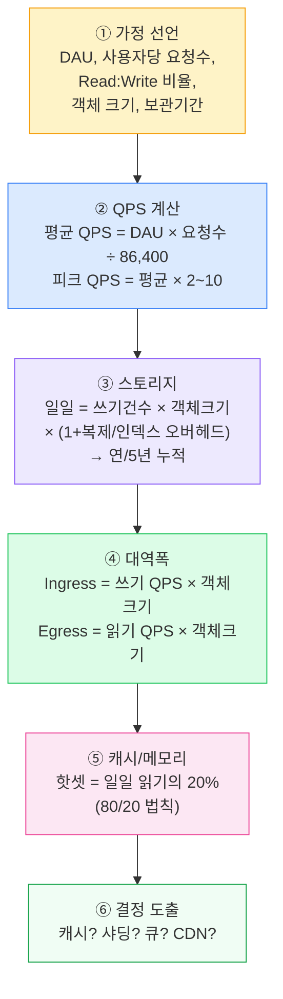
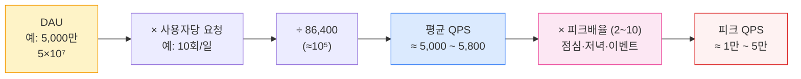

## 1. 왜·언제 추정하나

> **목적** — 숫자로 *설계의 규모(scale)*를 잡아, 적절한 아키텍처 선택을 정당화한다.

추정의 진짜 가치는 정밀도가 아니라 **자릿수(order of magnitude)**다. "이게 초당 100건짜리 문제냐, 100만 건짜리 문제냐"가 정해지면 설계가 완전히 달라진다.

- **QPS가 단일 DB 한계 이내**(대략 수천 QPS) → 캐시 + Read Replica로 충분, 샤딩 불필요
- **피크 QPS가 수만~수십만** → 캐시 적중률 설계·샤딩·큐·CDN이 필수가 됨
- **5년 스토리지가 수십 TB↑** → 단일 노드 불가, 파티셔닝·콜드 스토리지 계층화 필요

> **🎯 면접 포인트**
>
> 추정을 건너뛰고 바로 아키텍처를 그리면 "왜 캐시를 넣었죠? 왜 샤딩이 필요하죠?"에 답을 못 한다. **숫자 → 결정** 의 인과를 보여주는 게 시니어 신호. 가정(assumption)을 *먼저 소리 내어 선언* 하고 시작하라. 🔥(Deep-dive)

## 2. 추정 절차 — DAU에서 대역폭까지

*표준 추정 파이프라인 — 이 순서를 외워 두면 어떤 문제든 같은 틀로 풀 수 있다.*

> **💡 팁 — 항상 가정부터**
>
> "DAU를 1,000만으로 가정하겠습니다. 사용자당 하루 5번 조회, Read:Write = 100:1로 보겠습니다." 처럼 **가정을 명시** 하고 시작하면, 숫자가 틀려도 면접관이 "그럼 DAU를 5,000만으로 바꿔보죠"라고 대화를 이어갈 수 있다. 가정 없는 숫자는 검증 불가.

## 3. 2의 거듭제곱 표 & 라운딩 트릭

| 2의 거듭제곱 | 근사값 | 이름 | 바이트 단위 |
| --- | --- | --- | --- |
| 210 | ≈ 1 천 (1.024×10³) | Kilo | 1 KB |
| 220 | ≈ 1 백만 (10⁶) | Mega | 1 MB |
| 230 | ≈ 10 억 (10⁹) | Giga | 1 GB |
| 240 | ≈ 1 조 (10¹²) | Tera | 1 TB |
| 250 | ≈ 10¹⁵ | Peta | 1 PB |

### 시간·인구 라운딩 트릭

| 대상 | 정확값 | 암산용 라운딩 |
| --- | --- | --- |
| 하루 초 수 | 86,400 s | **≈ 105 (= 100,000)** |
| 한 달 초 수 | 2,592,000 s | ≈ 2.5×10⁶ |
| 1년 | 365.25 일 | ≈ 400 일 (계산 편의) 또는 365 |
| 대한민국 인구 | 약 5,100만 | ≈ 5×10⁷ |
| 전 세계 인터넷 사용자 | 약 50억 | ≈ 5×10⁹ |

> **💡 핵심 암산 트릭 — 1 day ≈ 86,400s ≈ 10⁵**
>
> "하루 = 8.64만 초"를 **10만(10⁵)** 으로 반올림하면 나눗셈이 즉시 끝난다. 예) DAU 1억(10⁸) × 요청 1회 ÷ 10⁵ = **10³ = 1,000 QPS** . 정확히는 ÷86,400 = 1,157 QPS지만, 자릿수는 동일. 면접에선 1,000으로 가도 충분하다.

> **⚠️ 면접 함정 #1 — 정확한 숫자에 집착**
>
> 86,400으로 손계산하다 시간을 다 쓰는 지원자가 많다. 면접관이 보는 건 **자릿수와 사고 과정** 이지 소수점이 아니다. **과감히 라운딩** 하고 "대략 1천 QPS급"이라고 말한 뒤 다음 단계로 넘어가라.

## 4. 지연시간 숫자표 (Jeff Dean numbers)

설계가 "메모리에서 끝나는 일인지, 디스크/네트워크를 타는 일인지"를 판단하려면 이 자릿수 감각이 필수다. 정확한 값보다 **상대 배율**이 중요하다.

| 연산 | 대략 지연 | 상대 감각 |
| --- | --- | --- |
| L1 캐시 참조 | ≈ 0.5 ns | 기준 |
| 분기 예측 실패 | ≈ 5 ns | — |
| L2 캐시 참조 | ≈ 7 ns | L1의 14배 |
| **메인 메모리 참조** | **≈ 100 ns** | L1의 200배 |
| 1 KB 압축 (Zippy/Snappy) | ≈ 3 μs | — |
| 1 Gbps로 1 KB 전송 | ≈ 10 μs | — |
| **SSD random read** | **≈ 0.1 ~ 0.15 ms (100~150 μs)** | 메모리의 약 1,000배 |
| **DC(데이터센터) 내부 round trip** | **≈ 0.5 ms (500 μs)** | — |
| 메모리에서 1 MB 순차 읽기 | ≈ 0.25 ms | — |
| SSD에서 1 MB 순차 읽기 | ≈ 1 ms | — |
| **디스크(HDD) seek** | **≈ 10 ms** | SSD seek의 약 100배 |
| 디스크에서 1 MB 순차 읽기 | ≈ 20~30 ms | — |
| **대륙 간(예: 서울↔미국) round trip** | **≈ 150 ms** | DC 내부의 약 300배 |

> **💡 외울 핵심 5개**
>
> **메모리 100ns · SSD read 0.1ms · DC 내부 RTT 0.5ms · 디스크 seek 10ms · 대륙간 RTT 150ms.** 이 다섯으로 거의 모든 추정을 한다. "캐시 히트는 메모리(0.1μs), 미스는 SSD(0.1ms)면 1,000배 차이 → 캐시 적중률이 곧 성능"이라는 결론이 여기서 나온다.

> **⚠️ 실무 함정 — 대륙간 RTT를 무시**
>
> 글로벌 서비스에서 단일 리전 DB에 모든 읽기를 보내면 멀리 있는 사용자는 RTT 150ms를 매번 먹는다. 그래서 **CDN·엣지 캐시·멀티 리전 읽기 복제** 가 필요하다는 결론이 이 숫자에서 도출된다.

## 5. QPS 산정 공식과 피크 배율

**QPS(Queries Per Second, 초당 쿼리 수)**는 용량의 핵심 지표다. 공식은 단순하다.

> **공식** — 평균 QPS = (DAU × 사용자당 요청 수) ÷ 86,400 · 피크 QPS = 평균 QPS × (2 ~ 10)

*평균 QPS는 24시간을 균등 분배한 가상의 값. 실제 부하는 특정 시간대에 몰리므로 **피크 QPS로 용량을 산정**해야 한다.*

### 피크 배율을 정하는 감각

- **완만한 서비스**(사내 도구, B2B): 피크 ≈ 평균 × 2~3
- **일반 소비자 앱**: 점심·저녁 집중 → 평균 × 3~5
- **이벤트성 스파이크**(배민 점심 피크, 쿠팡 새벽 Cut-off, 티켓팅, 블프): 평균 × 10 이상도. 별도로 처리.

> **⚠️ 면접 함정 #2 — 피크 트래픽 무시**
>
> 평균 QPS로 인프라를 산정하면 점심 피크에 시스템이 무너진다. 반드시 **피크 기준으로 용량을 잡고** , 평소엔 오토스케일·큐로 흡수한다고 말하라. 배민·쿠팡처럼 시간대 편중이 극심한 서비스는 이 한 줄이 합격/불합격을 가른다.

## 6. 실전 예제 ① — 배민 주문 시스템

#### Step 0 · 가정 선언

- DAU = **500만** (5×10⁶)
- 주문 전환: 활성 사용자 중 하루 **1건 주문** → 일일 주문 = 500만 건
- 조회(메뉴·매장·주문조회) : 주문 = **Read:Write ≈ 30:1**
- 주문 1건 저장 크기 ≈ **2 KB** (주문 헤더 + 메뉴 라인 + 결제·주소 메타)
- 주문 데이터 보관 = **5년**

#### Step 1 · 쓰기 QPS (주문)

평균 쓰기 QPS = 500만 ÷ 86,400 ≈ **57.8 ≈ 약 58 QPS**. 배민은 점심·저녁 집중이 극심 → 피크 배율 **×10** 적용 → 피크 쓰기 ≈ **580 QPS**.

#### Step 2 · 읽기 QPS (조회)

일일 조회 = 500만 × 30 = **1.5억(1.5×10⁸)**. 평균 읽기 QPS = 1.5×10⁸ ÷ 10⁵ ≈ **1,500 QPS** → 피크 ×10 ≈ **15,000 QPS**.

#### Step 3 · 스토리지 (5년 누적)

- 일일 = 500만 × 2 KB = 107 KB = **10 GB/일**
- 연간 = 10 GB × 365 ≈ **3.65 TB/년**
- 5년 = **≈ 18 TB** (인덱스·복제 오버헤드 ×3 가정 시 **≈ 55 TB**)

#### Step 4 · 대역폭

- 쓰기 Ingress(피크) = 580 QPS × 2 KB ≈ **1.16 MB/s** (작음)
- 읽기 Egress(피크) = 15,000 QPS × 2 KB ≈ **30 MB/s ≈ 240 Mbps**

#### Step 5 · 결정 도출

> **💡 숫자 → 설계 결정**
>
> **읽기 15,000 QPS** > 단일 RDBMS 편안 한계(수천) → **Redis 캐시 + Read Replica**로 읽기 분산. 메뉴·매장 정보는 변동 적어 캐시 적중률 높음. **쓰기 580 QPS**는 단일 마스터로 감당 가능. 다만 피크 스파이크는 **주문 접수 큐(Kafka)**로 흡수해 백프레셔(Back-pressure) 방지. **5년 18~55 TB** → 단일 노드도 가능하나, 운영 안정 위해 주문 ID 기반 **샤딩** 또는 오래된 데이터 **콜드 스토리지 계층화** 검토.

> **🎯 면접 포인트**
>
> "피크 ×10"을 그냥 쓰지 말고 **왜 배민은 ×10인가(점심·저녁 식사 시간 집중)** 를 한 문장으로 정당화하면 도메인 이해까지 보여진다. 또 쓰기는 작고 읽기가 큰 **Read-heavy 시스템** 임을 짚고 캐시 우선순위를 잡는 게 정석. 🔥(Deep-dive)

## 7. 실전 예제 ② — 라스트마일 TrackingEvent

> **문제 정의** — 전국 배송 스캔이 만드는 *대량 쓰기(write-heavy) 이벤트 스트림*의 용량을 잡아라.

#### Step 0 · 가정

- 일일 `TrackingEvent` = **5,000만 건** (5×10⁷) — 집하·간선·허브 경유·OFD·배송완료 등 운송장 1건당 여러 스캔
- 이벤트 1건 크기 = **300 B** (운송장ID, 상태코드, 위치, 타임스탬프, 기사ID)
- 보관 = **1년** (이후 콜드 스토리지)
- 조회: 고객·CS의 추적 조회 = 이벤트 쓰기의 약 **3배** (Read:Write ≈ 3:1, 한 운송장을 여러 번 새로고침)

#### Step 1 · 쓰기 QPS

평균 쓰기 QPS = 5×10⁷ ÷ 10⁵ = **500 QPS**. 라스트마일은 배송 시작(오전)·완료(저녁) 시간대 집중 → 피크 ×5 ≈ **2,500 QPS**.

#### Step 2 · 읽기 QPS

일일 조회 = 5×10⁷ × 3 = 1.5×10⁸ → 평균 = 1.5×10⁸ ÷ 10⁵ = **1,500 QPS** → 피크 ×5 ≈ **7,500 QPS**.

#### Step 3 · 스토리지

- 일일 = 5×10⁷ × 300 B = 1.5×10¹⁰ B = **15 GB/일**
- 연간 = 15 GB × 365 ≈ **5.475 TB/년** (≈ 5.5 TB)
- 인덱스(운송장ID·시간 복합 인덱스) + 복제 ×3 → **≈ 16 TB/년**

#### Step 4 · 대역폭

- 쓰기 Ingress(피크) = 2,500 QPS × 300 B = **0.75 MB/s**
- 읽기 Egress(피크) = 7,500 QPS × 300 B ≈ **2.25 MB/s**

#### Step 5 · 결정 도출

> **💡 숫자 → 설계 결정**
>
> **Write-heavy + 시계열**: 2,500 쓰기 QPS의 append-only 스트림 → **Kafka로 수집** 후 컨슈머가 배치 적재. 동기 DB 직접 쓰기는 피크에 위험. **시계열 저장**: 운송장ID로 파티셔닝 + 시간 정렬. RDBMS보다 **Cassandra/시계열 DB**나 파티셔닝된 테이블이 유리. **조회 7,500 QPS**: "마지막 상태"는 핫데이터 → **Redis에 운송장별 최신 상태 캐시**. 전체 이력은 콜드 조회. **Fan-out**: 한 스캔이 고객 푸시·CS·OMS 동기화로 퍼짐 → Kafka Topic으로 멀티 컨슈머. `Idempotency(멱등성)`로 중복 이벤트 흡수. 🔥(Deep-dive)

> **⚠️ 실무 함정 — 평균만 보고 큐를 뺀다**
>
> 평균 500 쓰기 QPS만 보면 "DB 직접 쓰기로 충분"이라 착각한다. 하지만 배송 피크·기사 앱 오프라인 동기화(지하·산간 후 재접속 시 누적 이벤트 일괄 전송) 때 순간 폭주가 발생 → **큐로 버퍼링** 해야 DB가 보호된다. 평균이 아닌 **버스트** 를 봐야 한다.
