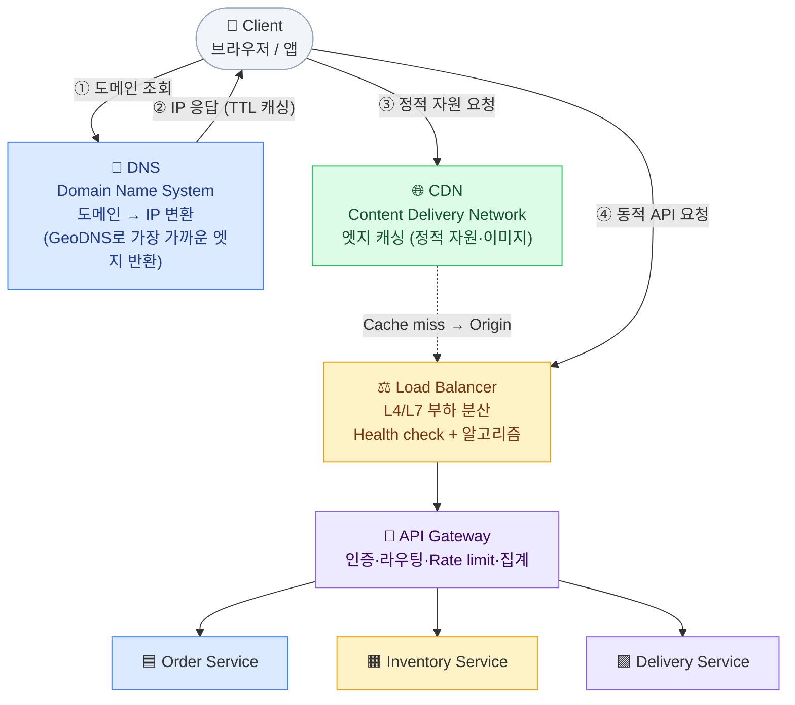
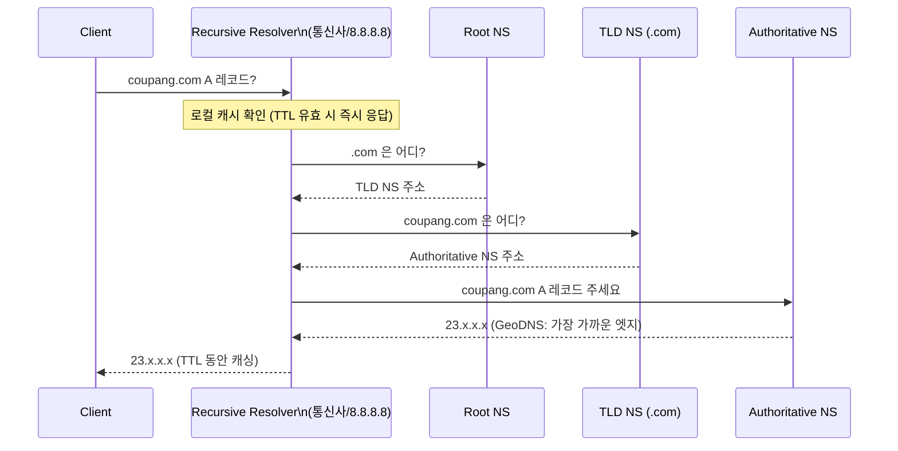
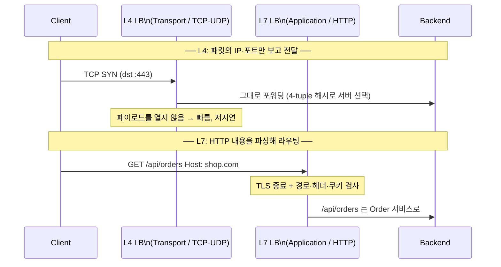
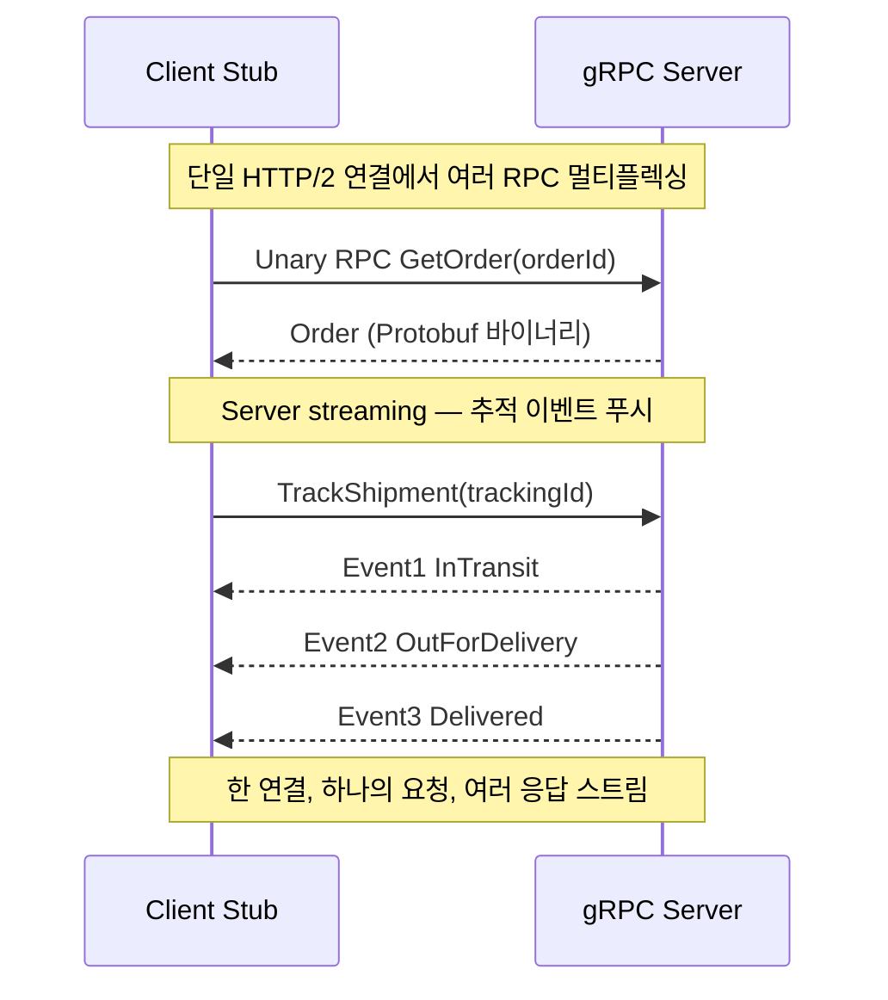

## 0. 요청 경로 한눈에

시스템 디자인 면접에서 "사용자가 `coupang.com`을 입력하면 어떻게 되나요?"는 워밍업 단골이다. 아래 흐름을 머릿속에 그릴 수 있어야 모든 빌딩블록의 위치가 보인다.

*Client → DNS → CDN → LB → API Gateway → 서비스. 정적 트래픽은 CDN에서 끝나고, 동적 트래픽만 Origin까지 내려간다.*

> **💡 팁 — "정적 vs 동적" 분기를 먼저 말하라**
>
> 면접에서 이 경로를 설명할 때, **정적 자원(이미지·JS·CSS)은 CDN에서 차단하고 동적 요청만 Origin으로 보낸다** 는 분기를 먼저 언급하면 트래픽 규모 감각이 있다는 인상을 준다. 쿠팡 상품 이미지가 매 요청마다 Origin을 때리면 대역폭 비용이 폭발한다.

## 1. 🧭 DNS — Domain Name System

> **핵심 책임** — 사람이 읽는 도메인(`coupang.com`)을 기계가 쓰는 IP(`23.x.x.x`)로 변환하는 분산 디렉터리.

### 동작 흐름 — 재귀 질의(Recursive Query)

*DNS 재귀 질의 — 한 번 해석하면 TTL 동안 Resolver/OS/브라우저가 캐싱하므로 매 요청마다 전체 경로를 타지 않는다.*

### 트래픽 분산·라우팅 정책

- **Round-robin DNS(라운드로빈)**: 하나의 도메인에 여러 A 레코드를 등록해 순환 응답. 가장 단순한 분산이지만 **서버 상태를 모른다** — 죽은 서버 IP도 그대로 반환할 수 있다.
- **GeoDNS(지리 기반 DNS)**: 클라이언트의 Resolver IP 위치를 보고 가장 가까운 리전/엣지의 IP를 반환. 한국 사용자는 서울 엣지, 미국 사용자는 버지니아 엣지.
- **Weighted / Latency-based(가중치·지연 기반)**: AWS Route 53의 정책처럼 가중치나 실측 지연으로 트래픽 비율 조정 — 카나리 배포·재해 복구에 활용.

### TTL(Time To Live) — 양날의 검

TTL은 레코드를 얼마나 캐싱할지 정하는 초 단위 값이다.

- **긴 TTL(예: 86400s)**: 질의 부하·지연 감소. 그러나 장애 시 트래픽을 죽은 IP에서 떼어내는 데 최대 TTL만큼 걸린다.
- **짧은 TTL(예: 30~60s)**: Failover(장애 전환)가 빠르지만 DNS 질의량 증가. 보통 Failover가 중요한 엔드포인트는 짧게 둔다.

> **⚠️ 실무 함정 — TTL은 "최댓값"일 뿐, 강제 만료가 안 된다**
>
> 배포 전환을 위해 TTL을 줄여도, **이미 캐싱된 레코드는 남은 TTL이 지나야 만료** 된다. 그래서 IP 변경 전 며칠 전부터 TTL을 미리 낮춰두는 "TTL lowering" 사전작업이 표준이다. 또한 일부 Resolver/브라우저는 TTL을 무시하고 자체 정책으로 캐싱하므로 100% 통제는 불가능.

> **🎯 면접 함정**
>
> "DNS로 부하 분산하면 LB 필요 없지 않나요?" → **오답.** DNS Round-robin은 (1) 서버 헬스를 모르고, (2) 캐싱 때문에 분산이 고르지 않으며, (3) 세션 친화성(Sticky)을 제어 못 한다. DNS는 *리전 단위 거친 분산* , LB는 *리전 내 정밀 분산* 으로 역할이 다르다고 답해야 한다.

## 2. 🌐 CDN — Content Delivery Network

> **핵심 책임** — 사용자와 물리적으로 가까운 *엣지 서버(Edge / PoP)*에 콘텐츠를 캐싱해 지연과 Origin 부하를 동시에 줄인다.

### Pull vs Push

| 방식 | 동작 | 장점 | 단점·적합한 상황 |
| --- | --- | --- | --- |
| **Pull CDN** (Origin Pull) | 첫 요청 때 Cache miss → CDN이 Origin에서 끌어와 캐싱. 이후 TTL 동안 엣지가 응답 | 운영 단순(자동 캐싱), 스토리지 절약 | 첫 요청은 느림(Cold), Origin 보호 위해 캐시 정책 튜닝 필요. **대부분의 웹은 Pull.** |
| **Push CDN** | 운영자가 콘텐츠를 미리 엣지로 업로드(배포) | Cold miss 없음, 대용량 파일·트래픽 예측 가능 시 유리 | 업로드·동기화 관리 부담. 동영상 VOD, 게임 패치, 대규모 소프트웨어 배포에 적합 |

### 정적 가속 vs 동적 가속

- **정적 가속**: 이미지·JS·CSS·폰트·VOD처럼 변하지 않는 자원을 엣지에서 직접 응답. Cache-Control·ETag로 제어.
- **동적 가속(Dynamic Acceleration)**: API 같은 동적 응답은 캐싱이 어렵지만, CDN이 Origin까지 **최적 경로(백본 네트워크)**와 **TLS 종료·연결 재사용**으로 가속. AWS CloudFront, Cloudflare가 제공.

### 국내 사례

- **네이버·카카오**: 대용량 이미지·동영상 트래픽을 자체 CDN과 글로벌 CDN(Akamai/CloudFront) 하이브리드로 처리. 라이브 스트리밍은 엣지 트랜스코딩과 결합.
- **쿠팡**: 상품 썸네일·상세 이미지를 CDN에서 차단해 Origin 트래픽을 수십 분의 1로 줄인다. 가격·재고처럼 자주 바뀌는 데이터는 짧은 TTL 또는 캐시 우회.

> **⚠️ 실무 함정 — 캐시 무효화(Invalidation)**
>
> "상품 이미지를 교체했는데 옛날 이미지가 계속 보여요"는 전형적 CDN 사고다. 해결: (1) 파일명에 해시를 붙이는 **버전드 URL** ( `logo.a1b2c3.png` ) — 가장 안전, (2) CDN **Purge API** 로 강제 무효화 — 전 엣지 전파에 수십 초~수 분. 가격 같은 실시간 데이터는 애초에 캐싱하지 말 것.

## 3. ⚖️ Load Balancer — 부하 분산기

> **핵심 책임** — 들어오는 요청을 여러 백엔드 인스턴스에 나눠, 단일 인스턴스 과부하·SPOF(Single Point of Failure, 단일 장애점)를 방지한다.

### L4 vs L7 — OSI 계층이 다르다

*L4는 4-tuple(출발/도착 IP·포트)만 보고 포워딩, L7은 HTTP 페이로드를 파싱해 경로·호스트·쿠키 기반 라우팅. 대신 L7은 연결당 비용이 크다.*

| 관점 | L4 (전송 계층) | L7 (애플리케이션 계층) |
| --- | --- | --- |
| 판단 기준 | IP·포트 (4-tuple) | URL·Host·Header·Cookie·HTTP method |
| 성능 | 매우 빠름, 낮은 지연·높은 처리량 | 파싱 오버헤드로 상대적으로 느림 |
| 기능 | 단순 포워딩 | 경로 라우팅, TLS 종료, 헤더 조작, WAF, 압축 |
| AWS 대응 | NLB (Network Load Balancer) | ALB (Application Load Balancer) |
| 적합 | 초저지연 게임·금융, gRPC/임의 TCP | 마이크로서비스 경로 라우팅, 웹 트래픽 |

> **🎯 면접 함정 — "L4/L7 차이 모름"은 즉시 감점**
>
> "L4랑 L7 LB 차이가 뭔가요?"는 거의 모든 백엔드 면접에 나온다. 핵심 한 줄: **L4는 패킷의 IP·포트만 보고 전달(내용 안 봄), L7은 HTTP 내용을 열어 경로·헤더로 라우팅한다.** 그래서 "URL `/api/v2` 만 새 버전으로 보내기" 같은 건 L7에서만 가능. gRPC를 L7 ALB 뒤에 둘 땐 HTTP/2 지원 여부를 반드시 확인.

### 분산 알고리즘

| 알고리즘 | 동작 | 장점 | 단점·적합 |
| --- | --- | --- | --- |
| **Round-robin** (라운드로빈) | 순서대로 한 대씩 순환 | 단순, 균등 분배 가정 시 충분 | 요청 처리시간이 제각각이면 불균형 — 동질 서버에 적합 |
| **Weighted RR** (가중 라운드로빈) | 서버 스펙에 비례한 가중치 | 이기종 서버 혼합 대응 | 가중치 수동 관리 |
| **Least connections** (최소 연결) | 현재 활성 연결이 가장 적은 서버로 | 롱-커넥션·요청시간 편차 큰 워크로드에 강함 | 연결 수 추적 비용. WebSocket·스트리밍에 유리 |
| **Consistent hashing** (일관성 해시) | 키(예: userId)를 해시해 같은 서버로 고정 | 캐시 지역성↑, 서버 증감 시 재배치 최소 | 키 분포 쏠리면 Hot. 세션·로컬 캐시 친화 라우팅에 적합 |
| **IP hash** | 클라이언트 IP 해시로 고정 | 간단한 Sticky 구현 | NAT 뒤 다수 사용자가 한 서버로 몰림 |

### Health check & Sticky session

- **Health check(헬스 체크)**: LB가 주기적으로 `/healthz`를 호출해 비정상 인스턴스를 풀에서 자동 제외. *Shallow*(프로세스 살아있나) vs *Deep*(DB·의존성까지 확인) 트레이드오프 — Deep은 정확하지만 의존성 장애 시 전체 인스턴스를 죽은 것으로 오판해 연쇄 장애를 부를 수 있다.
- **Sticky session(세션 고정)**: 같은 클라이언트를 같은 서버로 보내 로컬 세션을 재사용. 단점은 **확장성·재배포 시 세션 유실, 불균형**. 권장: 세션을 Redis 같은 외부 저장소로 빼서 **Stateless(무상태)** 서버를 만들고 Sticky를 제거하는 방향.

> **💡 팁 — 쿠팡/배민 트래픽 경로 멘탈모델**
>
> 대규모 이커머스의 동적 트래픽은 보통 **GeoDNS → 리전 진입 → L7 LB(ALB) → API Gateway → 서비스 메시** 순. 정적 자원은 같은 도메인이라도 CDN 엣지에서 분기돼 Origin을 거치지 않는다. "트래픽 피크 시 어디가 먼저 터지나?"를 물으면 보통 *L7 LB 연결 수 한계* 와 *DB 커넥션 풀* 을 짚는다.

## 4. 🚪 API Gateway

> **핵심 책임** — 클라이언트와 마이크로서비스 사이의 *단일 진입점(Single Entry Point)*. 횡단 관심사(인증·Rate limit·로깅)를 한곳에 모은다.

### 주요 역할

- **인증·인가(AuthN/AuthZ)**: JWT(JSON Web Token) 검증, OAuth 토큰 확인을 게이트웨이에서 처리 → 각 서비스가 중복 구현하지 않음.
- **라우팅(Routing)**: `/orders`는 Order 서비스, `/delivery`는 Delivery 서비스로 — 경로·버전 기반.
- **Rate limiting(요청 제한)**: 사용자·API key 단위로 초당 요청 제한. Token bucket·Sliding window 알고리즘.
- **집계(Aggregation / BFF)**: 한 화면에 필요한 여러 서비스 호출을 게이트웨이가 모아서 한 응답으로 — 모바일 라운드트립 절감.
- **기타**: 요청/응답 변환, 캐싱, 회로 차단(Circuit breaker), 관측성(Tracing) 주입.

### API Gateway vs Reverse Proxy — 무엇이 다른가

| 관점 | Reverse Proxy | API Gateway |
| --- | --- | --- |
| 주 관심사 | 네트워크 레벨 중계·캐싱·TLS 종료 | API 레벨 정책(인증·Rate limit·집계) |
| 추상화 수준 | HTTP 요청 전달 | 비즈니스 API·서비스 토폴로지 인지 |
| 대표 제품 | Nginx, HAProxy, Envoy | Kong, AWS API Gateway, Spring Cloud Gateway |
| 관계 | API Gateway는 사실상 **"정책 기능이 풍부한 Reverse Proxy"** — Kong은 Nginx 위에, AWS API GW도 프록시 위에 정책 계층을 얹은 형태. 둘은 배타적이 아니라 포함 관계에 가깝다. |  |

> **💡 사례 — 토스 API Gateway**
>
> 금융 서비스 특성상 토스는 게이트웨이 계층에서 **인증·트래픽 제어·감사 로깅·이상 탐지** 를 집중 처리하고, 내부 서비스는 비즈니스 로직에 집중하게 한다. 게이트웨이는 SPOF가 되기 쉬우므로 **다중화 + 무상태 설계 + 빠른 Failover** 가 필수.

> **⚠️ 실무 함정 — Gateway에 비즈니스 로직을 넣지 마라**
>
> 편하다고 게이트웨이에 도메인 분기·데이터 조합 로직을 쌓으면 "분산 모놀리스"가 되어 배포 병목과 SPOF를 만든다. 게이트웨이는 **횡단 관심사만** . 화면별 집계가 많으면 차라리 **BFF(Backend For Frontend)** 를 별도로 두는 게 낫다.

## 5. 🔁 Reverse Proxy (Nginx 등)

**Forward Proxy**는 클라이언트를 대신해 나가는 트래픽을 중계(사내 방화벽·필터링), **Reverse Proxy(역방향 프록시)**는 서버 앞에 서서 들어오는 트래픽을 받아 백엔드로 분배한다. 클라이언트는 진짜 서버를 모른다.

#### Reverse Proxy의 전형적 역할

- **TLS 종료(TLS termination)**: HTTPS 복호화를 프록시에서 처리해 백엔드 부담 경감.
- **정적 파일 서빙·캐싱**: Nginx가 정적 자원을 직접 응답, 동적 요청만 앱으로.
- **압축(gzip/brotli)·요청 버퍼링·연결 풀링**.
- **L7 부하 분산**: 실은 Nginx는 Reverse Proxy이자 L7 LB. 그래서 LB·프록시·게이트웨이의 경계가 제품마다 겹친다.

> **💡 팁 — 세 컴포넌트의 관계 정리**
>
> **Reverse Proxy ⊂ (L7 LB) ⊂ (API Gateway)** 로 기능이 점점 쌓인다고 보면 깔끔하다. Nginx 하나로 프록시+LB를, Envoy로 프록시+LB+관측성을, Kong으로 그 위에 API 정책까지 — 면접에선 "제품 이름"이 아니라 "어떤 책임을 어디서 처리하는가"로 답하라.

## 6. REST vs gRPC vs GraphQL

세 가지는 "서비스끼리 또는 클라이언트와 서버가 어떻게 대화하나"를 정하는 API 스타일이다. 정답은 없고 **용도에 따라 다르다.**

| 관점 | REST | gRPC | GraphQL |
| --- | --- | --- | --- |
| 전송·포맷 | HTTP/1.1 + JSON (텍스트) | HTTP/2 + Protobuf (바이너리) | HTTP/1.1 + JSON (단일 엔드포인트) |
| 스키마·계약 | 느슨(OpenAPI 선택적) | 엄격(`.proto` 강제) | 엄격(GraphQL Schema) |
| 성능·페이로드 | JSON 파싱·중복 큼 | Protobuf로 작고 빠름, 멀티플렉싱 | 필요한 필드만 받아 over-fetch 제거(서버 파싱은 비쌈) |
| 스트리밍 | 기본 없음(SSE 등 별도) | **양방향 스트리밍 1급 지원** | Subscription(WebSocket) |
| Over/Under-fetching | 흔함(고정 응답) | 고정(메시지 정의) | **클라이언트가 필드 선택** → 해결 |
| 브라우저·캐싱 | 최상(HTTP 캐시·CDN 친화) | 브라우저 직접 불가(gRPC-Web 필요) | HTTP 캐싱 약함(POST 단일 URL) |
| 대표 용도 | 공개 API, 웹·모바일 표준 | **내부 MSA 서비스 간 통신**, 저지연 | 복잡한 화면·다양한 클라이언트(앱·웹) 집계 |

### gRPC 호출 흐름 — HTTP/2 멀티플렉싱·스트리밍

*gRPC는 HTTP/2의 멀티플렉싱으로 한 TCP 연결에 여러 RPC를 흘리고, Server/Client/양방향 스트리밍을 1급으로 제공한다.*

> **🎯 면접 함정 — "gRPC는 무조건 빠르다"는 오해**
>
> gRPC가 빠른 이유는 **Protobuf 바이너리 + HTTP/2 멀티플렉싱** 이지 마법이 아니다. (1) **브라우저에서 직접 못 쓴다** (gRPC-Web 프록시 필요), (2) **HTTP 캐싱·CDN과 안 맞는다** , (3) 사람이 디버깅(curl)하기 불편, (4) 작은 페이로드·낮은 호출량이면 JSON 대비 이득이 미미. 그래서 실무 정석은 **"외부=REST/GraphQL, 내부 서비스 간=gRPC"** 다.

> **⚠️ 실무 함정 — GraphQL의 N+1과 캐싱**
>
> GraphQL은 over-fetch를 없애지만 **중첩 쿼리가 백엔드에서 N+1 쿼리 폭발** 을 일으킬 수 있어 DataLoader 배칭이 필수. 또 단일 POST 엔드포인트라 **HTTP·CDN 캐싱이 어렵고** , 클라이언트가 임의로 무거운 쿼리를 던질 수 있어 **쿼리 복잡도 제한·depth 제한** 이 필요하다.

## 7. 물류 적용 — 라스트마일 추적 API: REST vs gRPC

"운송장 추적(Tracking)" API를 어떤 프로토콜로 설계할까? 호출자가 누구냐에 따라 답이 갈린다.

| 경계 | 호출 주체 | 권장 | 이유 |
| --- | --- | --- | --- |
| **고객 앱 ↔ 추적 API** | 외부 모바일·웹 | **REST** (+ 실시간은 SSE/WebSocket) | 브라우저·CDN 친화, 공개 계약 단순. 지도 위 위치 푸시는 WebSocket 보강 |
| **기사 앱 ↔ 위치 수집** | 모바일 → 게이트웨이 | **REST/gRPC + 배치 업로드** | 오프라인 구간(지하·산간) 누적 후 재접속 시 배치 전송 + 멱등성(Idempotency) 필요 |
| **추적 서비스 ↔ OMS/알림 서비스** | 내부 마이크로서비스 | **gRPC (스트리밍)** | 초당 수만 TrackingEvent를 저지연·고밀도로. Protobuf로 페이로드 최소화 |

정량 감각: DAU 1,000만, 1인당 추적 화면 5회 폴링이면 하루 5,000만 조회 ≈ 평균 **580 QPS(Queries Per Second, 초당 쿼리 수)**, 피크는 그 5~10배. 이걸 매번 Origin DB로 보내면 죽으니 **최신 상태는 CDN/엣지 캐시 또는 Redis**에 짧은 TTL로 두고, 변경 시 Push로 갱신하는 구조가 정석이다.

> **💡 연결 — 이 빌딩블록이 어떻게 합쳐지나**
>
> 라스트마일 추적: **GeoDNS** 로 가까운 리전 → 지도 타일·아이콘은 **CDN** → 추적 API는 **L7 LB → API Gateway** (인증·Rate limit) → 외부는 REST, 내부 이벤트 Fan-out은 **gRPC 스트리밍 + Kafka** . 한 시스템 안에서 모든 빌딩블록이 자기 자리를 갖는다.
