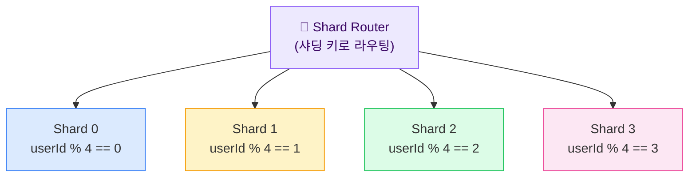
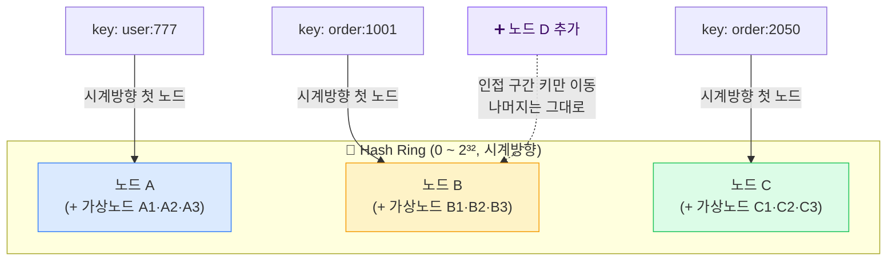

## 1. SQL vs NoSQL — 언제 무엇을

> **결정 기준** — 정답은 없다. *데이터 접근 패턴(읽기/쓰기 형태)·일관성 요구·확장 축*으로 고른다.

"NoSQL이 빠르고 좋다"는 면접 즉시 감점이다. RDBMS는 **강한 일관성·복잡한 조인·트랜잭션(ACID)**에 강하고, NoSQL은 **특정 접근 패턴에 맞춰 수평 확장·고처리량**에 강하다. 핵심은 "이 데이터를 *어떻게 읽고 쓰는가*"다.

| 유형 | 모델 | 강점 | 대표 | 전형 용도 |
| --- | --- | --- | --- | --- |
| **RDBMS** | 테이블·관계·스키마 고정 | ACID 트랜잭션, 조인, 강한 일관성 | MySQL, PostgreSQL | 주문·결제·정산처럼 정합성이 생명인 OLTP |
| **Key-Value** | key → value (불투명) | O(1) 조회, 초고속·단순 | Redis, DynamoDB | 세션·캐시·카운터·Rate limit |
| **Document** | JSON 형태의 자유 문서 | 유연한 스키마, 중첩 구조 | MongoDB | 상품 카탈로그, 스키마가 자주 바뀌는 도메인 |
| **Wide-column** | row key + 동적 컬럼 | 쓰기 처리량·시계열·대용량에 강함 | Cassandra, HBase, Bigtable | 로그·이벤트·TrackingEvent 같은 append 패턴 |
| **Graph** | 노드·엣지 관계 | 다단계 관계 탐색이 빠름 | Neo4j | 소셜 그래프, 추천, 경로·관계 분석 |

> **🎯 면접 함정 — "왜 그 DB?"에 접근 패턴으로 답하라**
>
> "주문은 왜 RDBMS, 추적 이벤트는 왜 Cassandra인가?" → **주문은 결제·재고와 트랜잭션으로 묶이고 조인·정합성이 필수라 RDBMS, 추적 이벤트는 초당 수만 건 append-only·시계열 조회라 쓰기 확장에 강한 Wide-column** . "빠르니까"는 답이 아니다. 데이터의 읽기/쓰기 형태로 정당화하라.

> **💡 팁 — Polyglot Persistence(다중 저장소)**
>
> 현실 대형 시스템은 한 DB로 다 하지 않는다. 쿠팡·배민도 **주문=RDBMS, 세션·재고 카운터=Redis, 검색=Elasticsearch, 이벤트=Kafka→Wide-column** 식으로 용도별 저장소를 섞는다. 면접에서 "하나로 다 한다"보다 "용도별 분리 + 정합성 동기화 방법"을 말하는 게 시니어답다.

## 2. Replication (복제) — 읽기 확장과 가용성

> **핵심 목적** — 같은 데이터를 여러 노드에 복제 → *읽기 분산·고가용성(HA)·재해 복구*. 단, 쓰기 확장은 아니다.

### Leader-Follower (Master-Slave) 복제

```mermaid
flowchart TB
    App["🟦 Application"]
    Leader["👑 Leader (Master)\n쓰기 전담"]
    F1["📖 Follower 1\n(Read replica)"]
    F2["📖 Follower 2\n(Read replica)"]
    F3["📖 Follower 3\n(Read replica)"]

    App -->|"Write (INSERT/UPDATE)"| Leader
    App -->|"Read (SELECT)"| F1
    App -->|"Read"| F2
    App -->|"Read"| F3
    Leader -.->|"replication log\n(WAL / binlog)"| F1
    Leader -.->|"비동기 복제\n→ replication lag 발생"| F2
    Leader -.->|""| F3

    style Leader fill:#fef3c7,stroke:#f59e0b,color:#78350f
    style F1 fill:#dbeafe,stroke:#3b82f6
    style F2 fill:#dbeafe,stroke:#3b82f6
    style F3 fill:#dbeafe,stroke:#3b82f6
```

*쓰기는 Leader 한 곳, 읽기는 Follower로 분산. Leader가 죽으면 Follower 하나를 승격(Failover). 읽기는 늘지만 쓰기 한계는 Leader가 그대로 가짐.*

### 동기 vs 비동기 복제

| 방식 | 동작 | 일관성·내구성 | 지연·가용성 Trade-off |
| --- | --- | --- | --- |
| **동기(Synchronous)** | Follower 확인까지 기다린 뒤 커밋 응답 | 데이터 유실 없음, 강한 내구성 | 쓰기 지연↑, Follower 하나 느리면 전체 쓰기 지연 — 보통 1개만 동기 |
| **비동기(Asynchronous)** | Leader가 즉시 응답, 복제는 백그라운드 | Leader 장애 시 **미복제분 유실 가능** | 쓰기 빠름, 그러나 **replication lag(복제 지연)** 발생 — 대부분 기본값 |

> **⚠️ 실무 함정 — Replication lag로 Read-your-writes가 깨진다**
>
> 비동기 복제에서 사용자가 글을 쓰고(Leader) 곧바로 새로고침해 Follower에서 읽으면, **아직 복제 안 된 옛 데이터** 가 보인다("방금 단 댓글이 사라졌어요"). 해결책: (1) **본인 쓰기 직후 일정 시간은 Leader에서 읽기** , (2) 쓰기 후 받은 LSN(로그 시퀀스 번호)까지 따라잡은 Follower만 사용, (3) Sticky 세션. 이게 **Read-your-writes(자기 쓰기 읽기 일관성)** 보장 기법이다. 🔥(Deep-dive)

> **💡 사례 — 토스 계좌**
>
> 금융 잔액 조회 트래픽은 막대하므로 Read replica로 분산하지만, **"방금 이체한 잔액"은 lag로 틀리면 안 되는** 대표 케이스다. 그래서 잔액 변경 직후 일정 구간은 Leader 읽기로 강제하거나, 핵심 잔액은 동기 복제·강한 일관성 경로로 둔다. 가용성보다 정합성이 먼저인 도메인.

## 3. Partitioning / Sharding — 쓰기·용량 확장

> **핵심 목적** — 데이터를 여러 노드로 *쪼개서* 분산 → 단일 노드의 쓰기·저장 용량 한계 돌파. 복제가 못 푸는 "쓰기 확장"을 해결.

용어 정리: **Partitioning(파티셔닝)**은 데이터를 조각으로 나누는 일반 개념, **Sharding(샤딩)**은 그 조각(shard)을 *여러 물리 노드*에 분산하는 것. 각 shard는 보통 자기 복제본(Leader-Follower)을 또 가진다.



*샤딩 키(여기선 userId)로 어느 shard에 쓸지/읽을지 결정. 각 shard는 독립된 쓰기 노드 → 쓰기 처리량이 노드 수에 비례해 확장된다.*

### 파티셔닝 전략 비교

| 전략 | 방식 | 장점 | 단점·Hotspot 위험 |
| --- | --- | --- | --- |
| **범위 기반** (Range) | 키 범위로 분할 (예: 날짜, A~M / N~Z) | 범위 스캔 효율적, 정렬 조회 유리 | **최신 데이터 한 파티션 쏠림**(오늘 날짜·자동증가 ID) → Hot partition |
| **해시 기반** (Hash) | 키 해시 % N 으로 분할 | 균등 분산, 핫스팟 방지에 유리 | 범위 스캔 불가, **노드 증감 시 대량 재배치**(→ Consistent hashing으로 보완) |
| **디렉토리 기반** (Directory / Lookup) | 키→shard 매핑을 별도 룩업 테이블로 관리 | 유연한 재배치, 키 분포 제어 자유 | 룩업 테이블이 SPOF·병목 가능 → 캐싱·다중화 필요 |

> **🎯 면접 함정 — 샤딩 키를 monotonic id로 잡으면 Hot shard**
>
> **auto-increment ID나 timestamp를 샤딩 키로 쓰면, 항상 최신 shard로만 쓰기가 몰려** 한 노드가 죽고 나머지는 논다(Hotspot). 해결: (1) 해시 기반 분산, (2) 키에 접두 솔트·버킷을 섞기, (3) 자연스러운 고-카디널리티 키(userId, deviceId) 선택. "샤딩 키 = monotonic id"는 단골 함정이다. 🔥(Deep-dive)

> **⚠️ 실무 함정 — 분산 조인·교차 샤드 트랜잭션 비용**
>
> 샤딩하면 **여러 shard에 걸친 JOIN·트랜잭션이 비싸진다** (스캐터-개더, 2PC). 대응: (1) **함께 조회되는 데이터는 같은 샤딩 키로 co-locate** (예: 한 사용자의 주문은 같은 shard), (2) 교차 샤드 작업은 애플리케이션에서 합치거나 비정규화, (3) 분산 트랜잭션 대신 Saga. "샤딩하면 다 해결"이 아니라 "조인·트랜잭션을 잃는다"는 대가를 반드시 언급하라.

## 4. Consistent Hashing (일관성 해시)

> **해결하는 문제** — 단순 `hash % N`은 노드가 1개 늘면 *거의 모든 키가 재배치*된다. 일관성 해시는 노드 증감 시 **이동 키를 1/N 수준으로 최소화**한다.

`hash(key) % N`의 문제: 노드 수 N이 4→5로 바뀌면 나머지 연산 결과가 거의 전부 달라져 캐시 미스 폭발·대량 데이터 이동이 일어난다. 일관성 해시는 키와 노드를 **같은 해시 링(0~2³²) 위에 올리고**, 키는 "시계 방향으로 만나는 첫 노드"에 귀속시킨다.



*키는 링에서 시계방향 첫 노드에 귀속. 노드 D를 추가해도 인접 구간 키만 이동하고 나머지는 그대로 → 재배치 최소화.*

### 가상 노드(Virtual Node)가 필요한 이유

- 물리 노드를 링에 1점씩만 올리면 **구간 크기가 들쭉날쭉**해져 일부 노드가 과부하(불균형)된다.
- 각 물리 노드를 **수십~수백 개의 가상 노드**로 링 곳곳에 흩뿌리면 부하가 고르게 분산되고, 노드 제거 시 그 부하가 **여러 노드로 골고루 재흡수**된다.
- 이종 스펙 노드는 가상 노드 수를 다르게 줘서 가중치를 표현할 수 있다.

> **💡 사례 — Amazon DynamoDB / Cassandra**
>
> Amazon Dynamo 논문이 일관성 해시 + 가상 노드를 대중화했고, DynamoDB·Cassandra·Riak이 이를 파티셔닝·복제 배치의 토대로 쓴다. 캐시 레이어(Memcached·Redis 클러스터)와 L4/L7 LB의 consistent-hash 분산도 같은 원리. "노드 추가 시 캐시가 다 날아가는 문제"를 일관성 해시로 막는다고 답하면 좋다.

## 5. Resharding & Hotspot 회피

### 재샤딩(Resharding) — 늘어난 데이터를 다시 나누기

- 트래픽·데이터가 커지면 shard 수를 늘려야 하는데, 운영 중 무중단 재배치는 까다롭다.
- **사전 분할(Pre-splitting / 논리 샤드)**: 물리 노드보다 훨씬 많은 *논리 샤드*(예: 1024개)를 미리 만들고, 물리 노드에 매핑만 옮긴다. 노드 추가 시 데이터 재해시 없이 **논리 샤드 소유권만 이동** → 카카오·대형 메시징·Redis Cluster(16384 슬롯)가 쓰는 방식.
- 일관성 해시 + 가상 노드도 재샤딩 비용을 낮추는 같은 목적의 도구.

### Hotspot(핫스팟) 회피 패턴

| 증상 | 원인 | 회피책 |
| --- | --- | --- |
| 한 shard 쓰기 폭주 | monotonic 키(시간·자동ID) | 해시 분산, 키에 버킷·솔트 접두 |
| 특정 인기 키 집중 (셀럽·핫딜 상품) | 자연 분포의 쏠림 | 해당 키만 추가 분할(샤드 스플릿), 캐시 앞단 흡수, 읽기 복제 |
| 특정 시간대 폭주 | 이벤트·세일 트래픽 | 큐로 평탄화(Back-pressure), 사전 스케일아웃 |

> **💡 사례 — 카카오 메시지 샤딩**
>
> 대규모 메시징은 채팅방·사용자 단위로 샤딩하되, **초대형 오픈채팅방 하나가 Hot shard** 가 되는 문제를 다룬다. 방 단위 분리·읽기 팬아웃 최적화·캐시로 특정 방의 부하를 분산한다. 샤딩 키(방ID vs 사용자ID) 선택이 곧 핫스팟 분포를 결정.

## 6. 물류 적용 — 풀필먼트 재고 테이블 샤딩 키

전국 100+ 풀필먼트 센터(FC)의 재고 테이블 `inventory(warehouse_id, sku, available, reserved)`를 샤딩한다면, 키를 **창고ID**로 잡을까 **SKU**로 잡을까? 접근 패턴이 답을 가른다.

| 샤딩 키 | 장점 | 단점·핫스팟 | 적합 패턴 |
| --- | --- | --- | --- |
| **창고ID (warehouse_id)** | 한 창고의 재고 조회·차감이 단일 shard에 co-locate → 트랜잭션·조인 쉬움 | **초대형 FC가 Hot shard**. 창고 수가 적으면 분산 입도 부족 | "이 창고에서 이 주문 출고" 같은 창고 중심 워크로드(WMS 피킹) |
| **SKU** | 인기 SKU가 여러 shard에 흩어져 분산 균등. SKU별 총재고 집계 쉬움 | "한 창고 전체 재고" 조회가 **교차 샤드 스캐터-개더**로 비싸짐 | 전국 단위 SKU 가용성 조회·핫딜 동시성 |
| **복합 (warehouse_id, sku)** | 해시로 균등 분산 + 핫 SKU 쏠림 완화 | 창고·SKU 어느 한 축 전체 스캔이 모두 교차 샤드 | 읽기·쓰기 모두 점조회(point lookup) 위주일 때 |

> **🎯 면접 포인트 — "정답"이 아니라 "워크로드 기준"으로 답하라**
>
> "재고 테이블 샤딩 키 뭘로?"의 모범 답: **"단일 출고 트랜잭션이 한 창고 안에서 끝나니 운영 정합성엔 warehouse_id가 유리하지만, 핫딜 때 인기 SKU 동시 차감이 한 shard로 몰리는 핫스팟이 있어, 그 SKU만 sub-shard로 쪼개거나 Redis 원자 카운터로 앞단 흡수하겠다"** — 단일 키 선택이 아니라 핫스팟까지 본 답이 시니어다.

> **⚠️ 실무 함정 — 재고는 "차감 정합성"이 먼저**
>
> 샤딩·복제로 분산하더라도 **재고 차감은 Oversell(초과판매)이 나면 안 되므로** 강한 일관성 경로가 필요하다. Read replica에서 가용재고를 읽고 차감하면 lag로 오버셀이 난다 — 차감은 Leader/원자적 조건부 UPDATE 또는 Redis 원자 감소로, 조회만 replica로 분리하는 게 정석. (앞 챕터 03의 LB·Gateway와 함께 04의 복제·샤딩이 한 시스템에서 맞물린다.)
