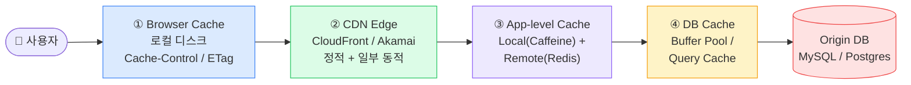
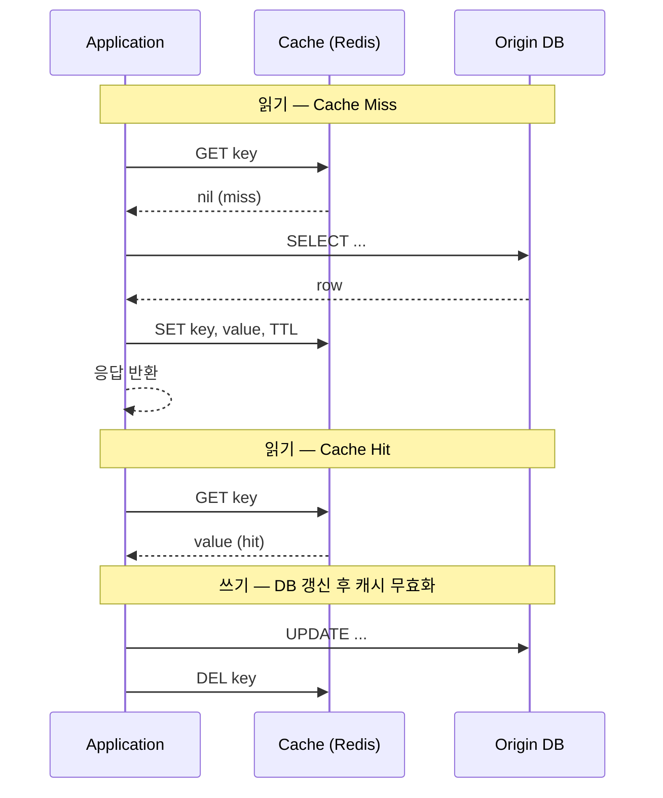
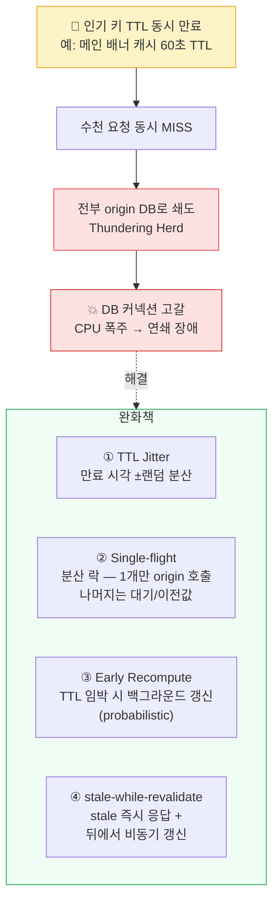
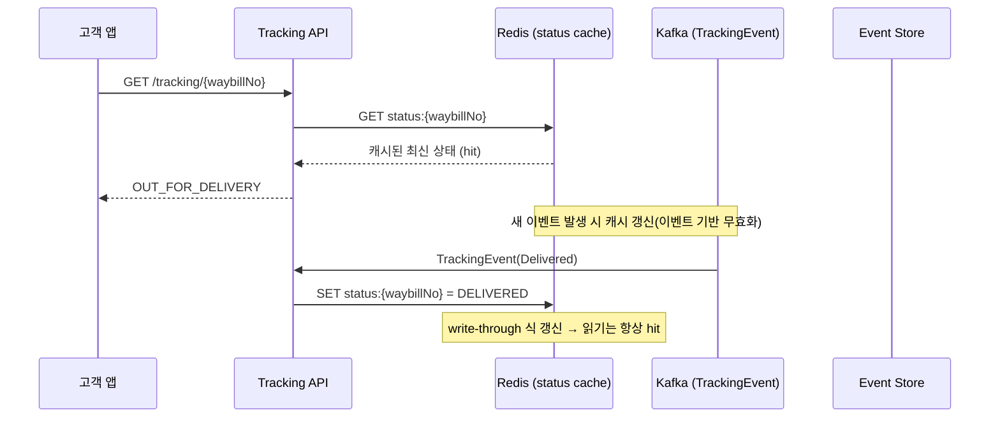

## 1. 캐시를 왜, 그리고 어디에

**캐시(Cache)**는 비싼 연산·느린 저장소의 결과를 빠른 저장소에 복제해 재사용하는 것이다. 핵심 동기는 두 가지다.

- **지연(Latency) 단축**: DB 디스크 조회(SSD seek ≈ 0.1ms, 인덱스 미스 시 수~수십 ms) → 메모리 캐시 hit ≈ 0.1~1ms. `p99` tail latency를 끌어내린다.
- **처리량(Throughput)·비용**: origin(원본 DB)의 QPS(Queries Per Second, 초당 쿼리 수) 부하를 흡수. DB 한 대가 5,000 QPS 한계라면, hit rate 90% 캐시는 origin QPS를 1/10로 줄인다.

### 캐시는 어디에나 있다 — 다층(Multi-layer) 구조

*캐시 계층 — 사용자에 가까울수록 빠르고 싸지만, 무효화(invalidation) 제어가 어려워진다*

> **💡 팁 — "가장 빠른 캐시는 호출하지 않는 캐시"**
>
> 계층마다 hit rate × 비용 × 무효화 난이도가 다르다. **Browser/CDN은 무효화가 가장 어렵고(이미 사용자 디스크에 박힘) latency 이득은 가장 크다.** 변동이 잦은 데이터일수록 origin에 가까운 App/DB 계층에서, 정적 자산일수록 Edge에서 캐싱하는 게 정석이다.

## 2. 캐시 패턴 5종 — 읽기/쓰기 경로 설계

패턴 선택의 본질은 두 질문이다. **(1) 캐시 미스(miss) 시 누가 DB를 읽고 채우나?** **(2) 쓰기(write)는 캐시·DB 중 어디를 먼저, 동기/비동기로?**

### Cache-aside (Lazy Loading) — 가장 흔한 기본형

*Cache-aside — 애플리케이션이 캐시와 DB를 직접 오케스트레이션. 쓰기는 보통 "DB 먼저, 캐시 DEL" (write-around 변형)*

> **⚠️ 실무 함정 — Cache-aside의 미묘한 경합(Race)**
>
> "DB UPDATE 후 캐시 DEL" 사이에 다른 스레드가 **옛 값을 읽어 캐시에 SET** 하면 stale 값이 다시 박힌다. 해결: 짧은 TTL 병행, `DEL` 대신 버전드 키, 또는 변경 직후 짧은 지연 후 재삭제(double-delete). 면접에선 "캐시는 갱신이 아니라 삭제(invalidate)한다"가 핵심 답.

### 패턴 비교표

| 패턴 | 읽기 동작 | 쓰기 동작 | 장점 | 단점 / 위험 | 적합 상황 |
| --- | --- | --- | --- | --- | --- |
| **Cache-aside** (Lazy loading) | miss 시 앱이 DB 읽고 캐시 채움 | DB 쓰고 캐시 DEL | 구현 단순, 캐시 장애 시 DB로 graceful fallback | 최초 miss 지연, 위 race, stale 가능 | 읽기 多, 범용 기본값 |
| **Read-through** | 캐시 라이브러리가 miss 시 직접 DB 로드 | (읽기 전용 관점) | 앱 코드 단순화, 로딩 로직 일원화 | 캐시 계층에 DB 의존성 결합, 첫 요청 느림 | 읽기 캐시 추상화(예: Spring Cache) |
| **Write-through** | read-through와 짝 | 캐시에 쓰면 캐시가 **동기로** DB도 씀 | 캐시·DB 항상 일치(강한 일관성) | 쓰기 지연↑(2곳 동기), 안 읽힐 데이터도 캐싱 | 읽기·쓰기 모두 잦고 일관성 중요 |
| **Write-back** (Write-behind) | 캐시 우선 | 캐시에만 먼저 쓰고 DB는 **비동기 배치** | 쓰기 지연 최소, 쓰기 폭주 흡수·병합 | **캐시 다운 시 데이터 유실**, 일관성 약함 | 조회수·좋아요 등 유실 허용 카운터 |
| **Write-around** | miss 시 채움(cache-aside와 동일) | DB에만 쓰고 캐시는 건드리지 않음 | "한 번 쓰고 잘 안 읽는" 데이터 캐시 오염 방지 | 쓴 직후 읽으면 무조건 miss | 로그·이력 등 write 후 즉시 안 읽는 데이터 |

> **🎯 면접 포인트 — Write-back 유실 위험**
>
> "쓰기 성능 위해 Write-back 쓰겠다"고 답하면 면접관은 곧장 **"캐시 노드가 죽으면 아직 DB에 안 내려간 쓰기는?"** 을 묻는다. 정답 방향: 유실 허용 데이터(좋아요 수)만 적용 / AOF·복제로 위험 완화 / 결제·재고 같은 정합성 필수 데이터엔 절대 금지. Trade-off를 명시하지 못하면 감점.

## 3. Eviction(축출) 정책 — 메모리는 유한하다

캐시 메모리가 차면 무엇을 버릴지 결정해야 한다. 정책 선택은 **접근 패턴(temporal vs frequency locality)**에 달렸다.

| 정책 | 버리는 기준 | 강점 | 약점 | 대표 쓰임 |
| --- | --- | --- | --- | --- |
| **LRU** (Least Recently Used) | 가장 오래 안 쓰인 항목 | 시간 지역성(temporal locality)에 강함, 직관적 | 일회성 대량 스캔이 hot set을 밀어냄(scan 오염) | 범용 1순위, Redis 기본 후보 |
| **LFU** (Least Frequently Used) | 가장 적게 접근된 항목 | 꾸준히 인기 있는 항목 보존 | 과거 인기 항목이 자리 점유(aging 필요), 카운터 비용 | 인기 편중 큰 데이터(Redis `allkeys-lfu`) |
| **FIFO** | 먼저 들어온 항목 | 구현 가장 단순 | 접근 빈도 무시 → hit rate 낮은 편 | 단순 큐형 캐시 |
| **TTL** (Time To Live) | 만료 시각 지난 항목 | stale 상한 보장, 시간 기반 자연 무효화 | 동시 만료 시 **Stampede** 유발 | 거의 모든 패턴과 병행(필수) |

> **💡 팁 — 실무에선 TTL + LRU/LFU 조합**
>
> TTL은 "정확성 상한(얼마나 stale을 허용하나)"을, LRU/LFU는 "메모리 압박 시 누구를 버리나"를 담당한다. 둘은 배타가 아니라 **병행** 이다. Redis는 `maxmemory-policy` 로 `allkeys-lru` , `allkeys-lfu` , `volatile-ttl` (TTL 가진 키 중 가까운 것부터) 등을 선택한다.

## 4. Redis 핵심 — 캐시의 사실상 표준

> **왜 Redis인가** — 단일 스레드 기반 인메모리 자료구조 서버. 단순 GET/SET을 넘어 *자료구조 연산을 원자적으로* 제공하는 것이 강점.

#### 주요 자료구조와 캐시 활용

- `String` — 직렬화 객체, 카운터(`INCR` 원자 증가)
- `Hash` — 객체 필드 부분 갱신(전체 역직렬화 회피)
- `Sorted Set(ZSET)` — 랭킹/리더보드, 시간순 피드
- `Set` — 중복 제거, 멱등성 키 집합
- `List` — 큐, 최근 N개
- `Bitmap / HyperLogLog` — 대규모 카디널리티(UV) 근사

### 단일 스레드 모델(Single-thread)

Redis의 명령 실행은 단일 스레드라 **명령 단위 원자성**이 공짜로 보장된다(락 불필요). 대신 `O(N)` 명령(`KEYS *`, 큰 `SMEMBERS`)이 이벤트 루프를 막아 전체 지연을 유발한다.

> **⚠️ 실무 함정 — O(N) 명령이 루프를 막는다**
>
> 운영에서 `KEYS pattern*` 은 금지. 대신 `SCAN` (커서 기반). 단일 스레드라 한 큰 명령이 모든 클라이언트를 정체시킨다. Big key(수십 MB 값)도 동일하게 위험.

### 영속성(Persistence) — RDB vs AOF

| 방식 | 원리 | 장점 | 단점 |
| --- | --- | --- | --- |
| **RDB** (스냅샷) | 주기적으로 메모리 전체를 덤프 | 파일 작음, 복구 빠름, fork로 메인 영향 적음 | 마지막 스냅샷 이후 쓰기 유실 가능 |
| **AOF** (Append Only File) | 쓰기 명령을 로그로 추가 | 유실 최소(`fsync` 정책에 따라 1초~즉시) | 파일 큼, 복구 느림, rewrite 필요 |

실무는 보통 **RDB + AOF 병행**. 다만 "캐시는 휘발성이어도 된다"는 관점에선 영속성을 끄고 origin을 single source of truth로 두기도 한다.

### 분산 — Redis Cluster

데이터를 **16384개 해시 슬롯**으로 나눠 노드에 분배(키의 CRC16 → 슬롯). 수평 확장과 슬롯 단위 리밸런싱이 가능. 단, **멀티키 연산은 같은 슬롯에 있어야** 하므로 `{user:123}:cart` 같은 hash tag로 같은 키 그룹을 한 슬롯에 모은다.

> **🎯 면접 포인트 — "Redis는 왜 빠른가?"**
>
> 단순히 "인메모리라서"는 절반짜리 답. (1) 메모리 + (2) 단일 스레드로 락·컨텍스트 스위치 비용 제거 + (3) I/O 멀티플렉싱(epoll) + (4) 효율적 자료구조 + (5) RESP 경량 프로토콜. 그리고 **그 단일 스레드가 곧 O(N) 명령의 위험** 이라는 양면을 함께 말해야 시니어답다.

## 5. CDN 캐싱과 캐시 무효화(Cache Invalidation)

**CDN(Content Delivery Network)**은 origin 콘텐츠를 전 세계 edge POP(Point of Presence)에 캐싱해 사용자와의 물리 거리를 줄인다(대륙 간 RTT ≈ 150ms → edge hit는 수~수십 ms). 정적 자산(JS/CSS/이미지)이 1차 대상이지만, 캐시 가능한 API 응답도 edge에 둘 수 있다.

#### 제어 헤더

- `Cache-Control: max-age, s-maxage, no-cache, private/public` — 캐시 수명·범위
- `ETag / If-None-Match` — 변경 없으면 `304 Not Modified`(본문 절약)
- `Vary` — 캐시 키 분기(언어·인코딩 등)

### 무효화 전략 — "캐시 무효화는 어렵다"

> **🎯 면접 단골 — 컴퓨터과학 2대 난제**
>
> Phil Karlton의 격언: *"There are only two hard things in Computer Science: cache invalidation and naming things."* 면접관이 이 말을 던지면, 핵심은 **"언제·어떻게 stale을 끊을 것인가"** 를 구체 전략으로 답하는 것이다.

- **TTL 만료(Passive)** — 가장 단순, 그러나 그 시간만큼 stale 허용
- **명시적 Purge(Active)** — 변경 시 CDN API로 특정 URL/경로 무효화(전파에 수초~수십초)
- **Versioned URL / Cache busting** — `app.v37.js`, `?v=hash`로 키 자체를 바꿔 새 객체로 취급(가장 안전, 영구 캐시 가능)
- **Key invalidation by tag** — surrogate key/tag로 연관 객체를 묶어 일괄 무효화

> **💡 팁 — 무효화하지 말고 "키를 바꿔라"**
>
> 정적 자산은 무효화(purge)보다 **해시 기반 파일명(content hash)** 이 정석이다. `main.a1b2c3.js` 처럼 내용이 바뀌면 파일명이 바뀌므로 무효화 자체가 불필요해지고, 옛 버전은 TTL로 자연 소멸한다. 네이버·토스 프론트 빌드가 모두 이 방식.

## 6. Thundering Herd / Cache Stampede 🔥(Deep-dive)

**Cache Stampede(쇄도)** = 인기 키 하나가 만료되는 순간, 수많은 요청이 동시에 miss → 전부 origin으로 몰려 DB가 폭주하는 현상. **Thundering Herd(천둥 같은 무리)**라고도 한다. hit rate 99%여도 1%의 동시 만료가 DB를 무너뜨릴 수 있다.

*Cache Stampede 발생 경로와 4가지 완화책 — 면접에선 최소 2개를 Trade-off와 함께 제시*

### 완화책 상세

- **① TTL Jitter** — TTL을 고정값이 아니라 `base ± random`으로. 같은 시각에 만든 캐시들이 한꺼번에 만료되는 걸 분산. 가장 싸고 즉효.
- **② 분산 락 / Single-flight** — miss 시 Redis `SET NX`로 락을 잡은 **한 요청만** origin을 호출하고 채운다. 나머지는 짧게 대기 후 캐시 재조회(또는 직전 stale 반환). Go의 `singleflight`, 자바 진영의 분산 락 패턴.
- **③ Early Recompute(Probabilistic)** — TTL이 다 되기 전에 확률적으로 미리 갱신(XFetch 알고리즘). 만료-순간 동시 miss 자체를 회피.
- **④ stale-while-revalidate** — 만료돼도 **stale 값을 즉시 응답**하고 백그라운드에서 갱신. HTTP `Cache-Control: stale-while-revalidate=N` 표준으로도 존재. 사용자 latency를 origin 갱신과 분리.

> **⚠️ 실무 함정 — Stampede를 아예 언급 안 하면 감점**
>
> "Redis로 캐싱하겠습니다"에서 멈추면, 면접관은 "그 인기 키가 만료되는 순간 DB는?"으로 압박한다. **Hot key + 동시 만료** 는 캐싱 설계의 필수 점검 항목. 또한 단순 락만 답하면 "락 잡은 요청이 느리거나 죽으면?"(락 타임아웃·stale 폴백)까지 이어진다.

## 7. 국내 빅테크 · 물류 사례

> **배민 — 메뉴/가게 캐시** — 메뉴·가게 정보는 **읽기:쓰기 비율이 압도적**. 피크(점심·저녁) 트래픽을 Redis 캐시로 흡수하고, 사장님이 메뉴를 바꾸면 해당 가게 키만 무효화(event 기반 invalidation). 잘못된 가격 캐싱은 곧 사고이므로 TTL을 짧게+이벤트 무효화 병행.

> **네이버 — 검색 결과·정적 자산 CDN** — 검색 자동완성·인기 검색어처럼 변동은 있지만 짧은 stale을 허용하는 데이터는 edge/근접 캐시로. JS/CSS는 content-hash 파일명으로 사실상 영구 캐시 + 배포 시 키 교체.

> **토스 — 잔액 캐시와 일관성** — 잔액·계좌 같은 **금융 정합성 필수** 데이터는 Write-back·긴 TTL 금지가 정석. 캐시하더라도 매우 짧은 TTL + 쓰기 시 즉시 무효화, 혹은 "Read-your-writes(자기 쓰기 즉시 반영)"를 위해 갱신 직후엔 캐시 우회(원본 조회). 일관성 > 약간의 latency.

### 물류 연결 — 라스트마일 추적 상태 캐싱

운송장 추적(`TrackingStatus`) 조회는 고객이 하루에도 수십 번 새로고침하는 **읽기 폭주** 패턴이다. 매번 origin(이벤트 저장소)을 때리면 비효율.

*라스트마일 추적 — 읽기는 캐시 hit, 상태 변경 이벤트가 올 때만 캐시 갱신(이벤트 기반 무효화). 조회 폭주를 origin과 분리*

> **💡 팁 — 추적 캐시는 "이벤트가 쓰고, 조회가 읽는다"**
>
> 추적 상태는 변경 빈도가 조회 빈도보다 훨씬 낮다. 그래서 **상태 변경 이벤트(Kafka)가 발생할 때만 캐시를 갱신(write-through 변형)** 하고, 폭주하는 조회는 전부 캐시 hit로 처리하는 게 정석. 동시 만료 stampede 방지를 위해 키별 TTL에 jitter를 준다.
