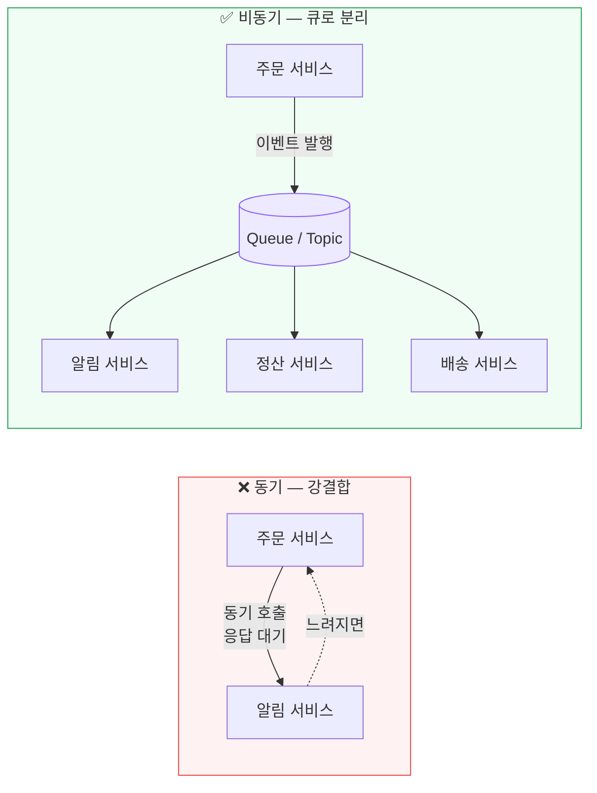
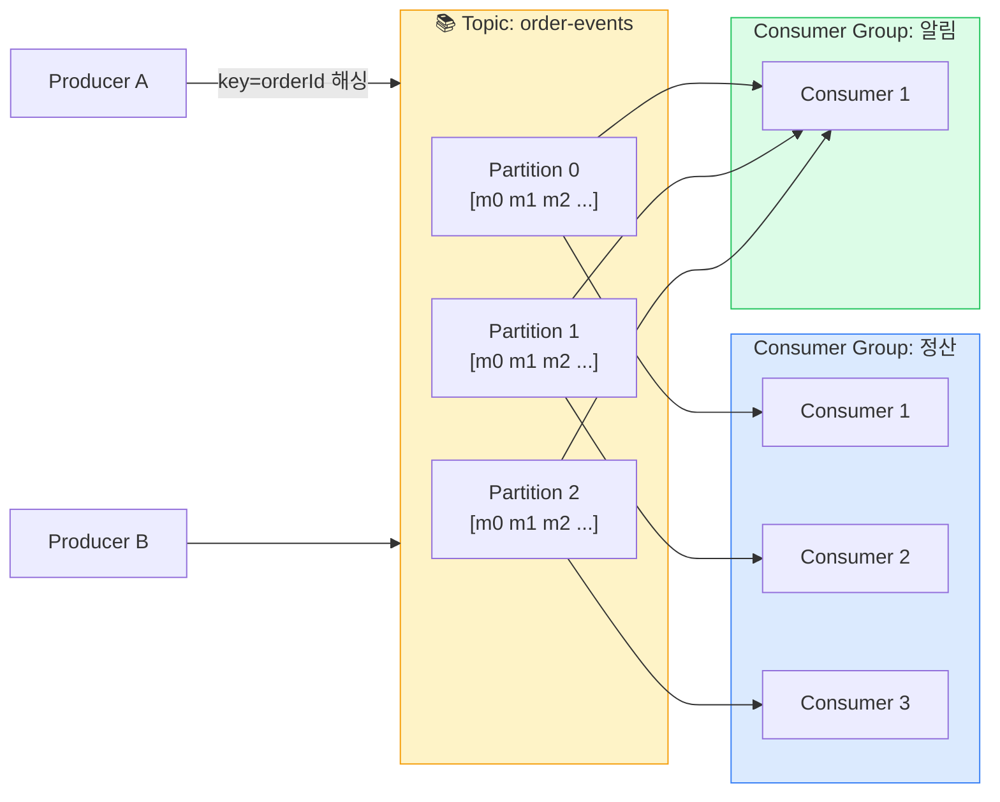
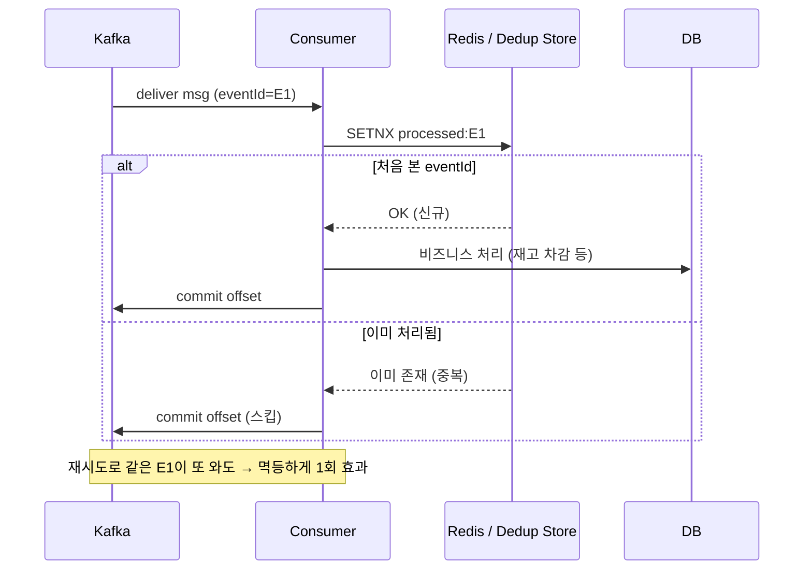
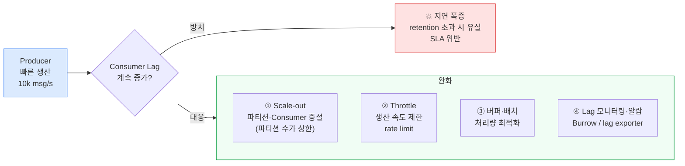
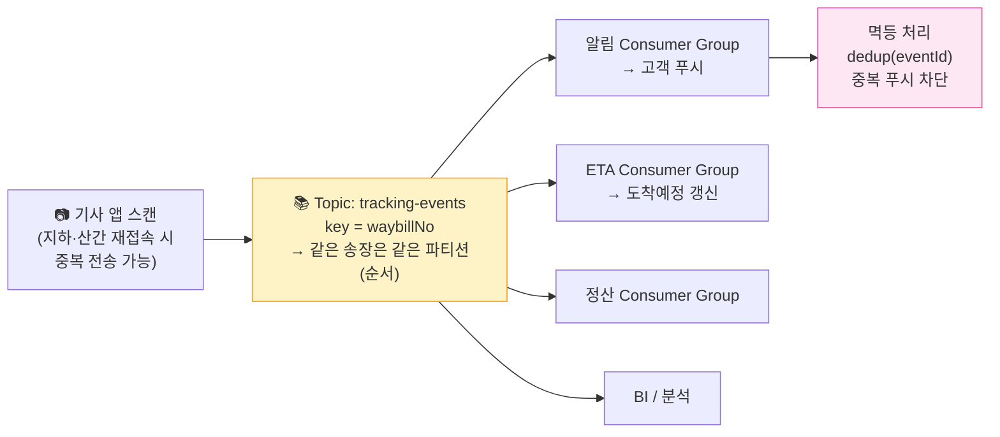

## 1. 왜 비동기 · 메시징인가

동기 호출(synchronous call)은 A가 B의 응답을 기다린다. B가 느리거나 죽으면 A도 같이 막힌다(연쇄 장애, cascading failure). 메시지 큐/스트림을 끼우면 셋이 달라진다.

- **결합도↓ (Decoupling)** — Producer는 Consumer가 누구인지·몇 개인지·살았는지 몰라도 된다. 새 소비자를 무중단으로 추가.
- **버스트 흡수 (Buffering / Load leveling)** — 순간 10배 트래픽이 와도 큐가 받아두고 Consumer가 자기 속도로 처리. 피크를 평탄화.
- **시간 분리 (Temporal decoupling)** — Consumer가 잠시 다운돼도 메시지는 큐에 보존 → 복구 후 이어서 처리. 가용성↑.

*동기 강결합 vs 비동기 분리 — 하나의 OrderPlaced 이벤트를 여러 소비자가 독립적으로 처리*

> **💡 팁 — 비동기는 공짜가 아니다**
>
> 대가로 **최종 일관성(Eventual Consistency), 디버깅 난이도, 순서·중복 문제** 를 떠안는다. "왜 동기 대신 비동기?"에 답할 때 이 Trade-off를 함께 말해야 한다. 강한 일관성과 즉시 응답이 필수면 동기가 맞다.

## 2. Message Queue vs Event Streaming

둘 다 "비동기 메시지"지만 사고방식이 다르다. 면접에서 Kafka와 RabbitMQ/SQS를 동일선상에 놓으면 감점이다.

| 관점 | Message Queue (RabbitMQ/SQS) | Event Streaming (Kafka) |
| --- | --- | --- |
| 핵심 비유 | 작업 분배 — "할 일 목록" | 분산 로그 — "사건 기록부" |
| 소비 후 | 보통 **소비 시 삭제(ack 후 제거)** | **보존(retention)** — 읽어도 안 사라짐 |
| 재생(Replay) | 어려움(이미 지워짐) | 쉬움 — offset 되감기로 과거 재처리 |
| 다중 구독 | 한 메시지 → 보통 한 워커가 처리(경쟁 소비) | 여러 Consumer Group이 **독립적으로** 전체 읽음 |
| 순서 | 큐 단위(또는 약함) | 파티션 단위 보장 |
| 적합 | 작업 분배, 태스크 큐, RPC 대체 | 이벤트 소싱, 로그 수집, 다중 소비·재처리 |

> **⚠️ 실무 함정 — "큐 = 스트림" 오해**
>
> "OrderPlaced를 알림·정산·배송 셋이 각자 처리"하려면 **다중 소비 + 재생** 이 필요 → 스트림(Kafka)이 적합. 반면 "이미지 리사이즈 작업을 워커 풀이 나눠 처리"는 **경쟁 소비 + 소비 후 삭제** → 큐(SQS)가 자연스럽다. 요구사항을 보고 둘을 구분해 답하라.

## 3. Kafka 핵심 — Topic / Partition / Offset / Consumer Group

*Topic은 N개 Partition으로 분할 → 병렬성 단위. 각 Consumer Group은 전체를 독립적으로 소비(정산·알림이 서로 영향 없음)*

#### 핵심 개념

- **Topic** — 메시지 카테고리(예: `order-events`).
- **Partition** — Topic을 나눈 단위. **병렬성·순서의 기본 단위**. 파티션 수 = 그 그룹의 최대 동시 소비자 수.
- **Offset** — 파티션 내 메시지의 순번. Consumer가 "어디까지 읽었나"를 offset으로 커밋.
- **Consumer Group** — 같은 그룹 내 Consumer들이 파티션을 나눠 가짐. 다른 그룹은 같은 데이터를 독립 소비.
- **Retention** — 시간(`retention.ms`)·크기 기준 보존. 그 안에선 언제든 offset 되감기 재처리.

### 순서 보장은 "파티션 단위"뿐 🔥(Deep-dive)

Kafka의 순서 보장은 **한 파티션 안에서만** 성립한다. Topic 전체(여러 파티션) 순서는 보장 안 된다. 그래서 "같은 주문의 이벤트는 순서대로 처리"하려면 **같은 키(orderId)로 같은 파티션에 보내야** 한다(`partition = hash(key) % N`).

> **🎯 면접 포인트 — "Kafka는 순서를 보장한다"는 위험한 단언**
>
> 이렇게 답하면 면접관은 즉시 "Topic 전체에 대해서요?"라고 되묻는다. 정답: **파티션 내에서만 보장** . 따라서 (1) 순서가 중요한 단위(주문/사용자)를 파티션 키로 잡고, (2) 키 분포가 한쪽으로 쏠리면 **Hot partition** 이 생겨 병렬성이 깨진다는 Trade-off까지 말해야 한다. 파티션을 늘리면 순서 단위가 더 잘게 쪼개지는 것도 함께.

## 4. Pub/Sub 패턴과 Fan-out

**Pub/Sub(Publish/Subscribe, 발행/구독)**는 발행자가 특정 수신자를 모른 채 토픽에 발행하고, 관심 있는 구독자들이 받는 패턴이다. **Fan-out(팬아웃)**은 한 메시지가 여러 소비자/대상으로 퍼지는 것.

- Kafka에서는 **Consumer Group 분리**로 자연스러운 fan-out — 그룹마다 전체 스트림을 독립 소비.
- 한 이벤트(`OrderPlaced`)가 알림·정산·배송·추천·BI로 동시에 흘러가도, 각 소비자는 서로의 처리 속도/장애에 무관.

> **💡 팁 — Fan-out의 두 방식**
>
> **Fan-out on write(쓰기 시 미리 뿌리기)** vs **Fan-out on read(읽을 때 모으기)** 는 뉴스피드 설계의 고전 Trade-off다. 팔로워 많은 셀럽 글을 쓸 때마다 수천만 명에게 미리 뿌리면(write fan-out) 쓰기 폭주가 난다. 하이브리드(보통은 write, 셀럽은 read)가 정석.

## 5. 전달 보장(Delivery Semantics)과 멱등 소비 🔥(Deep-dive)

| 보장 | 의미 | 장점 | 단점 | 구현 키 |
| --- | --- | --- | --- | --- |
| **At-most-once** (최대 1회) | 중복 없음, 단 유실 가능 | 가장 빠름, 단순 | 메시지 잃을 수 있음 | 먼저 commit 후 처리(fire-and-forget) |
| **At-least-once** (최소 1회) | 유실 없음, 단 중복 가능 | 유실 방지, 실무 기본값 | 중복 처리 필요 | 처리 후 ack/commit, 실패 시 재시도 |
| **Exactly-once** (정확히 1회) | 유실도 중복도 없음(이상) | 이상적 정확성 | **전 구간 보장은 사실상 불가/비쌈** | Kafka 트랜잭션은 Kafka↔Kafka 한정 |

> **🎯 면접 포인트 — "Exactly-once의 허상"**
>
> "Exactly-once로 하겠습니다"라고 단언하면 거의 탈락 신호다. Kafka의 EOS(Exactly-Once Semantics)는 **Kafka 내부(read→process→write to Kafka)에 한정** 되며, 외부 시스템(DB·결제·이메일 발송)으로의 부수효과까지는 보장하지 못한다. 메일을 두 번 보내는 건 Kafka가 막아줄 수 없다. **현업 정답: At-least-once + Idempotent consumer(멱등 소비자).** 중복이 와도 결과가 같도록 소비자 쪽에서 멱등성을 보장한다(처리 결과 동일성 = effectively-once).

### At-least-once + 멱등 소비 — 실제 흐름

*중복 메시지(E1 재전송)가 와도 dedup 키로 1회만 반영 — effectively-once*

#### 멱등 소비 구현 방법

- **Dedup 키** — 이벤트마다 고유 `eventId`로 처리 여부를 Redis/DB에 기록(`SETNX` 또는 unique 제약).
- **멱등 연산** — "잔액을 100으로 **설정**"은 멱등, "100 **증가**"는 비멱등. 가능하면 멱등 연산으로 모델링.
- **Upsert + 자연키** — `INSERT ... ON CONFLICT DO NOTHING`로 DB 제약이 중복을 흡수.
- **Outbox 패턴** — DB 트랜잭션과 메시지 발행의 원자성(이중 쓰기 문제)을 Outbox 테이블 + CDC(Change Data Capture)로 해결.

## 6. Back-pressure(배압)와 Consumer Lag

**Back-pressure(배압)** = 생산 속도가 소비 속도를 초과할 때, 시스템이 무너지지 않도록 상류로 "천천히"를 전달하는 메커니즘. Kafka에선 생산이 소비를 앞서면 **Consumer Lag(아직 안 읽은 메시지 수 = latest offset − committed offset)**가 쌓인다.

*Consumer Lag 증가 경로와 대응 — Kafka는 메시지를 보존하므로 일시적 lag은 흡수되지만, retention을 넘기면 유실*

> **⚠️ 실무 함정 — Consumer Lag 모니터링 누락**
>
> "Kafka 넣었으니 안전"이 아니다. **Lag이 꾸준히 증가** 하면 소비자가 못 따라가는 것이고, retention(예: 7일)을 넘기면 **읽지도 못한 메시지가 사라진다** . 면접·실무 모두 Lag 지표·알람(Burrow, Kafka exporter)과 scale-out 전략을 반드시 갖춰야 한다. 파티션 수가 소비 병렬성의 상한임도 기억할 것.

## 7. Kafka vs RabbitMQ vs AWS SQS

| 관점 | Kafka | RabbitMQ | AWS SQS |
| --- | --- | --- | --- |
| 모델 | 분산 로그(스트림) | 메시지 브로커(AMQP) | 완전관리형 큐 |
| 처리량 | 매우 높음(수십만~백만 msg/s) | 중간(수만) | 높음(거의 무제한, 관리형) |
| 순서 | 파티션 단위 보장 | 큐 단위(약함) | Standard 미보장 / FIFO 큐는 보장 |
| 재생(Replay) | 강점(offset 되감기) | 약함(소비 후 삭제) | 불가(삭제됨) |
| 라우팅 | 단순(토픽/파티션) | 강력(exchange·라우팅 키·바인딩) | 단순 |
| 운영 부담 | 높음(클러스터·ZK/KRaft 관리) | 중간 | 없음(서버리스) |
| 적합 | 이벤트 소싱·로그·대규모 fan-out·재처리 | 복잡한 라우팅·태스크 큐·낮은 지연 | AWS 환경 간단한 비동기·워커 큐 |

> **💡 팁 — 한 줄 선택 기준**
>
> **다중 소비·재처리·고처리량 → Kafka. 복잡한 라우팅·낮은 지연 태스크 큐 → RabbitMQ. AWS에서 운영 부담 없이 단순 비동기 → SQS.** "무조건 Kafka"는 over-engineering일 수 있다 — 운영 비용과 요구 처리량을 함께 따져라.

## 8. 빅테크 · 물류 사례

> **쿠팡 — 주문 이벤트 파이프라인(Kafka)** — 주문 한 건이 결제·재고·정산·배송·추천·BI 등 수십 개 컨슈머로 fan-out된다. Kafka로 **다중 소비 + 재처리**를 확보하고, 각 도메인은 독립 Consumer Group으로 소비. 장애 도메인이 전체를 막지 않도록 분리.

> **카카오 — 대규모 메시징** — 메시지 전송·푸시는 순간 버스트가 극심하다. 큐로 버스트를 흡수하고, 전달 보장은 **at-least-once + 멱등 처리**로 중복 발송을 억제. "정확히 한 번"을 보장하려다 무한 대기보단, 중복을 멱등하게 흡수하는 설계.

> **배민 — 주문 파이프라인** — 주문 접수 → 가게 수락 → 라이더 배차 → 배달 완료까지의 상태 이벤트를 비동기로 흘려 각 단계 서비스를 분리. 피크(점심·저녁) 버스트를 큐로 평탄화하고, 상태 순서가 중요한 단위는 주문 키로 파티셔닝.

### 물류 연결 — 수천만 TrackingEvent Fan-out + 멱등 소비

라스트마일에서 스캔·배차·배송완료 등 **운송장 추적 이벤트(TrackingEvent)**가 하루 수천만 건 발생한다. 이걸 고객 알림·ETA 갱신·정산·BI로 fan-out해야 한다.

*TrackingEvent fan-out — `waybillNo` 키로 송장별 순서 보장, eventId 기반 멱등 처리로 중복 알림 차단*

> **🎯 면접 포인트 — 물류 추적 설계 단골**
>
> "수천만 TrackingEvent를 어떻게 처리?"에서 핵심은 (1) **송장 키 파티셔닝** 으로 한 송장의 상태 순서 보장, (2) 기사 앱 오프라인 재접속의 **중복 전송** 을 멱등 소비로 흡수, (3) **Consumer Lag 모니터링** 으로 알림 지연 SLA 관리, (4) 키 쏠림(특정 메가허브 폭주)으로 인한 **Hot partition** 대응. 네 가지를 Trade-off와 함께 엮어야 시니어답다.
