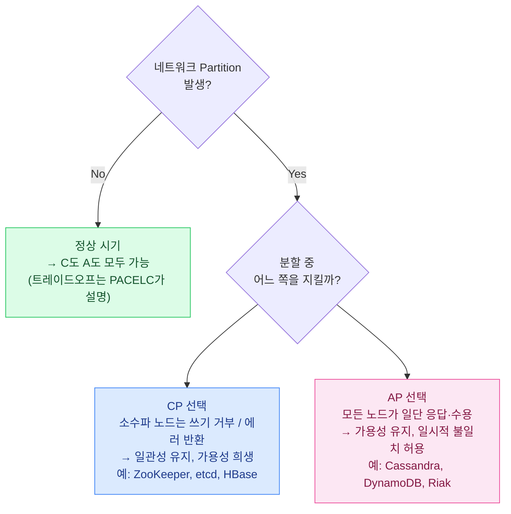
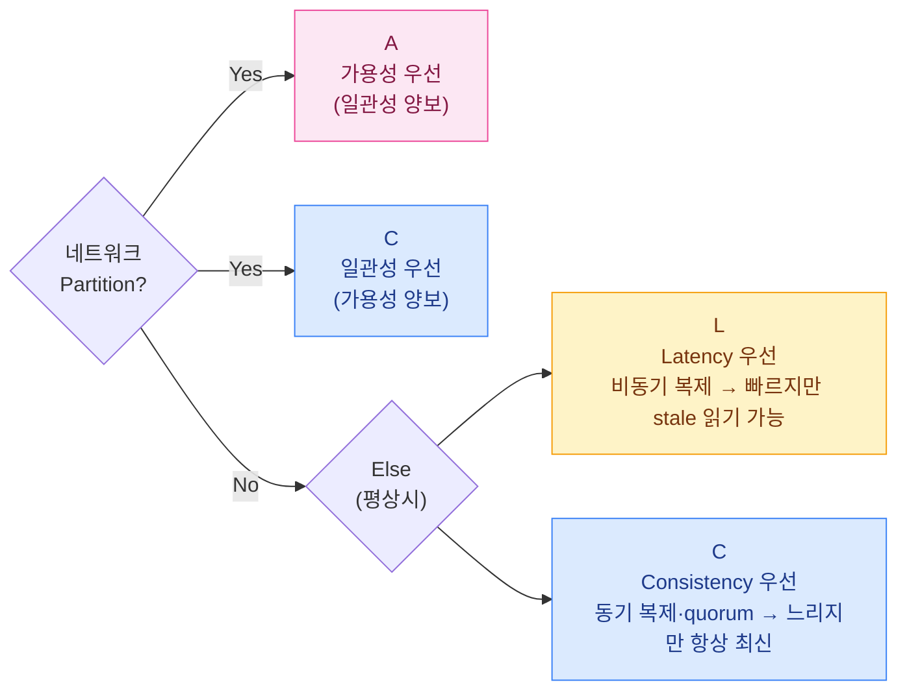
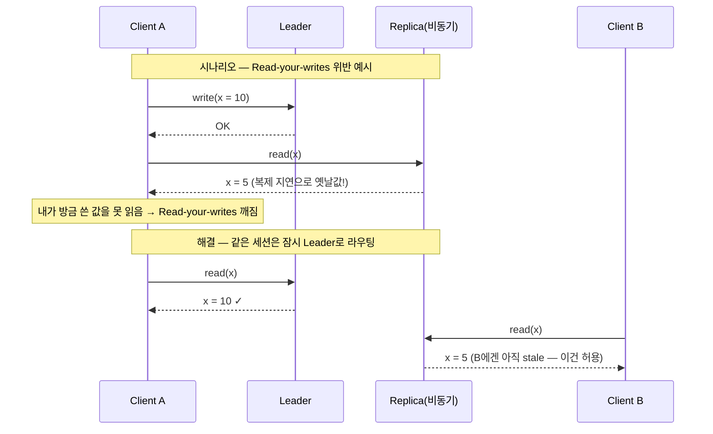
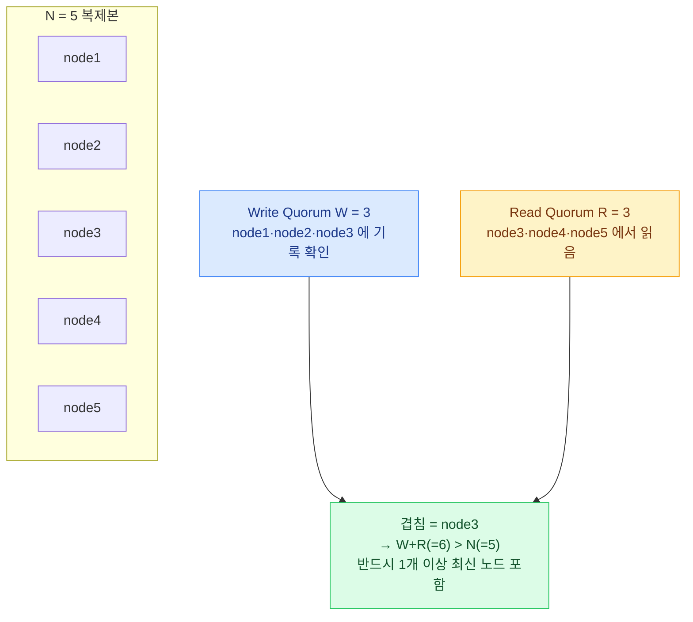
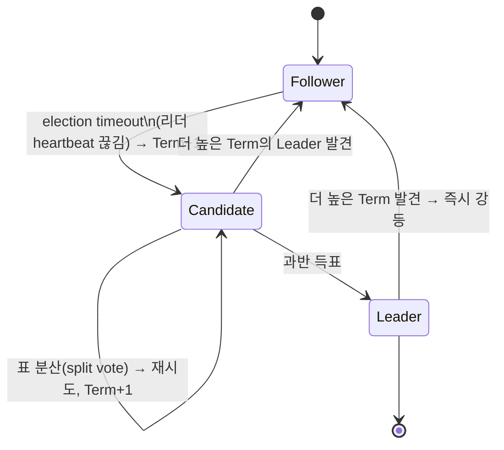
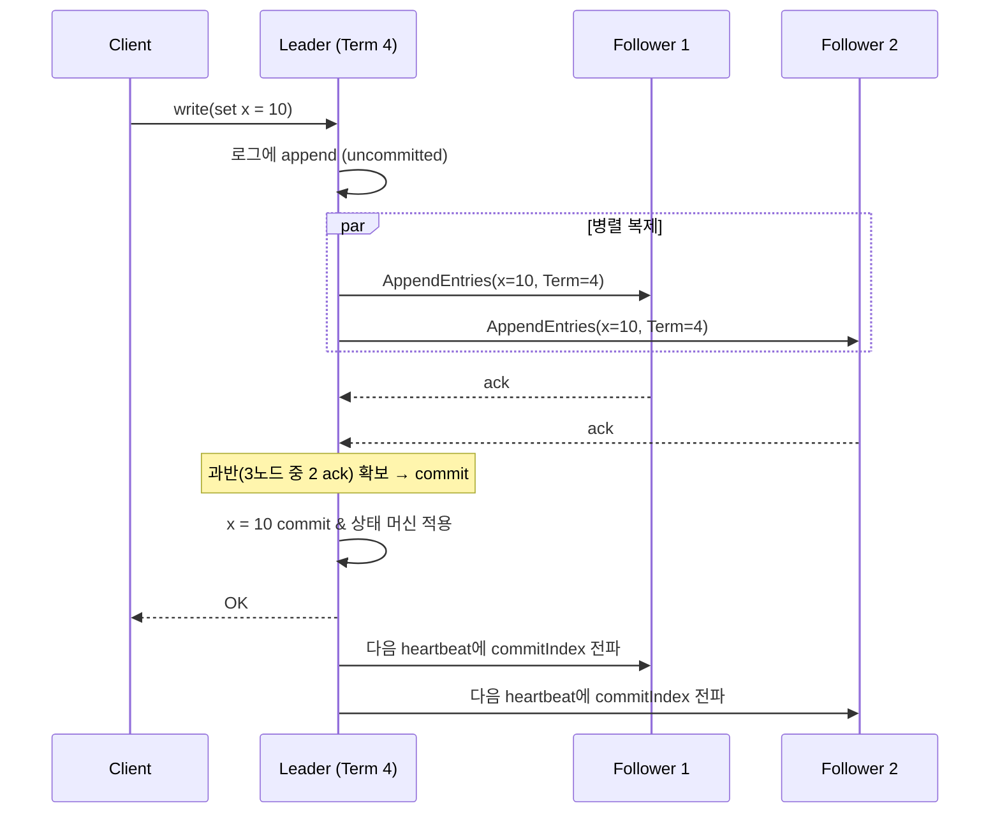
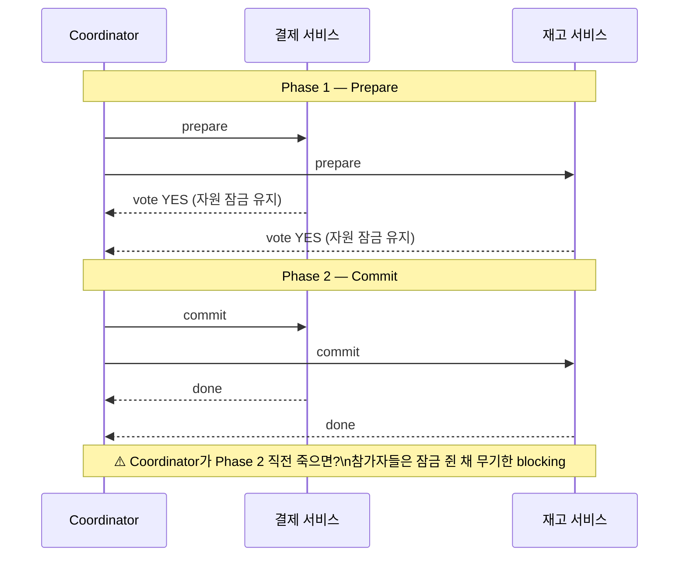
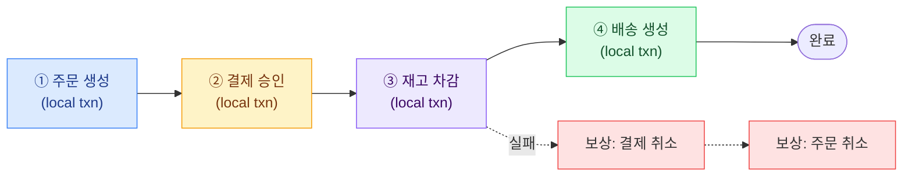

## 1. CAP 정리 — 파티션이 오면 둘 중 하나를 버린다

`CAP(Consistency 일관성, Availability 가용성, Partition tolerance 분할 내성)` 정리는 "셋 중 둘만 고른다"로 흔히 외워지지만, 이 요약은 **면접에서 감점 요인**이다. 정확한 명제는 다음과 같다.

> **정확한 진술** — 네트워크 *Partition(분할)*이 실제로 발생한 동안에는 *Consistency*와 *Availability*를 동시에 만족할 수 없다.

- 여기서 `Consistency`는 ACID의 C가 아니라 **Linearizability(선형성)** — "모든 노드가 같은 순간 같은 값을 본다"에 가까운 강한 일관성.
- 여기서 `Availability`는 "장애 노드를 제외한 모든 노드가 모든 요청에 응답한다".
- **P는 선택 항목이 아니다.** 분산 시스템은 광케이블 절단·스위치 장애·GC 멈춤으로 인한 네트워크 분할을 *피할 수 없다*. 따라서 현실의 선택은 "C냐 A냐"가 아니라 **"분할이 발생했을 때 C를 지킬 것이냐(CP), A를 지킬 것이냐(AP)"**이다.

*CAP의 본질 — "P를 버린다"는 선택지는 존재하지 않는다. P는 전제, 선택은 C vs A.*

> **🎯 면접 함정 #1**
>
> "저희는 P를 버리고 CA 시스템을 쓰겠습니다"라고 말하면 즉시 감점. **분산 시스템에서 P는 버릴 수 없다.** CA 시스템은 단일 노드 RDBMS처럼 네트워크 분할이 애초에 없는 환경에서만 성립한다. 분산을 전제로 한 질문에서 CA를 답으로 내놓으면 "분산 환경을 이해하지 못했다"는 신호다.

> **⚠️ 실무 함정 — "CP면 항상 멈춘다"는 과장**
>
> CP라고 모든 요청이 막히는 게 아니다. **분할 중 소수파(minority) 쪽 노드만** 쓰기를 거부한다. 과반(quorum)을 확보한 다수파는 정상 동작한다. 즉 "5대 중 2대가 고립" → 그 2대만 거부, 3대는 정상. 토스 송금 같은 CP 시스템도 평시엔 멀쩡히 빠르다.

## 2. PACELC — CAP가 놓친 "평상시"를 채운다

CAP는 분할이 발생한 순간만 다룬다. 하지만 분할은 드물고, 시스템은 **대부분의 시간을 정상 상태로** 보낸다. `PACELC`는 이 빈틈을 메운다.

> **읽는 법** — **if P**(분할 시) **then A or C** **else**(평상시) **L or C** — 즉 분할 땐 가용성/일관성, 평상시엔 지연(Latency)/일관성을 저울질한다.

*PACELC 의사결정 트리 — 같은 AP 계열도 평상시 정책(EL vs EC)에서 갈린다.*

### 대표 분류 (PACELC 표기)

| 시스템 | PACELC | 해석 |
| --- | --- | --- |
| Cassandra (기본 튜닝) | **PA / EL** | 분할 시 가용성, 평상시 지연 우선 — 최신성보다 빠른 응답 |
| DynamoDB | **PA / EL** | 가용성·저지연 우선. 단, 옵션으로 강한 일관성 읽기 선택 가능 |
| MongoDB | **PA / EC** | 분할 시 가용성 쪽이지만, 평상시 primary 읽기는 일관성 우선 |
| HBase, BigTable | **PC / EC** | 분할 시에도 평상시에도 일관성을 끝까지 우선 |
| VoltDB / 단일 리전 RDBMS | **PC / EC** | 일관성을 위해 지연·가용성 모두 양보 |

> **💡 PACELC를 면접에서 쓰는 법**
>
> "이 시스템 CAP에서 뭐예요?"라는 질문에 **"AP인데, 평상시엔 EL이라 stale read를 감수합니다. 단, 결제 경로만 강한 일관성 읽기로 EC로 바꿉니다"** 처럼 답하면 한 단계 위로 보인다. 하나의 시스템 안에서도 경로별로 다른 일관성을 쓸 수 있다는 점이 핵심.

## 3. 일관성 모델 — Strong에서 Eventual까지의 스펙트럼

일관성은 0/1이 아니라 **스펙트럼**이다. 강할수록 추론하기 쉽지만 지연·가용성을 더 내준다. 면접에서는 "강한 일관성=무조건 좋다"가 아니라 **"이 경로엔 이 정도 일관성이면 충분하다"**를 고를 줄 알아야 한다.

| 모델 | 보장 내용 | 비용 | 적합한 곳 |
| --- | --- | --- | --- |
| **Strong / Linearizable (강한 일관성·선형성)** | 쓰기 완료 후 모든 읽기가 즉시 최신값. 전역 단일 시점처럼 동작 | 합의·quorum 필요 → 지연 ↑, 분할 시 가용성 ↓ | 잔액·재고 차감·좌석 예약·분산 락 |
| **Causal (인과 일관성)** | 인과관계 있는 연산만 순서 보장 (A→B면 모두가 A 먼저 봄). 무관한 연산은 순서 자유 | 벡터 클럭 등 메타데이터, 중간 비용 | 댓글·답글 스레드, 채팅 메시지 순서 |
| **Read-your-writes (자기 쓰기 읽기)** | 내가 쓴 값은 내가 반드시 다시 읽을 수 있음 (남에겐 늦게 보여도 됨) | 세션 고정(sticky)·write 후 leader 읽기로 구현. 낮음 | 프로필 수정 직후 본인 화면, 장바구니 |
| **Monotonic read (단조 읽기)** | 한 번 최신값을 봤으면 그 뒤엔 더 옛날 값으로 후퇴하지 않음 | 같은 replica로 라우팅 고정. 낮음 | 타임라인·피드 새로고침 시 역행 방지 |
| **Eventual (최종 일관성)** | 쓰기가 멈추면 "언젠가" 모든 노드가 수렴. 그 사이 stale 읽기 허용 | 가장 저렴. 지연 ↓, 가용성 ↑ | 조회수·좋아요 수, 배송 추적 표시 |

*최종 일관성 환경에서 Read-your-writes를 보장하는 라우팅 — 본인은 Leader, 타인은 Replica.*

> **🎯 면접 함정 #2 — "Strong = 무조건 느림"으로 단정**
>
> Strong 일관성이 비싼 건 맞지만 **"그래서 절대 못 쓴다"는 과장** 이다. 단일 리전·소수 노드 quorum이면 강한 일관성도 한 자릿수 ms로 가능하다. 토스 송금은 강한 일관성을 쓰면서도 응답은 빠르다 — 리전 내 합의라 RTT가 0.5ms 수준이기 때문. 비싼 건 **"대륙 간 동기 복제"** (RTT 150ms)일 때다. "어느 범위의 강한 일관성이냐"를 구분하라.

> **💡 물류 도메인 매핑**
>
> **라스트마일 배송 추적(TrackingEvent 표시)** → `Eventual` 로 충분. 화면에 "허브 도착"이 0.5초 늦게 떠도 사고가 아니다. **풀필먼트 재고 차감(Available 감소)** → `Strong` 필수. stale 읽고 oversell(초과판매)하면 실물 없는 주문이 발생한다. 같은 시스템 안에서도 경로별로 일관성을 다르게 쓴다.

## 4. Quorum(정족수) — W + R > N 의 산수

복제본 `N`개를 두는 시스템에서, 쓰기를 `W`개 노드가 확인하고 읽기를 `R`개 노드에서 받아오면, **W + R > N**일 때 읽기 집합과 쓰기 집합이 *최소 1개 노드에서 겹쳐* 최신값을 반드시 포함한다. 이것이 quorum 일관성의 핵심 부등식이다.

*N=5, W=3, R=3 — W+R>N 이므로 읽기·쓰기 집합이 node3에서 겹쳐 최신값 보장.*

### W·R 조합의 Trade-off

| 설정 (N=3) | 특성 | 장점 | 단점 |
| --- | --- | --- | --- |
| **W=3, R=1** | 쓰기 무겁고 읽기 가벼움 | 읽기 빠름·읽기 가용성↑ | 한 노드만 죽어도 쓰기 불가 |
| **W=1, R=3** | 쓰기 가볍고 읽기 무거움 | 쓰기 빠름·쓰기 가용성↑ | 한 노드만 죽어도 읽기 불가 |
| **W=2, R=2** | 균형 (W+R=4>3) | 노드 1개 장애 견딤·일관성 유지 | 읽기·쓰기 둘 다 중간 지연 |
| **W=1, R=1** | W+R=2 ≤ 3 → quorum 깨짐 | 가장 빠름·가용성 최고 | **최종 일관성**으로 떨어짐 (stale 읽기) |

> **⚠️ 실무 함정 — quorum이 "동시 충돌"까지 막아주진 않는다**
>
> W+R>N은 *최신값을 읽을 수 있음* 만 보장한다. 두 클라이언트가 동시에 같은 키를 쓰면 **충돌(conflict)** 이 생기고, Dynamo 계열은 이를 `vector clock` + 애플리케이션 머지(또는 last-write-wins)로 해결한다. quorum은 합의(consensus)가 아니다 — 순서까지 합의하려면 Raft/Paxos가 필요하다.

## 5. Consensus — Raft 개요 🔥(Deep-dive)

`Consensus(합의)`는 "여러 노드가 **하나의 값/순서에 모두 동의**"하게 만드는 문제다. Raft는 Paxos의 난해함을 줄인 합의 알고리즘으로, etcd·Consul·TiKV·CockroachDB가 채택했다. 세 축으로 이해하면 된다: **Leader election(리더 선출)**, **Log replication(로그 복제)**, **Term(임기)**.

### ① Leader election + Term

- 노드는 **Follower → Candidate → Leader** 상태를 가진다.
- Follower가 일정 시간(election timeout) 동안 리더의 heartbeat를 못 받으면 `Term`(임기 번호)을 +1 하고 Candidate가 되어 투표를 요청한다.
- 과반 표를 얻으면 Leader. `Term`은 단조 증가하며, 오래된 Term의 메시지는 무시된다 — 이것이 **split-brain(분열 뇌)**을 막는 핵심.

*Raft 상태 머신 — Term이 더 높은 노드를 만나면 무조건 Follower로 강등(split-brain 방지).*

### ② Log replication

모든 쓰기는 Leader를 거친다. Leader가 로그 엔트리를 append하고 Follower들에게 복제한 뒤, **과반(quorum)이 기록을 확인하면 commit**하고 클라이언트에 응답한다.

*Raft 로그 복제 — Leader가 과반 ack를 받은 뒤에야 commit하고 응답한다. 이것이 강한 일관성의 원천.*

> **🎯 면접 포인트 — 왜 홀수 노드(3, 5, 7)인가**
>
> 과반(quorum) = ⌊N/2⌋+1. **N=3이면 2, N=5면 3** 이 과반. 4노드는 과반이 3이라 3노드(과반 2)보다 장애 내성이 같으면서(둘 다 1대 장애 허용) 비용만 늘어 비효율. 그래서 합의 클러스터는 거의 항상 홀수다. "왜 ZooKeeper를 3대나 5대로 두나요?"의 답이 여기 있다.

> **💡 사례 — 카카오톡 메시지 순서 & 분산 락**
>
> 카카오톡처럼 **한 대화방 안 메시지 순서** 를 보장하려면 그 방의 쓰기를 단일 리더로 직렬화(혹은 시퀀서)해야 한다. 합의 기반 시스템(ZooKeeper/etcd)은 분산 락·리더 선출·메타데이터 저장에 쓰여, 토스의 멱등 처리나 좌석 예약 직렬화의 토대가 된다.

## 6. 분산 트랜잭션 — 2PC의 한계와 Saga

여러 서비스/DB에 걸친 원자성은 `2PC(Two-Phase Commit, 2단계 커밋)`로 풀려고 시도되어 왔다. 코디네이터가 ① **prepare**(모두 준비됐나?) ② **commit/abort** 두 단계로 진행한다.

*2PC 흐름 — 평시엔 원자적이지만, Coordinator 단일 장애 시 참가자가 잠금을 쥔 채 멈춘다.*

### 2PC의 한계

- **Blocking**: 코디네이터가 commit 결정 직후 죽으면 참가자는 commit/abort를 몰라 *잠금을 쥔 채 무기한 대기*. 가용성 치명타.
- **동기·잠금 기반**: prepare~commit 사이 자원이 잠겨 처리량(QPS)이 급락. 마이크로서비스·고트래픽엔 부적합.
- **단일 장애점(SPOF, Single Point of Failure)**: 코디네이터 자체가 SPOF. (3PC, Paxos-Commit으로 보완 시도하지만 복잡·여전히 느림.)

> **🎯 면접 함정 #3 — "2PC 쓰면 분산 트랜잭션 다 해결"**
>
> "주문-결제-재고를 2PC로 묶겠습니다"는 위험 신호. 면접관은 **"코디네이터가 죽으면?"** 으로 곧장 압박한다. 현대 MSA는 2PC 대신 `Saga(사가)` + `Outbox` + `멱등 소비자` 로 **최종 일관성** 을 택하는 게 정석. "강한 원자성 대신 보상 트랜잭션으로 일관성을 맞춘다"가 답.

### Saga 패턴 개요 🔥(Deep-dive)

Saga는 긴 트랜잭션을 **로컬 트랜잭션의 연쇄**로 쪼개고, 중간 실패 시 **보상 트랜잭션(Compensating Transaction)**으로 되돌린다. 잠금을 길게 쥐지 않아 가용성·처리량이 높지만, *격리성이 약해져* 중간 상태가 외부에 노출될 수 있다.

*Saga — 재고 차감 실패 시 결제·주문을 보상 트랜잭션으로 역순 롤백. 2PC의 잠금 대신 최종 일관성.*

> **⚠️ 실무 함정 — Saga는 공짜가 아니다**
>
> 보상 로직을 **모든 실패 경로마다** 설계해야 하고, 보상이 또 실패하면? 멱등성과 재시도, dead-letter가 필수다. 또 ③ 재고가 차감된 중간 상태에서 사용자가 조회하면 "있던 재고가 사라진" 비격리 현상을 볼 수 있다. **"Saga가 2PC보다 항상 낫다"가 아니라, 강한 격리가 필요 없을 때만 우월** 하다.

## 7. CP / AP 시스템 분류 — 어디에 무엇을 쓰나

| 시스템 | CAP 성향 | 일관성 모델 | 전형적 용도 |
| --- | --- | --- | --- |
| **ZooKeeper / etcd** | **CP** | Linearizable (합의 기반) | 분산 락·리더 선출·서비스 디스커버리·설정 저장 |
| **HBase / BigTable** | **CP** | Strong (region 단위) | 대용량 OLTP·시계열·로그 분석 백엔드 |
| **Spanner / CockroachDB** | **CP** | 외부 일관성 / Serializable | 글로벌 분산 + 강한 일관성이 동시에 필요할 때 |
| **Cassandra** | **AP** | Tunable (W·R로 조절) | 쓰기 폭주·시계열·로그·피드 |
| **DynamoDB / Riak** | **AP** | Eventual (옵션으로 Strong 읽기) | 세션·장바구니·카탈로그·고가용 KV |
| **MySQL/PostgreSQL (단일 노드)** | CA 영역* | Serializable~RC | * 분할이 없는 단일 노드라 CAP 논의 밖. 복제 붙이면 PACELC 적용 |

> **💡 설계 한 줄 요약**
>
> **"틀린 답을 빠르게 주느니, 늦게라도 맞는 답을 줘야 하는 경로"** (잔액·재고·예약) → `CP` . **"좀 틀려도 되니 항상 응답해야 하는 경로"** (피드·좋아요·추적 표시) → `AP` . 하나의 서비스 안에서도 경로별로 다른 저장소·일관성을 섞는 게 시니어의 설계다. 토스 = 송금 CP + 알림 AP, 쿠팡 = 재고 CP + 상품 추천 AP.
