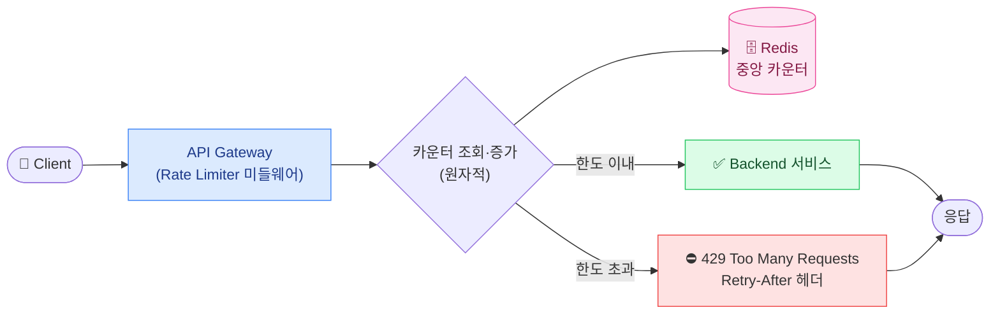
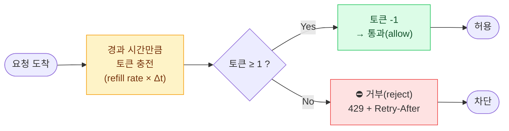
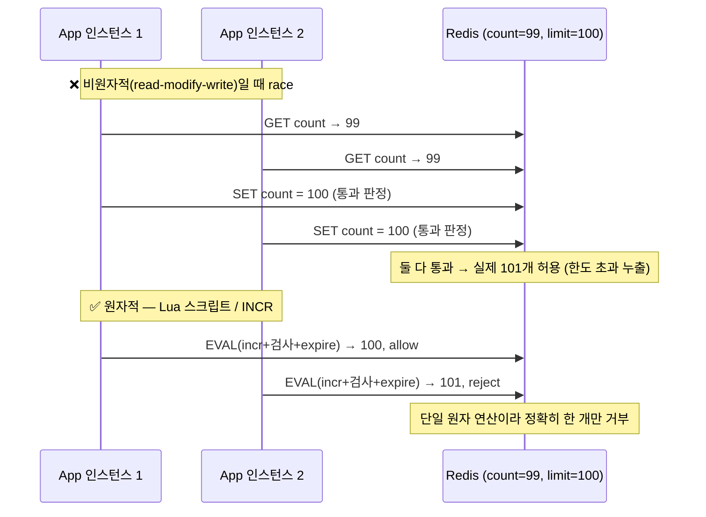

## 1. 요구사항 명확화 — 묻지 않으면 떨어진다

면접에서 바로 그림을 그리면 감점이다. `Rate Limiter(요청 제한기)`는 "누구당 / 무엇을 기준으로 / 몇 개를" 막을지부터 합의해야 한다.

### Functional 요구사항

- **제한 단위(key)**: `user ID` / `IP` / `API key` / 엔드포인트별 — 보통 복합 (예: API key + endpoint).
- **제한 규칙**: 예) "API key당 **100 req/sec**, IP당 **1,000 req/min**". 규칙이 다층(layered)일 수 있음.
- **초과 시 동작**: 거부(`429`) / 큐잉(throttle) / soft-limit 경고. 그리고 **클라이언트에게 언제 재시도할지 알려주기**(`Retry-After`).

### Non-functional 요구사항

| 속성 | 목표 | 이유 |
| --- | --- | --- |
| **Low latency** | Rate Limiter 자체가 p99 < 1~2ms 추가 | 모든 요청 경로에 끼므로 느리면 전체가 느려짐 |
| **분산 정확성** | 여러 서버 인스턴스가 같은 카운터를 공유 | 인스턴스별 로컬 카운터면 N대일 때 한도가 N배로 샘 |
| **High availability** | Limiter 장애 시 fail-open or fail-close 정책 명시 | Limiter가 죽었다고 전 서비스가 막히면 안 됨(보통 fail-open) |
| **정확도 vs 메모리** | 알고리즘 선택의 핵심 축 | 정밀할수록 메모리/연산 ↑ — 트레이드오프 |

> **🎯 면접 포인트 — 먼저 물어야 할 질문**
>
> "글로벌인가 리전별인가?", "제한 단위가 user인가 IP인가?", "soft/hard limit?", "Limiter가 죽으면 fail-open인가?" — 이 질문들을 먼저 던지는 것만으로 시니어 신호다. **요구사항 명확화 단계를 건너뛰고 바로 Token Bucket을 그리면 감점.**

## 2. 용량 추정 — 숫자로 메모리를 잡는다

### QPS 추정

전제: 하루 **1억(108) 요청**이 들어오는 API.

- 1 day ≈ 105 초 (정확히 86,400s).
- 평균 `QPS(Queries Per Second, 초당 쿼리 수)` = 108 / 105 = **약 1,000 QPS**.
- 피크는 평균의 5~10배 → **약 5,000 ~ 10,000 QPS**로 잡고 설계.

### 카운터 메모리 추정

제한 단위(고유 user/IP/key)별로 카운터 하나가 필요하다. 활성 사용자를 **1,000만(107)**으로 가정.

- 키 1개당 메모리: 카운터(int 8B) + 타임스탬프/만료 + Redis 키 오버헤드 ≈ **약 50~100 B**로 보수적 추정.
- 총 메모리 = 107 × 100 B = **약 1 GB**. → 단일 Redis 노드 메모리(수십 GB)로 충분히 수용.
- Sliding Window Log처럼 **요청마다 타임스탬프를 저장**하는 알고리즘은 키당 메모리가 수십~수백 배로 폭증 → 메모리가 병목이 된다(아래 비교표 참조).

> **💡 추정의 결론을 설계로 연결**
>
> "1억 req/day → 피크 1만 QPS, 카운터 메모리 ~1GB → 단일 Redis로 가능하지만 1만 QPS면 Redis가 SPOF & 병목 후보. 따라서 **Redis 클러스터 + 키 샤딩** 또는 **로컬 캐시 + 중앙 동기화 하이브리드** 를 검토한다." — 추정이 곧바로 아키텍처 결정 근거가 되어야 한다.

## 3. API / 데이터 모델

### 응답 규약

- 허용: 정상 처리, 응답 헤더에 `X-RateLimit-Limit`, `X-RateLimit-Remaining`, `X-RateLimit-Reset`.
- 초과: HTTP `429 Too Many Requests` + `Retry-After: 5`(초). 클라이언트는 이 값만큼 백오프해야 함.

### 데이터 모델 (Redis)

- 키 설계: `rl:{scope}:{id}:{window}` 예) `rl:apikey:AK123:1719800000`.
- Fixed/Sliding Counter: 값은 정수 카운터. `INCR` + `EXPIRE`.
- Token Bucket: 값은 `{tokens, last_refill_ts}` 해시. 요청 시 경과시간만큼 토큰 충전 후 차감.
- Sliding Window Log: `ZSET`(sorted set), score=timestamp. 윈도 밖 원소 제거(`ZREMRANGEBYSCORE`) 후 `ZCARD`로 개수 확인.

> **⚠️ 실무 함정 — INCR + EXPIRE의 원자성**
>
> `INCR` 후 별도로 `EXPIRE` 를 호출하면, 그 사이 프로세스가 죽으면 **만료 없는 영구 키** 가 남아 메모리 누수가 된다. `SET key val EX 60 NX` 나 **Lua 스크립트로 INCR+EXPIRE를 원자적으로** 묶어야 한다. 면접에서 "INCR 하고 EXPIRE 걸면 됩니다"라고만 하면 이 함정을 지적당한다.

## 4. High-level 아키텍처

*요청 → Gateway의 Rate Limiter → Redis 중앙 카운터 → allow(서비스) / reject(429).*

### Rate Limiter를 어디에 둘까

| 위치 | 장점 | 단점 |
| --- | --- | --- |
| **API Gateway 단** (Kong, AWS API GW, Nginx) | 중앙 집중·서비스 코드 무관·운영 일원화 | 게이트웨이가 병목·SPOF 후보, 세밀한 비즈니스 규칙 표현 한계 |
| **애플리케이션 미들웨어** | 비즈니스 컨텍스트 활용(등급별 한도 등) 쉬움 | 서비스마다 중복 구현·일관성 관리 부담 |
| **사이드카(Sidecar)** (Envoy, Service Mesh) | 앱 무관·언어 무관·메시 차원 일괄 정책 | 인프라 복잡도↑, 메시 도입 전제 |

> **💡 사례 — 어디서 막나**
>
> **토스·카카오 오픈 API** 는 게이트웨이 단에서 API key별 rate limit을 1차로 건다. 그 뒤 결제·송금 같은 민감 경로는 애플리케이션 레벨에서 user별 2차 제한을 추가하는 **다층 방어(layered)** 가 흔하다. "한 군데서만 막는다"보다 "엣지에서 거칠게 + 앱에서 정밀하게"가 현실적.

## 5. Deep-dive 🔥(Deep-dive)

### 5-1. 알고리즘 5종 비교 (반드시 외울 표)

| 알고리즘 | 동작 | 정확도 | 메모리 | 버스트 허용 |
| --- | --- | --- | --- | --- |
| **Token Bucket (토큰 버킷)** | 버킷에 일정 속도로 토큰 충전, 요청마다 1개 소비. 토큰 있으면 통과 | 높음 | 적음 (키당 토큰+ts) | **허용** — 쌓인 토큰만큼 순간 버스트 OK |
| **Leaky Bucket (리키 버킷)** | 큐에 쌓고 일정 속도로 처리(누수). 큐 차면 drop | 높음 | 적음 (큐 길이) | **억제** — 출력률 일정, 트래픽 평활화 |
| **Fixed Window Counter (고정 윈도)** | 1분 같은 고정 구간 카운터, 경계마다 리셋 | 낮음 | 가장 적음 (정수 1개) | **경계 버스트 위험** — 한도 2배 누출 가능 |
| **Sliding Window Log (슬라이딩 로그)** | 요청 타임스탬프를 모두 저장, 윈도 내 개수로 판정 | **가장 정확** | **가장 많음** (요청마다 1 엔트리) | 정밀 차단 |
| **Sliding Window Counter (슬라이딩 카운터)** | 현재+이전 고정 윈도 카운터를 가중 평균으로 근사 | 높음 (근사) | 적음 (카운터 2개) | 경계 문제 완화·실무 최선의 균형 |

> **🎯 면접 함정 #1 — Fixed Window 경계 버스트**
>
> 한도 "100 req/min"에서 **0:59에 100개 + 1:00에 100개** 가 오면, 윈도가 리셋되며 **2초 안에 200개** 가 통과한다 — 의도한 한도의 2배. 이 "경계(boundary) 버스트"를 모르고 Fixed Window를 추천하면 즉시 지적당한다. 해법: **Sliding Window Counter** 로 이전 윈도를 가중 반영. 이걸 설명하면 면접의 핵심 한 방을 통과한 것.

*Token Bucket 동작 — 요청 시점에 경과시간만큼 토큰을 채우고(lazy refill), 1개 차감 가능하면 통과.*

### 5-2. 분산 환경 — race condition 🔥(Deep-dive)

서버 인스턴스가 여러 대면 로컬 카운터로는 안 된다(N대 → 한도 N배 누출). 그래서 **Redis 같은 중앙 카운터**로 모은다. 하지만 `read → 판단 → write`가 분리되면 동시 요청 사이에 **race condition**이 생긴다.

*분산 race condition — read-modify-write를 Lua/INCR로 원자화해야 한도가 정확히 지켜진다.*

> **⚠️ 실무 함정 — 중앙 카운터의 비용·SPOF**
>
> **① 동기화 비용** : 모든 요청이 Redis 왕복(DC 내 RTT ≈ 0.5ms) → 1만 QPS면 Redis 부하·네트워크가 병목. 완화: 로컬 토큰 선차감 후 주기적 중앙 정산(hybrid), 또는 키 샤딩. **② Redis SPOF** : 중앙 Redis가 죽으면 전 서비스 영향. 대비: Redis 복제+Sentinel/Cluster, 그리고 **fail-open** (Limiter 장애 시 일단 통과시켜 본 서비스 가용성 보호) 정책. "Redis 단일 인스턴스로 충분합니다"는 SPOF를 무시한 답.

### 5-3. Sticky vs 중앙 집중

- **Sticky 라우팅**: 같은 key를 항상 같은 인스턴스로 보내 로컬 카운터를 정확히 유지. 중앙 왕복이 없어 빠르지만, 인스턴스 추가/제거 시 리밸런싱·핫키 편중 문제.
- **중앙 집중(Redis)**: 정확하고 단순하지만 왕복 지연·SPOF. 대부분의 프로덕션은 **중앙 Redis + 원자 연산**을 기본으로, 초고QPS 경로만 하이브리드로 보강한다.

> **💡 물류 도메인 — "배차 요청 Rate Limiter"**
>
> 라스트마일에서 **기사 앱이 배차(dispatch) 요청을 폭주** 시키거나, 외부 화주사가 운송장 조회 API를 과하게 호출하면 배차 엔진이 마비된다. 여기에 Rate Limiter를 적용: • 기사 단위 `Token Bucket` (평소 잔잔, 피크엔 쌓인 토큰으로 순간 버스트 허용) → 정상적인 몰림은 흡수. • 화주 API key 단위 `Sliding Window Counter` (경계 버스트 방지) → 한 화주가 한도를 정확히 못 넘게. 초과 시 `429 + Retry-After` 로 백오프를 강제해 **retry storm(재시도 폭주)** 이 배차 엔진을 2차 가격하는 것을 막는다.

## 6. Trade-off 정리 — "정답"은 없다

| 결정 포인트 | 선택 A | 선택 B | 언제 어느 쪽 |
| --- | --- | --- | --- |
| 알고리즘 | Sliding Window Log (정확) | Sliding Window Counter (근사·저메모리) | 메모리 여유·정밀 과금이면 Log, 일반적이면 Counter |
| 버스트 | Token Bucket (버스트 허용) | Leaky Bucket (평활화) | 순간 폭주 OK면 Token, 하류 보호·일정 처리율이면 Leaky |
| 카운터 위치 | 중앙 Redis (정확·단순) | 로컬+동기화 하이브리드 (저지연) | 정확도 우선이면 중앙, 초고QPS·지연 민감이면 하이브리드 |
| 장애 정책 | fail-open (가용성 보호) | fail-close (남용 차단) | 일반 API는 fail-open, 결제/송금 등 보안 경로는 fail-close |
| 적용 위치 | API Gateway (중앙) | App/Sidecar (세밀) | 거친 1차는 Gateway, 등급별 정밀 규칙은 App — 다층 병행 |

> **🎯 마무리 한 줄 (면접 클로징)**
>
> "기본은 **중앙 Redis + Lua 원자 연산 + Sliding Window Counter** 로 정확도·메모리·경계버스트를 균형 있게 잡고, Redis는 Cluster로 SPOF를 제거하며 Limiter 장애 시 **fail-open** 으로 본 서비스 가용성을 보호합니다. 배차처럼 순간 버스트가 정상인 경로만 **Token Bucket** 으로 예외 처리합니다." — Trade-off를 한 호흡에 정리하면 합격 시그널.
