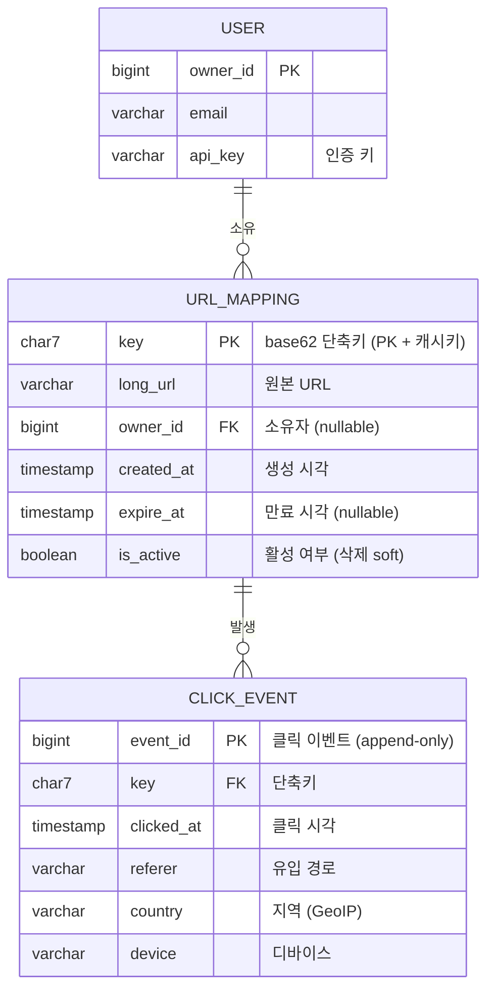
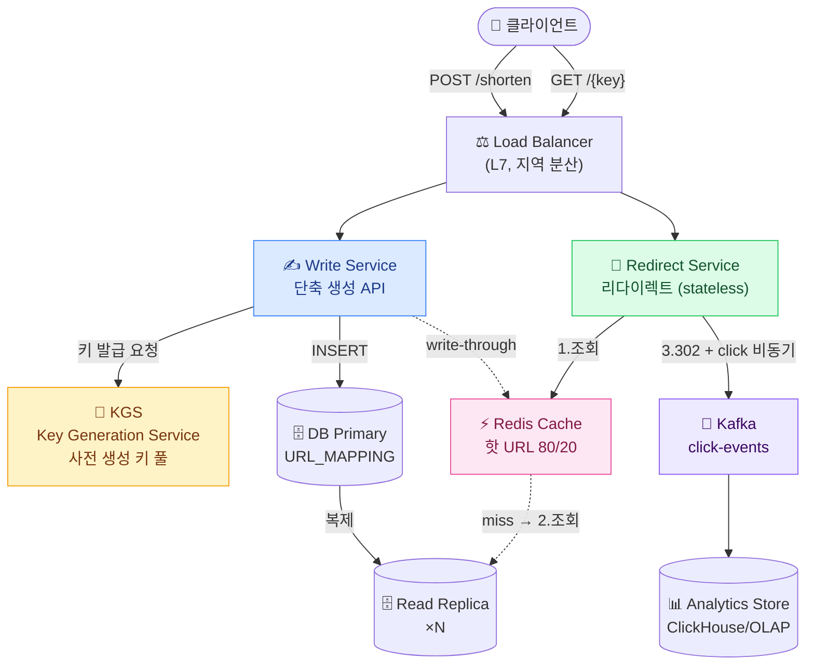
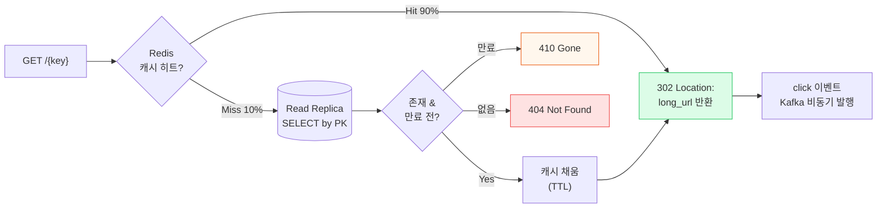
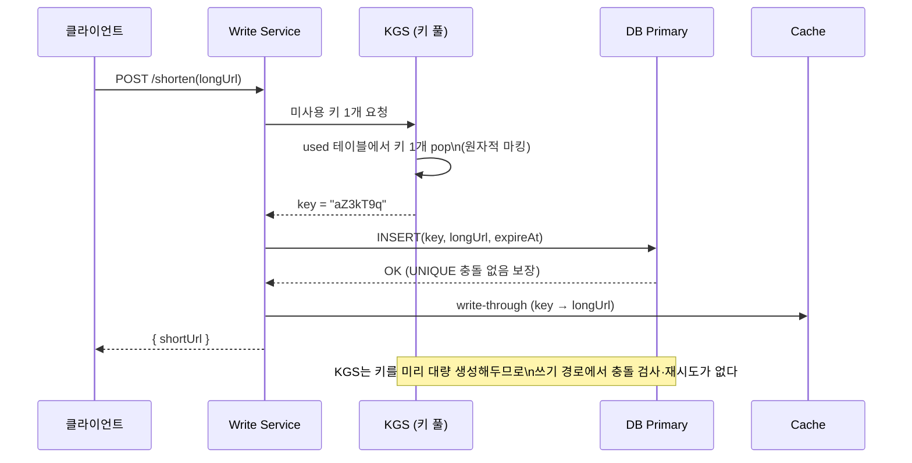
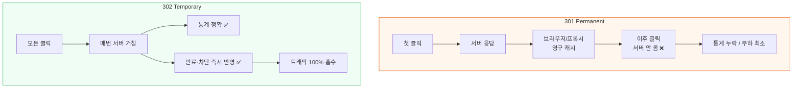

## 1. 요구사항 명확화 (Requirements)

> **한 줄 정의** — 긴 URL을 짧은 키로 매핑하고, 짧은 키 접근 시 원본으로 *리다이렉트*한다. 압도적 read-heavy(읽기 우세) 시스템.

### Functional(기능) 요구사항

- **단축**: `long_url` 입력 → `short_url` 발급 (예: `https://nav.to/aZ3kT9q`)
- **리다이렉트**: `short_url` 접근 → 원본으로 HTTP redirect
- **커스텀 별칭(Custom Alias)**: 사용자가 `nav.to/myevent` 처럼 직접 지정 가능
- **만료(Expiration)**: TTL(Time To Live, 유효 기간) 설정 가능, 만료 후 410 Gone
- **클릭 통계(Analytics)**: 클릭 수, Referer(유입 경로), 지역, 디바이스 집계

### Non-functional(비기능) 요구사항

- **읽기:쓰기 = 100:1** — read-heavy. 리다이렉트가 절대 다수. 읽기 latency가 제품 체감을 지배.
- **고가용성(High Availability)**: 리다이렉트는 죽으면 안 된다. 링크가 인쇄물·QR에 박혀 영구 사용됨.
- **저지연(Low Latency)**: 리다이렉트 p99 < 50ms 목표.
- **키 예측 불가(Non-predictable)**: 키를 순차 증가로 노출하면 경쟁사·크롤러가 전체 URL을 enumeration(전수 조회).
- **일관성**: 단축은 Read-your-writes(자기가 쓴 건 바로 읽힘) 수준이면 충분. 통계는 최종 일관성(Eventual Consistency) 허용.

> **🎯 면접 포인트 — 첫 5분이 평가를 가른다**
>
> "URL 단축기 만드세요"에 바로 테이블부터 그리면 감점. **읽기:쓰기 비율, 키 길이/문자셋, 커스텀 별칭 여부, 만료·통계 필요성** 을 먼저 물어야 한다. 면접관은 "당신이 스코프를 통제할 수 있는가"를 본다.

## 2. 용량 추정 (Back-of-the-envelope)

### 2-1. 쓰기 QPS

가정: **쓰기(단축 생성) 1억 건/월**.

- 1개월 ≈ 30일 × 86,400초 ≈ `2.6 × 10⁶ 초` (≈ 약 250만 초)
- 평균 쓰기 QPS = 1억 / 2.6×10⁶ ≈ **≈ 40 writes/s**
- 피크 QPS ≈ 평균 × 5 ≈ **≈ 200 writes/s**

### 2-2. 읽기 QPS (100:1)

- 평균 읽기 QPS = 40 × 100 = **≈ 4,000 reads/s**
- 피크 읽기 QPS ≈ 4,000 × 5 ≈ **≈ 20,000 reads/s**

→ 결론: 쓰기는 단일 노드도 감당. **읽기 2만 QPS를 어떻게 받느냐가 설계의 핵심**. 캐시 + 읽기 복제(Read Replica)가 필수.

### 2-3. 5년 누적 URL 수 → 키 길이 산정

- 1억/월 × 12 × 5년 = **60억 ≈ 6 × 10⁹ 개**
- 키 문자셋: `base62` = [a-z A-Z 0-9] = 62종
- 키 길이별 공간: 6자 = 62⁶ ≈ **568억** (≈ 5.7×10¹⁰) — 60억 수용 가능하나 여유 10배뿐 7자 = 62⁷ ≈ **3.5조** (≈ 3.5×10¹²) — 60억의 약 580배 여유 → **7자 채택**

> **💡 외워둘 base62 치트시트**
>
> 62⁶ ≈ 568억, 62⁷ ≈ 3.5조, 62⁸ ≈ 218조. "수십억~수조 규모면 7자"는 거의 모든 면접에서 통하는 기본값. bit.ly·TinyURL도 6~7자대.

### 2-4. 스토리지 추정

레코드 1건당 대략:

- `key` 7B + `long_url` 평균 100B + 메타(created, expire, ownerId, 카운터) ≈ 100B → **레코드 ≈ 약 500B** (인덱스·오버헤드 포함 넉넉히)
- 5년 60억 × 500B = **3 × 10¹² B ≈ 3 TB**

→ 단일 RDBMS 한 대로도 수 TB는 가능하지만, 6×10⁹ 행 + 2만 읽기 QPS 면 **읽기 복제 다수 + 향후 샤딩**을 염두에 둔다.

### 2-5. 캐시 메모리

읽기는 인기 URL에 쏠린다(80/20). 핫 20%만 캐시:

- 하루 읽기 ≈ 4,000 × 86,400 ≈ 3.5억 reads/day, 고유 URL이 그중 약 20% = 약 7천만 핫키
- 핫키 1건 캐시 ≈ (key 7B + url 100B + 오버헤드) ≈ 약 200B → 7천만 × 200B ≈ **14 GB**

→ Redis 한 클러스터(수십 GB)로 충분히 핫셋 수용. **캐시 히트율 90%+ 면 DB 읽기 부하가 1/10로 떨어진다.**

## 3. API / 데이터 모델

### 3-1. API 설계 (REST)

| 메서드 · 경로 | 설명 | 요청 / 응답 |
| --- | --- | --- |
| `POST /api/v1/shorten` | 단축 URL 생성 | req: `{ longUrl, customAlias?, expireAt? }` → res: `{ shortUrl, key }` |
| `GET /{key}` | 리다이렉트 (핵심 트래픽) | **301** 또는 **302** + `Location: long_url` |
| `GET /api/v1/{key}/stats` | 클릭 통계 조회 | res: `{ clicks, byCountry, byReferer, byDevice }` |
| `DELETE /api/v1/{key}` | 링크 삭제 (소유자만) | 인증 필요 (API Key / OAuth) |

> **⚠️ 면접 함정 — 301 vs 302 즉답**
>
> **301(Moved Permanently)** : 브라우저·중간 프록시가 **응답을 영구 캐시** → 이후 클릭이 우리 서버로 안 옴 → **클릭 통계를 못 센다.** 대신 서버 부하·지연은 최소. **302(Found, 임시)** : 매번 우리 서버를 거침 → 통계 수집 가능, 만료·차단 즉시 반영. 대신 트래픽 100% 흡수. → **"통계가 핵심 기능이면 302"** 가 정답 방향. 통계 불필요·성능 최우선이면 301. 이 Trade-off를 말로 풀어야 한다.

### 3-2. 데이터 모델 (erDiagram)

*데이터 모델 — 리다이렉트 경로는 `URL_MAPPING`만 보면 됨(단일 PK 조회). 통계는 `CLICK_EVENT`에 비동기 적재.*

#### 인덱스 / 스키마 결정

- `key`는 **PK이자 캐시 키**. 리다이렉트는 PK point-lookup 한 번 → 인덱스 추가 불필요(클러스터드 인덱스로 끝).
- 커스텀 별칭은 `key` 컬럼에 그대로 저장(별도 alias 컬럼 두면 조회 분기 발생). `UNIQUE` 제약으로 중복 방지.
- `CLICK_EVENT`는 append-only(추가 전용) → 시계열 파티셔닝(월별) 또는 별도 OLAP(Online Analytical Processing, 분석용) 저장소로 분리.

## 4. High-level 아키텍처

*High-level 아키텍처 — 읽기 경로(초록)와 쓰기 경로(파랑)를 분리. 통계는 Kafka로 비동기 흘려 리다이렉트 latency를 보호.*

### 리다이렉트 요청 흐름 (읽기 — 핵심)

*리다이렉트 흐름 — 캐시 우선, miss 시 Read Replica. click 발행은 응답 후 비동기(latency 0 영향).*

### 키 발급 흐름 (KGS 방식 — sequenceDiagram)

*KGS 키 발급 — 사전 생성된 키 풀에서 pop. 쓰기 경로의 충돌·재시도를 제거해 latency 안정화.*

## 4-B. 키 생성 전략 비교 🔥(Deep-dive)

이 시스템의 진짜 깊이는 "어떻게 짧고·유일하고·예측 불가능한 키를 만드는가"에 있다. 네 가지 전략을 비교한다.

| 전략 | 방식 | 충돌(Collision) | 예측 가능성 | 확장성 / 비용 |
| --- | --- | --- | --- | --- |
| **① 해시 truncate** (MD5/SHA → 앞 7자) | long_url 해시 후 base62 7자 절단 | **높음** — 절단 시 비둘기집 충돌. 충돌 시 salt 추가 후 재해시 루프 필요 | 낮음(URL 의존) — 단 같은 URL은 같은 키(중복 제거엔 장점) | 충돌 처리 비용이 트래픽 증가에 비선형 |
| **② base62(auto-inc id)** | DB auto-increment id를 base62 인코딩 | **없음** — id가 유일하므로 충돌 0 | **매우 높음(위험)** — id 순차 → 키 순차 → enumeration 가능 | 단순·저렴하나 단일 시퀀스가 SPOF·샤딩 난점 |
| **③ KGS(사전 생성)** Key Generation Service | 오프라인에서 랜덤 키 대량 생성 → used/unused 테이블 → 쓰기 시 pop | **없음** — 생성 단계에서 중복 제거 완료 | **낮음(좋음)** — 무작위 키라 예측 불가 | 쓰기 경로 충돌 0, latency 안정. 키 풀 관리·중복 발급 방지 필요 |
| **④ 분산 ID(Snowflake)** | timestamp+machineId+seq → base62 | **없음** — 전역 유일 보장 | 중간 — timestamp 비트로 시간 추론 가능, 키가 길어짐(보통 11자+) | 분산 환경 최강, 단 키 길이 증가 → "짧음" 요구와 상충 |

> **🎯 면접 함정 — 가장 많이 틀리는 3가지**
>
> **1. "auto-increment id를 그냥 base62 인코딩하면 됩니다"** → id가 순차라 키도 순차 → 경쟁사가 `aaaab, aaaac…` 로 전체 URL을 enumeration. **예측 가능성** 을 지적해야 통과. **2. 해시 truncate에서 충돌 처리를 안 함** → "MD5 앞 7자 자르면 끝"은 비둘기집 원리상 반드시 충돌. 재해시·salt 루프를 말해야 함. **3. Snowflake로 "짧게" 한다는 모순** → Snowflake는 64bit라 base62로도 11자 내외. "짧은 URL" 요구와 충돌함을 인지해야 함.

> **💡 실전 권장 — KGS 하이브리드**
>
> 대규모(bit.ly급)에서는 **③ KGS** 가 정석. 키를 미리 생성해 두므로 쓰기 경로가 단순 pop+INSERT가 되어 latency가 평탄하고, 무작위라 예측도 불가. 커스텀 별칭만 별도 UNIQUE 충돌 검사로 처리한다.

## 5. Deep-dive 🔥(Deep-dive)

### 5-1. 캐싱 — 80/20 인기 URL

- 리다이렉트는 멱법칙(power-law) 분포 — 소수 URL(이벤트·바이럴 링크)이 트래픽 대부분. **LRU(Least Recently Used) 캐시**로 핫셋만 보관.
- 캐시 전략은 **Cache-aside(읽기 시 채움)** + 생성 시 **Write-through** 병행. 새 링크는 만들자마자 캐시에 있어 첫 클릭도 빠름.
- TTL은 짧게(예: 1시간) 잡되, 만료·삭제는 **능동 무효화(invalidation)**로 즉시 반영.

> **⚠️ Cache Stampede (쇄도)**
>
> 바이럴 링크의 캐시 TTL이 만료되는 순간 수천 요청이 동시에 DB로 몰림(Thundering herd). 대응: **TTL 지터(jitter)** , **분산 락 기반 단일 재계산** , 혹은 인기 키는 만료 안 시키는 **핀 고정(pinning)** .

### 5-2. 301 vs 302 — 통계 영향 🔥(Deep-dive)

*301 vs 302 — 통계가 제품 핵심이면 302. 순수 성능·통계 불필요면 301. 이 선택은 비즈니스 요구가 결정.*

### 5-3. 분석 비동기 수집 (Kafka)

- 리다이렉트 응답 경로에서 통계를 **동기 INSERT 하면 안 된다** — 클릭마다 DB 쓰기가 붙어 read latency·DB 부하 폭증.
- 리다이렉트는 즉시 302 반환 후, click 이벤트를 **Kafka에 비동기 발행** → 컨슈머가 배치 집계 → OLAP(ClickHouse 등) 적재.
- 통계는 **최종 일관성** 허용 — "클릭 수가 몇 초 늦게 반영"은 비즈니스상 문제없음.

### 5-4. 충돌 & Hot Key

- **충돌**: 해시 방식이면 INSERT 시 `UNIQUE` 위반 → salt 추가 재시도. KGS면 사전 제거로 충돌 0.
- **Hot Key**: 단일 바이럴 키가 Redis 한 샤드에 집중 → 핫스팟. 대응: **로컬 캐시(앱 인메모리) 추가 레이어**, 또는 키 복제(같은 값 N벌). 리다이렉트는 read-only라 복제가 안전.

> **💡 물류 도메인 연결 — 운송장 단축 링크**
>
> " `nav.to/track/xxx` 형태의 **배송 추적 단축 URL** "도 같은 구조. 단 추적 링크는 **302 필수** (배송 상태가 바뀌므로 매번 최신 페이지로). 풀필먼트 알림 SMS에 들어가는 링크는 hot key + 만료(배송 완료 후 7일) 설계가 그대로 적용된다.

## 6. Trade-off & Alternatives

### 6-1. 키 생성: 해시 vs 카운터 vs KGS

- **해시**: 같은 URL 중복 제거에 유리하나 충돌 처리 부담. 통계·예측불가 모두 보통.
- **카운터(auto-inc base62)**: 구현 최단·충돌 0이나 **예측 가능성**이 치명적 약점. 내부용·비공개 링크면 허용.
- **KGS**: 쓰기 경로 안정·예측불가. 키 풀 운영 복잡도가 비용. **대규모 공개 서비스의 기본값.**

### 6-2. SQL vs NoSQL

| 관점 | RDBMS(MySQL/PostgreSQL) | NoSQL(DynamoDB/Cassandra) |
| --- | --- | --- |
| 접근 패턴 | PK point-lookup 위주 → 잘 맞음 | key-value 단순 조회에 최적 |
| 스케일 | 읽기 복제로 수만 QPS, 그 이상은 샤딩 필요 | 수평 확장 자연스러움(파티션 키 = url key) |
| UNIQUE/트랜잭션 | 커스텀 별칭 UNIQUE·만료 일관성 처리 쉬움 | 조건부 쓰기(conditional put)로 가능하나 까다로움 |
| 결론 | 중규모·강한 일관성·복잡 쿼리 | 초대규모·단순 KV·전역 분산 |

→ **접근 패턴이 단순 KV + 초대규모면 NoSQL**(DynamoDB로 key=PK). 커스텀 별칭·통계 조인·중규모면 RDBMS + 읽기 복제가 운영이 단순. 정답 없음, 규모와 일관성 요구로 결정.

### 6-3. 301 vs 302

요약: **통계·만료·차단이 제품 가치면 302**, **순수 성능·인프라 비용 최소화면 301**. 절대 정답은 비즈니스 요구가 정한다 — 면접에선 "둘 다 말하고 조건을 제시"가 만점.

> **🎯 실제 사례**
>
> **네이버 단축 URL(me2.do)** , **카카오 단축 URL** , 글로벌 **bit.ly** 모두 통계·관리 기능 때문에 사실상 302 계열 + 자체 키 풀/카운터 기반. bit.ly는 클릭 분석이 제품의 핵심 가치라 301로는 사업이 성립하지 않는다 — "통계 → 302" 인과를 보여주는 좋은 예시.
