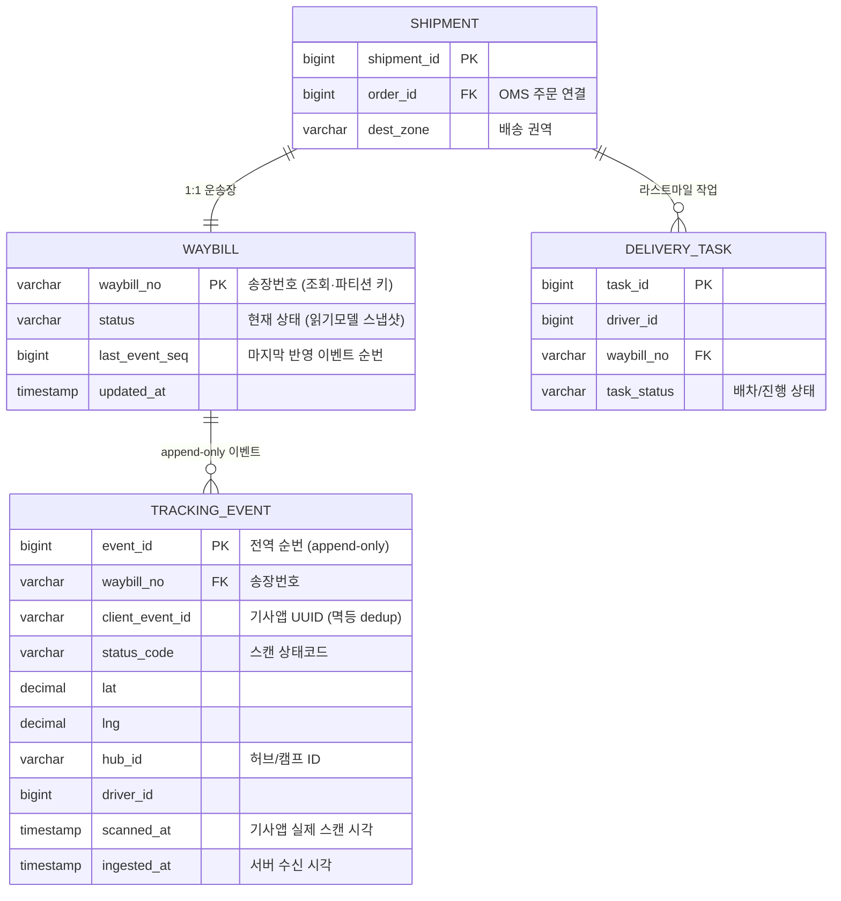
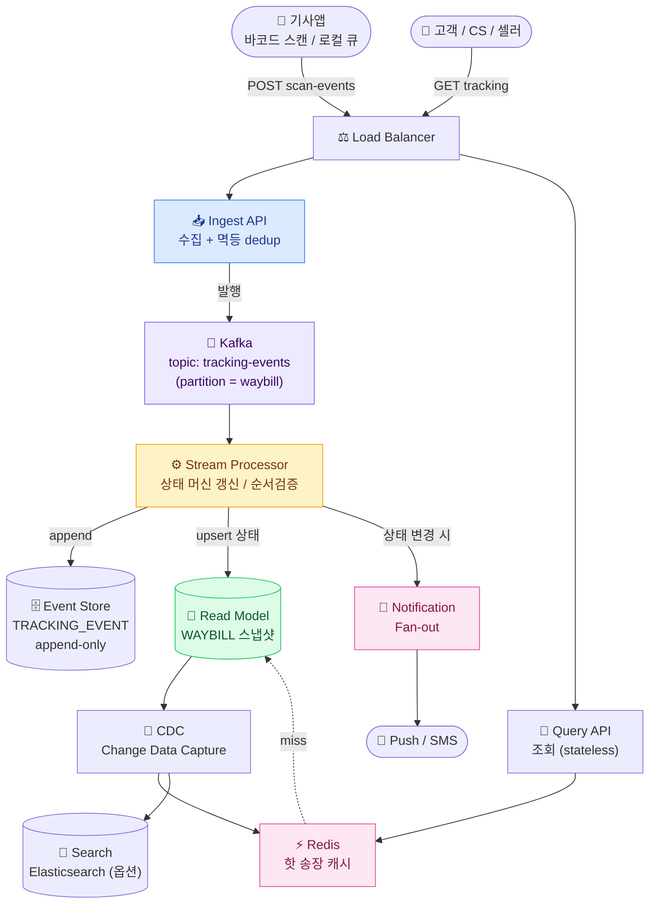
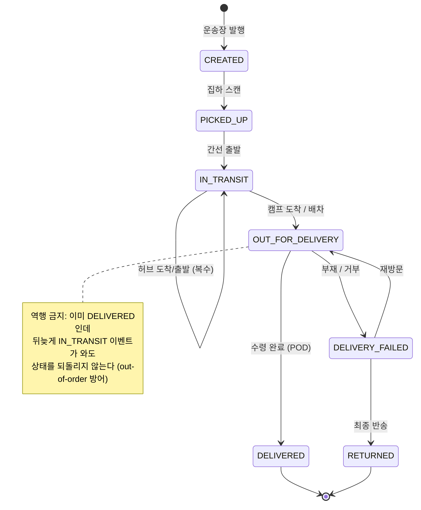
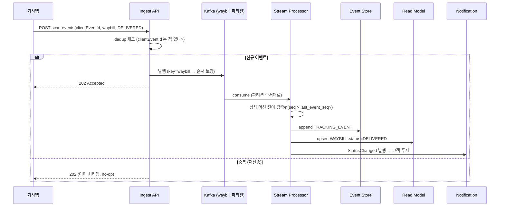

## 1. 요구사항 명확화 (Requirements)

> **한 줄 정의** — 기사앱 스캔 이벤트를 수집해 *송장(Waybill) 상태·위치*를 갱신하고, 고객에게 실시간 조회와 상태 변경 푸시를 제공한다. 압도적 read-heavy + 최종 일관성 허용.

### Functional(기능) 요구사항

- **송장번호 조회**: `waybill`로 현재 상태·진행 단계·예상 도착·위치 조회
- **상태 변경 푸시**: 집하·간선 출발·배송 출발(Out for delivery)·배송 완료 시 푸시/SMS 알림
- **기사앱 스캔 이벤트 수집**: 기사가 바코드 스캔 → `TrackingEvent` 발생(집하·허브 도착/출발·배송 완료 등)
- **푸시 구독**: 고객이 특정 송장 알림 구독/해제

### Non-functional(비기능) 요구사항

- **수집 규모**: 수천만 `TrackingEvent`/일. 피크 시간대(오전 출고/저녁 배송) 몰림.
- **read-heavy**: 조회 QPS가 수집 QPS의 10~50배(고객·CS·셀러가 반복 조회).
- **최종 일관성(Eventual Consistency) 허용**: "스캔 후 수 초 내 조회에 반영"이면 충분. 강한 일관성 불필요.
- **순서 보장**: 같은 송장 내 이벤트는 **시간 순서**가 의미 있음(상태 역행 방지).
- **가용성**: 수집 파이프라인이 죽어도 기사앱은 로컬 큐로 버티고 재전송. 데이터 유실 0 목표.
- **오프라인 내성**: 지하·산간 통신 음영에서 스캔 → 재접속 시 일괄 재전송.

> **🎯 면접 포인트 — 왜 이게 최상위 단골인가**
>
> 쿠팡·배민·컬리·CJ대한통운 류의 시스템 디자인 면접에서 **거의 반드시 나온다.** "고객 조회 화면" 같은 표면이 아니라 **수천만 이벤트 수집 + 순서 보장 + 멱등 + Fan-out 알림 + 읽기 모델 분리(CQRS)** 를 한 번에 묻는 종합 문제이기 때문. write 파이프라인을 얼마나 깊게 파느냐가 시니어 변별점.

## 2. 용량 추정 (Back-of-the-envelope)

### 2-1. 수집(쓰기) QPS

가정: **일 5천만 TrackingEvent** (송장 1건당 평균 5~10단계 스캔 × 일 수백만~천만 송장).

- 1일 = 86,400초 ≈ `10⁵ 초`
- 평균 수집 QPS = 5×10⁷ / 86,400 ≈ **≈ 580 writes/s**
- 피크는 출고·배송 시간대 집중 → 평균 × 5~6 ≈ **≈ 3,000~3,500 writes/s**

### 2-2. 조회(읽기) QPS

- 읽기 = 쓰기 × 10~50배 가정. 보수적으로 ×20 → 평균 ≈ **≈ 11,000 reads/s**
- 피크(배송 몰리는 저녁, 고객 새로고침) ≈ **≈ 50,000~70,000 reads/s**

→ 결론: **조회를 위한 읽기 모델(머티리얼라이즈 뷰) + 캐시**가 핵심. 수집은 이벤트 스토어에 append, 조회는 별도 최적화된 모델로 분리(CQRS, Command Query Responsibility Segregation, 명령/조회 책임 분리).

### 2-3. 스토리지 추정

이벤트 1건 ≈ **300B**(송장번호, 상태코드, 위치 lat/lng, 허브ID, 기사ID, timestamp, 디바이스):

- 일: 5×10⁷ × 300B = 1.5×10¹⁰ B = **≈ 15 GB/day**
- 연: 15GB × 365 ≈ **≈ 5.5 TB/year** (이벤트 스토어, 압축 전)
- 핫 데이터(진행 중 배송, 최근 7~14일)만 빠른 저장소, 그 이후는 콜드 스토리지(S3/Glacier)로 티어링.

> **💡 외워둘 숫자**
>
> "일 5천만 이벤트 → 평균 ~580 QPS, 피크 ~3.5K QPS, 일 15GB, 연 5.5TB." 이 한 줄을 술술 말하면 추정 단계 통과. 핵심은 **이벤트가 append-only라 무한 증가 → 티어링/파티셔닝 필수** 임을 짚는 것.

## 3. API / 데이터 모델

### 3-1. API 설계

| 메서드 · 경로 | 설명 | 요청 / 응답 |
| --- | --- | --- |
| `POST /api/v1/scan-events` | 기사앱 스캔 이벤트 수집 (배치 가능) | req: `{ events: [{ waybill, statusCode, geo, hubId, scannedAt, clientEventId }] }` + `Idempotency-Key` |
| `GET /api/v1/tracking/{waybill}` | 송장 상태·진행 단계 조회 (핵심 트래픽) | res: `{ status, steps[], lastLocation, eta }` |
| `POST /api/v1/tracking/{waybill}/subscribe` | 상태 변경 푸시 구독 | req: `{ channel: push\|sms, token }` |

> **⚠️ 실무 함정 — 수집 API에 Idempotency-Key는 필수**
>
> 기사앱은 **오프라인 후 재전송·네트워크 타임아웃 재시도** 로 같은 스캔을 여러 번 보낸다. `clientEventId` (앱이 생성한 UUID) 또는 `Idempotency-Key(멱등성 키)` 로 중복 스캔을 서버에서 dedup(중복 제거) 해야 함. 안 하면 "배송 완료"가 두 번 찍히고 알림이 두 번 간다.

### 3-2. 데이터 모델 (erDiagram)

*데이터 모델 — `TRACKING_EVENT`는 append-only 이벤트 스토어(진실의 원천), `WAYBILL.status`는 조회용 머티리얼라이즈 뷰(스냅샷). `scanned_at`(실제 스캔)과 `ingested_at`(서버 수신)을 분리해 out-of-order 판정에 사용. Shipment 1:1 Waybill, Waybill 1:N TrackingEvent, `client_event_id`로 중복 스캔 dedup.*

#### 핵심 설계 결정

- `TRACKING_EVENT`는 **append-only**(수정·삭제 없음) → 감사·재처리·이벤트소싱 가능.
- `WAYBILL.status`는 이벤트를 접어 만든 **읽기 모델(read model)**. 조회는 이 한 행만 보면 됨 → 수만 QPS 대응.
- `(waybill_no, client_event_id)` UNIQUE → 멱등 dedup. `last_event_seq`로 out-of-order/중복 반영 방지.

## 4. High-level 아키텍처

*전체 아키텍처 — 수집(파랑) → Kafka(보라) → Stream 처리(주황) → 이벤트스토어 + 읽기모델(초록) → CDC로 캐시/검색 갱신 → 알림 Fan-out(핑크). 조회는 캐시 우선.*

### 송장 상태 머신 (stateDiagram)

*송장 상태 전이 — Stream Processor가 이 머신으로 전이를 검증. 허용되지 않는 역행 전이는 무시(이벤트는 보존, 상태만 미반영).*

### 스캔 이벤트 수집 + 멱등 (sequenceDiagram)

*수집 + 멱등 흐름 — 같은 `waybill`은 같은 Kafka 파티션으로 라우팅돼 순서 보장. `clientEventId`로 중복 스캔을 dedup. Stream 단계에서 한 번 더 seq 검증(at-least-once 컨슈머 대비).*

## 5. Deep-dive 🔥(Deep-dive)

### 5-1. 수천만 이벤트 Fan-out & 알림

- 상태 변경 시 **구독한 고객에게 푸시/SMS Fan-out(팬아웃)**. 모든 스캔이 아니라 **의미 있는 상태 전이**(집하/배송출발/완료)만 알림 → 트래픽 절감.
- 알림은 별도 워커가 Kafka `status-changed` 토픽 consume → 푸시 게이트웨이로 비동기 발송. 발송 실패는 retry 큐 + DLQ(Dead Letter Queue, 실패 메시지 큐).
- Rate limiting: 동일 고객에 단시간 중복 알림 억제(coalescing).

### 5-2. Kafka 파티셔닝 — waybill 키 순서 보장 🔥(Deep-dive)

> **🎯 면접 핵심 — 순서는 "파티션 단위로만" 보장된다**
>
> Kafka는 **파티션 내에서만** 순서를 보장한다. 그래서 **partition key = waybill_no** 로 잡아 같은 송장의 모든 이벤트를 한 파티션에 모은다 → 그 송장의 집하→간선→배송 순서가 유지됨. 송장 간 순서는 어차피 무관하므로 전역 순서는 불필요. "Kafka가 알아서 순서 보장한다"고 답하면 감점 — **파티셔닝 키 선택** 을 말해야 한다.

### 5-3. 멱등 소비 (Idempotent Consumer) — 중복 스캔 🔥(Deep-dive)

- Kafka는 기본 **at-least-once(최소 한 번)** — 컨슈머 재시작·리밸런스 시 같은 메시지 재처리 가능. "Exactly-once는 허상"임을 인지하고 **멱등 소비**로 푼다.
- 방어 2겹: ① Ingest 단계 `clientEventId` dedup, ② Stream 단계 `last_event_seq` 비교(이미 반영한 이벤트면 skip).
- 읽기 모델 upsert는 **조건부 UPDATE**(`WHERE last_event_seq < :seq`)로 원자성 + out-of-order 동시 방어.

### 5-4. 기사앱 오프라인 동기화 🔥(Deep-dive)

- 지하·산간 음영에서 스캔 → 앱 **로컬 큐(SQLite 등)에 저장** → 재접속 시 `scannedAt` 원본 시각을 담아 일괄 재전송.
- 서버는 `scanned_at`(실제 발생)과 `ingested_at`(수신)을 분리 저장 → 상태/순서 판정은 **scanned_at 기준**. 늦게 도착해도 시간순으로 올바르게 접힘.
- 이게 **out-of-order(순서 뒤바뀜)**의 주원인. 5-5와 연결.

### 5-5. 상태 머신 역행 방지 (out-of-order) 🔥(Deep-dive)

> **⚠️ 실무 함정 — "DELIVERED 후 IN_TRANSIT이 도착"**
>
> 오프라인 재전송으로 **늦게 도착한 과거 이벤트** 가 현재 상태를 되돌리면 고객이 "배송완료 → 배송중"으로 보이는 사고. 방어: ① 이벤트에 **단조 증가 seq/scanned_at** 부여, ② 읽기 모델은 `seq > last_event_seq` 일 때만 상태 갱신, ③ 상태 머신에서 **허용된 전이만** 반영(이벤트 자체는 스토어에 모두 보존).

### 5-6. CDC로 읽기 모델 → 캐시/검색 갱신

- `WAYBILL` 읽기 모델 변경을 **CDC(Change Data Capture, 변경 데이터 캡처)**(Debezium 등)로 캡처 → Redis 캐시·Elasticsearch 인덱스 갱신.
- 장점: 애플리케이션이 캐시/검색 동기화를 신경 안 써도 됨(이중 쓰기 제거 → 정합성↑). 단점: 파이프라인 추가 운영 비용.

### 5-7. 핫 송장 (Hot Waybill)

- 바이럴 상품·대형 셀러 송장은 조회가 집중 → Redis 핫스팟. 대응: **앱 로컬 캐시(짧은 TTL)** 추가, 핫키 복제.
- 조회는 read-only라 stale(약간 오래됨) 허용 → TTL 수 초로 잡아 DB 보호.

### 5-8. 최종 일관성

스캔 → Kafka → Stream → 읽기 모델 → 캐시까지 수 초의 지연 존재. 고객 입장에선 "스캔 후 몇 초 내 반영"이면 충분하므로 **최종 일관성으로 충분**. 강한 일관성을 요구하면 처리량이 급락 — 도메인 특성상 불필요한 비용.

## 6. Trade-off & Alternatives

### 6-1. 동기 vs 비동기 상태 갱신

- **동기**(수집 API가 즉시 상태 갱신): 구현 단순·조회 즉시 일관. 그러나 수집 피크 시 DB 쓰기 경쟁 → latency·장애 전파.
- **비동기**(Kafka 경유): 수집 API는 발행만 → 빠르고 버퍼링으로 피크 흡수(Back-pressure 대응). 대신 최종 일관성·파이프라인 복잡도. **대규모는 비동기 채택.**

### 6-2. 이벤트소싱 vs 상태 스냅샷

| 관점 | 이벤트 소싱 (append-only 이벤트가 진실) | 상태 스냅샷만 (status 컬럼 UPDATE) |
| --- | --- | --- |
| 이력/감사 | 전 이력 보존 → 재현·디버깅·분쟁 대응 강함 | 현재 상태만 → 이력은 별도 로그 필요 |
| 재처리 | 이벤트 리플레이로 읽기 모델 재구축 가능 | 불가 (덮어써짐) |
| 조회 성능 | 그대로면 매 조회마다 접기 → 느림 → 스냅샷 병행 필요 | 단일 행 조회 → 빠름 |
| 저장 비용 | 높음 (모든 이벤트 누적, 티어링 필요) | 낮음 |
| 결론 | 이력·감사·재처리가 중요한 추적엔 적합 | 단순·저비용이나 추적 도메인엔 정보 손실 |

→ 추적 시스템은 **하이브리드가 정석**: 이벤트 스토어(append-only)를 진실의 원천으로 두고, 빠른 조회를 위해 **스냅샷(읽기 모델)을 함께** 유지(CQRS). 이벤트소싱의 이력 강점과 스냅샷의 조회 속도를 모두 취함.

### 6-3. Push vs Pull 추적

| 관점 | Push (서버 → 고객 실시간 전송) | Pull (고객이 조회 시 갱신) |
| --- | --- | --- |
| 실시간성 | 높음 (상태 변경 즉시 푸시) | 고객이 열 때만 최신 |
| 서버 비용 | 구독 관리·연결·Fan-out 비용 큼 | 저렴 (조회 시 캐시 조회) |
| 적합 | "배송 출발/완료" 같은 핵심 전이 알림 | "내 택배 어디?" 반복 조회 화면 |

→ **둘 다 쓴다**: 핵심 상태 전이는 Push(푸시/SMS), 상세 진행 화면은 Pull(캐시 조회). 모든 스캔을 Push하면 비용 폭발이므로 의미 있는 전이만 선별.

### 6-4. Strong vs Eventual Consistency

추적은 **Eventual로 충분**(수 초 지연 무해). Strong을 고집하면 수집 경로에 동기 합의가 끼어 처리량 급락. 단 **"배송 완료" 같은 결제·정산 트리거가 되는 전이**는 다운스트림에서 멱등하게 한 번만 처리되도록 보장(중복 정산 방지) — 일관성 등급을 이벤트별로 차등 적용하는 게 시니어다운 답변.

> **🎯 실제 사례 — 풀필먼트 · 라스트마일 도메인 연결**
>
> **쿠팡 CLS(쿠팡로지스틱스서비스)** : 자체 배송망 수직 통합으로 기사앱 스캔이 곧바로 추적·고객 푸시로 흐름 → 데이터 일관성·실시간성이 3PL 위탁보다 강함. **CJ대한통운** : 허브앤스포크 전 구간 송장 스캔(집하·서브터미널·허브·배송), 다수 주체 이벤트가 합류 → 멱등·순서 보장이 특히 중요. **컬리 샛별배송** : Cut-off 23:00→07:00 도착의 짧은 윈도, 새벽 음영 지역 오프라인 동기화가 빈번. 세 사례 모두 "Kafka 파티셔닝 + 멱등 + 읽기모델 분리"가 그대로 적용된다.
