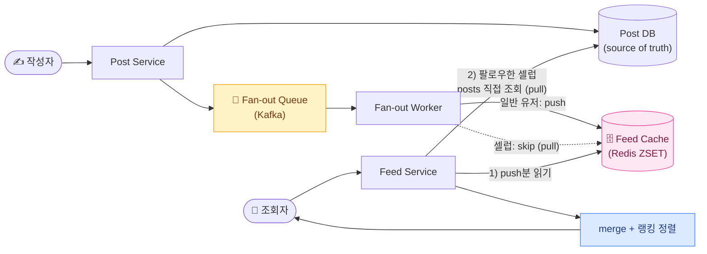
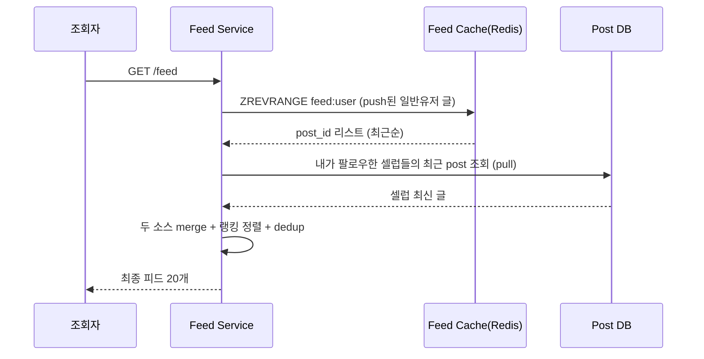
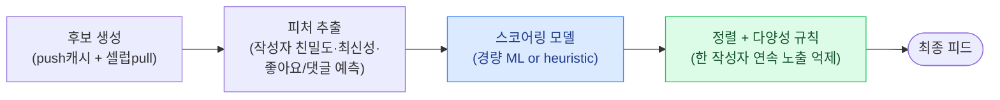

## 1. 요구사항 명확화 — 무엇을 피드라 부를지부터 합의

`News Feed(뉴스피드)`는 "내가 팔로우한 사람들의 최근 글을 시간/랭킹 순으로 모아 보여주는 화면"이다. 트위터 타임라인, 인스타 피드, 페이스북 뉴스피드가 모두 같은 문제다. 바로 그림을 그리면 감점 — 먼저 범위를 좁힌다.

### Functional 요구사항

- **피드 조회(read)**: 내가 팔로우한 사람들의 post를 모아 페이지네이션으로 반환. 무한 스크롤.
- **글 작성(write)**: post 생성 시 팔로워들의 피드에 반영.
- **정렬 기준**: 순수 시간역순(reverse-chronological)인가, **랭킹(engagement 기반)** 인가? 이 결정이 파이프라인 복잡도를 좌우.
- **팔로우 그래프**: follow/unfollow. 유저당 팔로잉/팔로워 수의 분포(롱테일 + 셀럽).

### Non-functional 요구사항

| 속성 | 목표 | 이유 |
| --- | --- | --- |
| **Read-heavy** | Read:Write ≈ 100:1 이상 | 피드는 쓰기보다 조회가 압도적. 조회 최적화가 설계의 중심 |
| **Low latency** | 피드 조회 p99 < 200ms | 첫 화면 로딩 체감. 조회 시점에 무거운 연산을 하면 무너짐 |
| **Eventual Consistency(최종 일관성)** | 몇 초 지연 허용 | "내 글이 팔로워 피드에 1~2초 늦게 뜨는" 건 대부분 용인됨 |
| **High availability** | 피드는 죽어도 stale하게라도 뜨게 | 은행이 아니다. 약간 오래된 피드 > 빈 화면 |

> **🎯 면접 포인트 — 가장 먼저 던질 질문**
>
> "정렬이 **시간순인가 랭킹인가**?", "**Read:Write 비율**은?", "셀럽 같은 **팔로워 편중(skew)** 이 있나?", "피드는 **일관성보다 가용성** 우선인가?" — 이 네 개를 먼저 물으면 시니어 신호다. 특히 랭킹 여부는 아키텍처를 통째로 바꾼다. 요구사항 없이 바로 Fan-out 그리면 감점.

## 2. 용량 추정 — 셀럽 문제가 숫자에서 튀어나온다

전제: `DAU(Daily Active Users, 일간 활성 사용자)` **2억 명**, 유저당 평균 팔로잉 **200명**.

### QPS 추정

- 1 day ≈ 10⁵ 초 (86,400s).
- 유저가 하루 평균 **10회 피드 조회** → 조회 = 2억 × 10 = 20억/day → 평균 **약 23,000 QPS**, 피크 5배면 **약 115,000 QPS**.
- 유저가 하루 평균 **0.2개 글 작성** → 쓰기 = 2억 × 0.2 = 4,000만/day → 평균 **약 460 QPS**. → **Read:Write ≈ 50:1**, 조회가 압도적.

### Fan-out(팬아웃) 쓰기 증폭

`Fan-out(팬아웃)`은 글 1개를 팔로워 N명의 피드에 뿌리는 것. 쓰기 460 QPS라도 팔로워 수만큼 증폭된다.

- 평균 팔로워 200명 가정: 460 × 200 = **약 92,000 fan-out writes/sec** — 이미 조회 QPS에 육박.
- **셀럽 1명(팔로워 5,000만)** 이 글 1개 쓰면: 단일 write가 **5,000만 개의 피드 삽입**으로 폭발. 초당 몇 명만 동시에 써도 수억 건. → 순수 push는 여기서 붕괴.

### 피드 캐시 메모리

- 유저당 피드 캐시를 **post ID 800개**만 유지(최근 것만). ID 8B + score 8B ≈ 16B → 유저당 약 13KB.
- 활성 유저 2억 전체를 precompute하면 2억 × 13KB ≈ **2.6TB**. → 전부는 낭비. **활성 유저만** 캐싱(아래 lazy 전략).

> **💡 추정의 결론을 설계로**
>
> "쓰기는 460 QPS로 작지만 fan-out으로 9만/sec까지 증폭되고, 셀럽에선 단발 5,000만으로 폭발 → **순수 push 불가**. 조회는 11만 QPS라 조회 시점 연산은 최소화해야 함 → **순수 pull도 불가**. 결론은 **하이브리드**." 추정이 곧 아키텍처 결정 근거다.

## 3. API / 데이터 모델

### API (REST)

- `GET /v1/feed?cursor={id}&limit=20` → 피드 페이지. **cursor 기반 페이지네이션**(offset은 삽입 시 밀림/중복 발생).
- `POST /v1/posts` `{ text, media_ids }` → 글 작성, fan-out 트리거.
- `POST /v1/follow` `{ target_user_id }` / `DELETE /v1/follow/{id}`.

### 데이터 모델

```sql
-- 원본 post (source of truth) — 샤드 키: author_id
CREATE TABLE posts (
    post_id     BIGINT PRIMARY KEY,   -- Snowflake ID (시간순 정렬 내장)
    author_id   BIGINT NOT NULL,
    content     TEXT,
    created_at  TIMESTAMPTZ NOT NULL
);

-- 팔로우 그래프 — 양방향 조회를 위해 두 인덱스
CREATE TABLE follows (
    follower_id BIGINT NOT NULL,
    followee_id BIGINT NOT NULL,
    PRIMARY KEY (follower_id, followee_id)
);
CREATE INDEX idx_followee ON follows (followee_id);  -- "이 사람의 팔로워 목록" = fan-out 대상
```

> **⚠️ 실무 함정 — post_id에 auto-increment 쓰지 마라**
>
> 피드는 시간역순 정렬이 핵심인데 auto-increment는 **샤드 간 전역 순서**를 못 준다. **Snowflake ID**(상위 비트 = 타임스탬프)를 쓰면 ID 자체가 대략 시간순이라, 피드 캐시(`ZSET`)의 score로 그대로 재활용된다. 트위터가 Snowflake를 만든 이유가 바로 이것.

## 4. High-level 아키텍처



*작성 시 fan-out worker가 일반 유저 피드엔 push, 셀럽은 skip. 조회 시 push분(캐시) + 셀럽분(pull)을 merge.*

### 두 가지 극단 — 그리고 하이브리드

| 방식 | 쓰기 시 | 조회 시 | 강점 | 약점 |
| --- | --- | --- | --- | --- |
| **Fan-out on Write (push)** | 팔로워 전원 피드에 미리 삽입 | 내 캐시만 읽으면 끝 (빠름) | **조회 초저지연**, 조회 로직 단순 | 쓰기 증폭 폭발, 셀럽에서 붕괴, 비활성 유저 낭비 |
| **Fan-out on Read (pull)** | 아무것도 안 함 | 팔로잉 전원의 최근 글을 그때 모아 merge | 쓰기 저렴, 저장공간 절약 | **조회 시 무거운 연산**(팔로잉 200개 스캔+정렬) → 지연 폭증 |
| **Hybrid (실무 정답)** | 일반은 push, 셀럽은 skip | 캐시(push분) + 셀럽(pull) merge | 양쪽 장점, 셀럽 폭발 회피 | merge 로직 복잡, 경계 관리 필요 |

> **💡 사례 — 실제로 어떻게 하나**
>
> 초기 **Twitter** 는 Fan-out on Write 기반(Redis 타임라인)이되, 팔로워가 매우 많은 계정은 fan-out에서 제외하고 조회 시 merge하는 하이브리드로 진화했다. **Instagram/Meta** 도 유사하게 push 기반 + 랭킹 레이어. 핵심은 "대부분 push로 조회를 싸게 만들고, **소수 셀럽만 예외 처리**"라는 것.

## 5. Deep-dive 🔥

### 5-1. 셀럽(hot-key) 문제 — 하이브리드 merge

셀럽 글을 push하면 단발 5,000만 write. 그래서 **셀럽은 push 대상에서 제외**하고, 조회 시점에 pull한다.



*일반 유저 글은 미리 push되어 캐시에 있고, 셀럽 글만 조회 시 pull해서 합친다. 셀럽이 몇 명뿐이라 pull 비용이 작다.*

> **🎯 면접 함정 #1 — 셀럽 경계와 merge 정렬**
>
> "셀럽 = 팔로워 N만 이상"의 **경계값**을 물으면 좋다(보통 수십만~백만). 그리고 merge 후 정렬 기준: 시간순이면 두 소스를 timestamp로 k-way merge, **랭킹이면 두 소스를 한 스코어 함수로 재평가**해야 한다. "그냥 합쳐서 시간순 정렬"이라고만 하면 랭킹 케이스를 놓친 것. 또 유저가 셀럽 경계를 넘는 순간의 과거 글 정합성(이미 push된 것 vs 앞으론 pull)도 지적 포인트.

### 5-2. 피드 캐시 설계 — 낭비 없이 precompute

- **자료구조**: Redis `ZSET`, member=post_id, score=Snowflake(시간). `ZREVRANGE`로 최신순 페이지네이션.
- **리스트 상한**: 유저당 최근 **800개**만 유지(`ZREMRANGEBYRANK`로 초과분 trim). 무한 스크롤 깊은 곳은 DB에서 pull.
- **Lazy precompute**: 2억 전부 미리 만들면 2.6TB 낭비. **최근 활성 유저만** 캐싱하고, 비활성 유저는 캐시 미스 시 재생성 후 TTL 부여.

```redis
# fan-out worker가 일반 팔로워 피드에 삽입 (원자적으로 상한 유지)
ZADD  feed:{follower_id}  {snowflake_score}  {post_id}
ZREMRANGEBYRANK  feed:{follower_id}  0  -801   # 최신 800개만 남김
EXPIRE feed:{follower_id}  604800               # 7일 미접속시 만료 → 메모리 회수
```

> **⚠️ 실무 함정 — cache stampede & 캐시 미스 재생성**
>
> 비활성 유저가 오랜만에 접속해 캐시 미스가 나면, 피드를 팔로잉 전원 스캔으로 재생성해야 한다(pull과 동일). 인기 유저들에 동시 미스가 몰리면 **stampede(쇄도)**. 완화: 재생성에 **단일 flight lock**(`SETNX`)을 걸어 한 요청만 재생성하고 나머지는 대기/stale 반환. "미스나면 다시 만들면 됩니다"는 stampede를 무시한 답.

### 5-3. 랭킹 파이프라인 개요

시간순을 넘어 engagement 랭킹을 넣으면 별도 파이프라인이 붙는다.



*후보 생성 → 피처 → 스코어링 → 재정렬. 무거운 스코어링을 조회 경로에 넣으면 지연이 터지므로, 후보 수를 수백 개로 제한한 뒤 경량 모델을 태운다.*

> **💡 물류 도메인 — "화주 대시보드 배송 이벤트 피드"**
>
> 뉴스피드를 물류로 재해석하면 **화주(shipper) 대시보드의 배송 이벤트 피드**다. 화주가 "팔로우"하는 대상 = 자기 운송장(shipment)들이고, post = 상태 이벤트(집화·간선 상차·허브 도착·배송 출발·완료). 여기서도 **셀럽 = 대형 화주**: 하루 수십만 건을 발송하는 쿠팡/컬리급 화주 한 명은 이벤트가 폭주한다. 소형 화주는 **push**(이벤트 발생 시 대시보드 피드 캐시에 삽입)로 실시간 체감을 주고, 대형 화주는 **pull + 집계뷰**(조회 시 최근 이벤트를 시계열 DB에서 range 스캔)로 폭발을 막는다. 순서 보장이 중요하므로 이벤트에 **Snowflake ID + per-shipment sequence**를 붙여, 중복/역전을 dedup한다.

## 6. Trade-off 정리 — "정답"은 하이브리드지만 경계가 관건

| 결정 포인트 | 선택 A | 선택 B | 언제 어느 쪽 |
| --- | --- | --- | --- |
| Fan-out 전략 | Push (조회 빠름) | Pull (쓰기 저렴) | 대부분 유저는 Push, 셀럽·고팔로워만 Pull → **하이브리드** |
| 정렬 | 시간역순 (단순·저비용) | 랭킹 (참여도↑·복잡) | MVP·실시간성 우선이면 시간순, 체류시간·광고 최적화면 랭킹 |
| 피드 캐시 범위 | 전 유저 precompute | 활성 유저만 lazy | 저장공간·비용 고려 시 lazy가 정석, 초저지연 절대우선이면 precompute |
| ID 발급 | auto-increment | Snowflake | 다중 샤드·시간순 정렬 필요하면 Snowflake 사실상 필수 |
| 일관성 | Strong (즉시 반영) | Eventual (수초 지연) | 피드는 Eventual로 충분, 결제/잔액이라면 Strong |

> **🎯 마무리 한 줄 (면접 클로징)**
>
> "기본은 **일반 유저 push + 셀럽 pull 하이브리드**로, 조회는 Redis ZSET 피드 캐시(최근 800개, 활성 유저 lazy precompute)에서 초저지연으로 뽑고, 셀럽 글만 조회 시 merge합니다. ID는 **Snowflake**로 시간순 정렬과 dedup을 동시에 잡고, 랭킹은 후보를 수백 개로 좁힌 뒤 경량 스코어링을 태웁니다. 셀럽 경계값과 merge 정렬이 실제 난이도의 핵심입니다." — 하이브리드의 근거와 경계 관리를 한 호흡에 말하면 합격 시그널.
