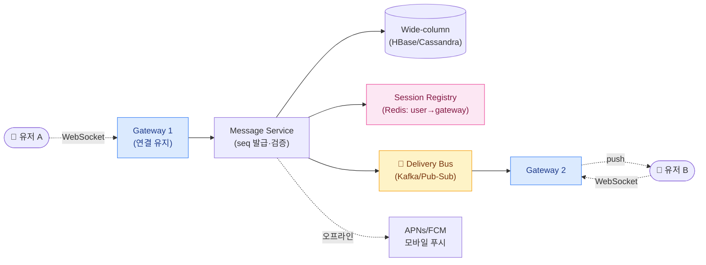
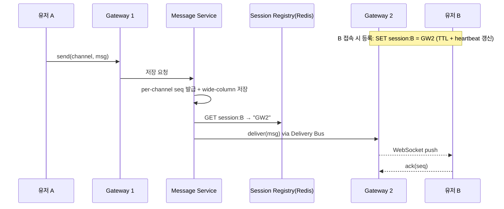
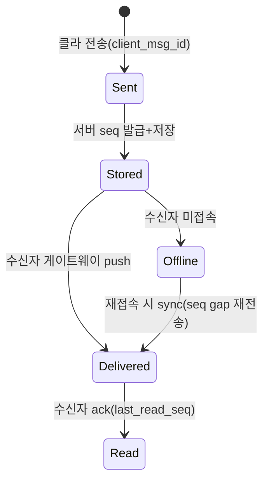

## 1. 요구사항 명확화 — 채팅은 '전달 보장'이 핵심

`실시간 채팅(Real-time Chat)`은 "메시지를 낮은 지연으로 상대에게 밀어 넣고(push), 잃지 않고 순서대로 저장·표시"하는 시스템이다. 카카오톡·LINE·Discord·Slack이 같은 문제다. 먼저 범위를 좁힌다.

### Functional 요구사항

- **1:1 채팅 / 그룹 채팅**: 그룹 인원 상한(수십? 수백? 수천의 Discord 서버?)에 따라 설계가 갈린다.
- **메시지 전달**: 실시간 push, **at-least-once 전달 + 클라이언트 dedup**. 순서 보장.
- **상태 표시**: 온라인/오프라인(presence), 타이핑 인디케이터, **읽음(read receipt)**, **안읽음 수**.
- **오프라인 지원**: 수신자가 접속 안 했으면 저장했다가, 재접속 시 sync + 모바일 push 알림.
- **히스토리**: 지난 대화 스크롤(무한 페이지네이션).

### Non-functional 요구사항

| 속성 | 목표 | 이유 |
| --- | --- | --- |
| **Low latency** | 전송 p99 < 200ms (같은 리전) | 실시간 체감의 생명 |
| **Durability(내구성)** | 메시지 유실 0 지향 | "보냈는데 안 왔다"는 채팅앱의 사망 신호 |
| **Ordering(순서)** | 채널 내 순서 보장 | 대화 맥락이 뒤섞이면 안 됨 |
| **High availability** | 게이트웨이 장애 시 재접속·재전송 | 연결 끊김은 상시 발생 → graceful reconnect 필수 |
| **Scale** | 동시 접속(concurrent connections) 수천만 | 접속 자체가 자원. C10K를 넘는 C10M 문제 |

> **🎯 면접 포인트 — 먼저 물을 질문**
>
> "**1:1 위주인가 대형 그룹인가**?(Discord식 수천 명 채널이면 fan-out 설계가 완전히 달라짐)", "**전달 보장 수준**은?(at-least-once + dedup)", "**멀티 디바이스** 지원?(폰+PC 동시)", "presence·타이핑까지 필요한가?" — 이 질문들이 시니어 신호. 특히 그룹 규모는 아키텍처를 통째로 바꾼다.

## 2. 용량 추정 — 동시 접속이 자원이다

전제: `DAU(Daily Active Users, 일간 활성 사용자)` **1억 명**, 유저당 하루 평균 송신 **40 메시지**.

### 메시지 QPS

- 1 day ≈ 10⁵ 초 (86,400s).
- 총 송신 = 1억 × 40 = 40억/day → 평균 **약 46,000 QPS**, 피크 5배면 **약 230,000 QPS**.
- 그룹 채팅은 1건 송신이 N명에게 fan-out → 실제 **전달(delivery) 이벤트**는 이보다 훨씬 큼(그룹 평균 인원 곱).

### 동시 접속(concurrent connection)

- 동접률 20% 가정: 1억 × 0.2 = **2,000만 동시 WebSocket 연결**.
- 한 게이트웨이 서버가 유지 가능한 연결을 **약 50만~100만**으로 보면(메모리/FD 튜닝), 2,000만 / 65만 ≈ **약 30~40대의 게이트웨이**. → 연결 상태(누가 어디 붙었나)를 관리하는 것이 핵심 과제.

### 저장 용량

- 메시지 1개 ≈ **300 B**(본문+메타). 40억/day × 300B = **약 1.2 TB/day** → 1년 **약 430 TB**.
- → 단일 RDB로 불가. **wide-column store**(HBase/Cassandra류)에 채널별 시계열로 저장.

> **💡 추정의 결론을 설계로**
>
> "동접 2,000만 → 게이트웨이 30~40대에 연결이 흩어짐 → **세션 라우팅(누가 어느 서버?)** 이 1급 문제. 저장 430TB/년 → RDB 불가, **채널ID를 파티션 키로 하는 wide-column**. 순서를 서버가 흩어진 채로 지켜야 함 → **per-channel sequence**." 추정이 곧 설계 축이 된다.

## 3. API / 데이터 모델

### 연결 & API

- **WebSocket**: `wss://chat/connect?token=...` → 인증 후 지속 연결. 이 연결로 송수신·presence·타이핑을 멀티플렉싱.
- `send(channel_id, client_msg_id, text)` — `client_msg_id`는 클라이언트 UUID로 **dedup·재전송 안전성** 확보.
- `GET /v1/channels/{id}/messages?before={seq}&limit=50` — 히스토리 페이지네이션.
- `ack(channel_id, last_read_seq)` — 읽음 커서 갱신.

### 데이터 모델 (wide-column)

```sql
-- 메시지: partition key = channel_id, clustering = seq (채널 내 순서 정렬 내장)
-- (Cassandra/HBase 개념을 SQL 유사문법으로 표현)
CREATE TABLE messages (
    channel_id   BIGINT,
    seq          BIGINT,        -- per-channel monotonic sequence
    message_id   BIGINT,        -- Snowflake (전역 유일·시간 힌트)
    sender_id    BIGINT,
    content      TEXT,
    created_at   TIMESTAMPTZ,
    PRIMARY KEY ((channel_id), seq)   -- 채널 단위 파티션, seq 순 정렬 저장
) WITH CLUSTERING ORDER BY (seq DESC);

-- 읽음 커서: 참여자별 '어디까지 읽었나'만 저장 (메시지마다 X)
CREATE TABLE read_cursors (
    channel_id    BIGINT,
    user_id       BIGINT,
    last_read_seq BIGINT,
    PRIMARY KEY ((channel_id), user_id)
);
```

> **⚠️ 실무 함정 — 서버 timestamp로 정렬하지 마라**
>
> 게이트웨이가 30대로 흩어져 있고 각 서버 벽시계(wall clock)는 **clock skew(시계 오차)** 가 있다. timestamp로 정렬하면 늦게 도착한 메시지가 앞에 끼거나 순서가 뒤집힌다. 반드시 **채널별 단조 증가 시퀀스(per-channel monotonic sequence)** 를 발급해 그걸로 정렬·dedup해야 한다. "created_at으로 order by 하면 됩니다"는 즉시 지적당한다.

## 4. High-level 아키텍처



*A는 GW1, B는 GW2에 붙어 있다. Message Service가 seq 발급·저장 후, Session Registry로 "B가 GW2에 있음"을 조회해 그 게이트웨이로 delivery. B가 오프라인이면 저장만 하고 모바일 푸시.*

### Long Polling vs SSE vs WebSocket

| 방식 | 방향성 | 지연 | 오버헤드 | 채팅 적합도 |
| --- | --- | --- | --- | --- |
| **Long Polling** | 단방향(요청-대기) | 중간(재연결 gap) | 매 폴링마다 HTTP 헤더·재핸드셰이크 | △ fallback용으론 OK |
| **SSE(Server-Sent Events)** | 서버→클라 단방향 | 낮음 | HTTP 유지, 송신은 별도 요청 필요 | △ 수신 위주면 가능(알림엔 좋음) |
| **WebSocket** | **양방향 full-duplex** | **가장 낮음** | 핸드셰이크 1회 후 프레임만 | ◎ 채팅의 표준 |

> **💡 사례 — 무엇을 쓰나**
>
> **Discord** 는 WebSocket 게이트웨이 + Elixir/Erlang(경량 프로세스로 대량 동접) + Cassandra(→ 후에 ScyllaDB)로 메시지를 저장한다. **Slack** 도 WebSocket 기반 이벤트 스트림. **카카오톡·LINE** 은 자체 프로토콜(LOCO 등) 위 지속 연결. 공통점: **지속 연결 + 별도 세션 레지스트리 + wide-column 저장**.

## 5. Deep-dive 🔥

### 5-1. 세션 라우팅 — "B가 지금 어느 서버에?"

게이트웨이가 흩어져 있으니, A의 메시지를 B에게 밀려면 "B가 붙은 게이트웨이"를 알아야 한다. **Session Registry(보통 Redis)** 에 `user_id → gateway_id` 매핑을 유지한다.



*B 접속 시 자기 게이트웨이를 레지스트리에 등록(heartbeat로 TTL 갱신). 전송 시 레지스트리를 조회해 정확한 게이트웨이로 라우팅.*

> **🎯 면접 함정 #1 — 레지스트리 정합성과 멀티 디바이스**
>
> ① 게이트웨이가 죽으면 레지스트리의 매핑이 **stale**해진다 → heartbeat 기반 TTL + 재접속 시 재등록으로 self-heal. ② 유저가 **폰+PC 동시 접속**이면 `user_id → {여러 gateway}` 세트가 되어 **전 디바이스로 fan-out**해야 한다. "user당 서버 하나"로 답하면 멀티 디바이스를 놓친 것. ③ 각 게이트웨이가 `Delivery Bus(Kafka/Pub-Sub)`를 구독하고 자기에게 붙은 유저만 골라 push하는 방식(브로드캐스트 구독)이 레지스트리 조회를 줄이는 대안.

### 5-2. 순서 보장 — per-channel sequence, 병목 피하기

채널마다 단조 증가 seq를 발급한다. 문제는 발급 지점이 병목/SPOF가 되지 않게 하는 것.

- **채널 단위 샤딩**: seq 발급을 채널ID로 샤딩. 한 채널은 항상 같은 파티션/워커가 처리 → 그 안에서 순차 증가. 채널 간엔 독립이라 전체는 수평 확장.
- **at-least-once + client dedup**: 네트워크 재전송으로 중복이 올 수 있으니, `client_msg_id`로 서버가 dedup하고, 수신 클라이언트도 seq로 중복 제거.



*메시지 라이프사이클. Offline이면 저장만 하고, 재접속 시 마지막 읽은 seq 이후를 gap 채워 재전송한다.*

> **⚠️ 실무 함정 — sequence 발급을 전역 단일 카운터로 두지 마라**
>
> 모든 채널의 seq를 하나의 전역 원자 카운터에서 뽑으면 그게 곧 전 시스템의 SPOF·병목이다(초당 수십만 발급). **채널 단위로 seq 공간을 분리**해야 수평 확장된다. 전역 유일성이 필요한 건 `message_id`(Snowflake)뿐이고, **정렬용 seq는 채널 로컬**이면 충분하다.

### 5-3. 읽음 처리 & 안읽음 수 — fan-out 폭발 관리

- **읽음 커서(read cursor)**: 메시지마다 읽음 플래그를 두지 않는다. 참여자별 `last_read_seq` **하나**만 저장 → "그 seq 이하는 다 읽음". 저장·갱신 비용이 O(참여자).
- **안읽음 수(unread count)**: `채널 최신 seq − 내 last_read_seq`로 즉시 계산. 별도 카운터를 매 메시지 증가시키는 방식보다 정합성이 안전.

| 방식 | 읽음 표현 | 비용 | 대형 그룹 |
| --- | --- | --- | --- |
| **메시지별 읽음 플래그** | 메시지 × 유저 매트릭스 | 폭발적(N×M) | ✗ 수백 명 방에서 붕괴 |
| **read cursor(커서)** | 참여자별 last_read_seq 1개 | O(참여자) | ◎ 표준 방식 |

> **🎯 면접 함정 #2 — 대형 그룹 read receipt fan-out**
>
> 500명 방에서 한 명이 읽을 때마다 read receipt를 **전원에게 실시간 push**하면 500명 × 500명 = 25만 이벤트가 튄다. 1:1이나 소규모는 실시간 receipt를 주지만, **대형 그룹은 read receipt를 aggregate**(예: "N명 읽음"만, 그것도 주기적 집계/폴링)하거나 아예 제공하지 않는다(Discord는 개별 read receipt 없음). "모두에게 읽음 표시 보내면 됩니다"는 fan-out 폭발을 무시한 답.

> **💡 물류 도메인 — "기사-고객 실시간 채팅 & 위치 공유"**
>
> 라스트마일에서 **배송기사와 고객 간 채팅**은 정확히 이 시스템이다. 특징: ① 대화가 **주문(order) 단위로 단명**한다 → 채널 = order_id, 배송 완료 후 TTL로 아카이빙. ② 채팅 채널 위에 **실시간 위치 공유(기사 GPS 좌표 스트림)** 를 얹는데, 이건 순서·유실이 덜 민감한 **고빈도 저가치 이벤트**라 채팅 메시지와 다른 QoS로 다뤄야 한다(위치는 최신값만 유지·중간값 drop 허용, 채팅은 durable). ③ 기사·고객 모두 오프라인이 잦으니 **오프라인 저장 + FCM/APNs 푸시**가 핵심. ④ "메시지를 상담사가 봤나"보다 "**기사가 곧 도착**" 같은 시스템 이벤트를 채팅 스트림에 섞어 보내는 하이브리드가 실무에 흔하다. per-channel seq로 채팅·시스템 이벤트·위치를 한 타임라인에 정렬한다.

## 6. Trade-off 정리 — "정답"은 없다

| 결정 포인트 | 선택 A | 선택 B | 언제 어느 쪽 |
| --- | --- | --- | --- |
| 전송 프로토콜 | WebSocket (양방향·저지연) | SSE/Long Polling (단순·방화벽 친화) | 채팅 본류는 WebSocket, 수신 알림·fallback은 SSE/폴링 |
| 순서 보장 | per-channel seq (확장성) | 전역 timestamp (단순) | 다중 게이트웨이면 seq 필수, 단일 노드 데모면 timestamp도 가능 |
| 저장소 | wide-column (쓰기 처리량·시계열) | RDB (트랜잭션·조인) | 대규모 채팅은 wide-column, 소규모·강한 정합성이면 RDB |
| 전달 보장 | at-least-once + dedup (안전) | at-most-once (단순·유실 허용) | 채팅은 유실 불가 → at-least-once, 위치/타이핑은 at-most-once로 경량화 |
| read receipt | 전원 실시간 fan-out | 집계/미제공 | 1:1·소규모는 실시간, 대형 그룹은 집계 또는 생략 |

> **🎯 마무리 한 줄 (면접 클로징)**
>
> "채팅 본류는 **WebSocket 게이트웨이 + Redis 세션 레지스트리(멀티 디바이스 fan-out) + Kafka delivery bus**로 흩어진 서버 간 라우팅을 풀고, 순서는 **채널 단위 샤딩 + per-channel monotonic seq**로 병목 없이 보장합니다. 저장은 channel_id 파티션의 **wide-column**, 읽음은 **read cursor 한 개**로 O(참여자)에 잡고, 오프라인은 저장 후 **재접속 sync + 모바일 푸시**로 메웁니다. 대형 그룹의 read receipt fan-out만 집계로 눌러줍니다." — 라우팅·순서·읽음·오프라인을 한 호흡에 정리하면 합격 시그널.
