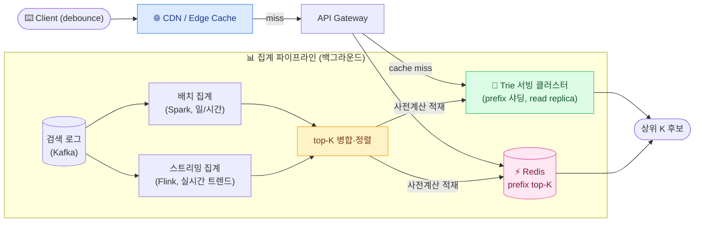
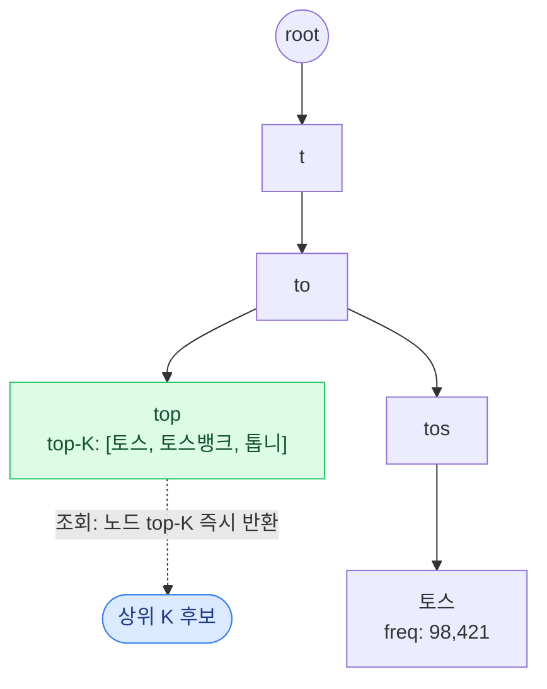
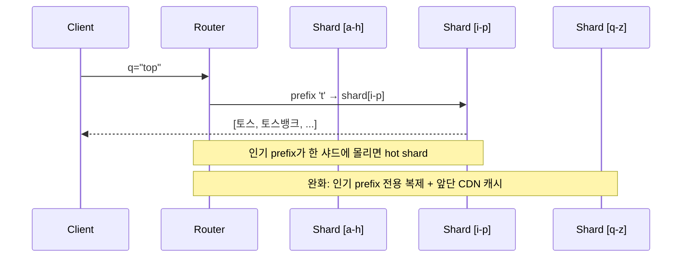

## 1. 요구사항 명확화 — read-heavy의 극단

`Search Autocomplete(검색 자동완성)`은 사용자가 입력창에 `t`, `to`, `top` 을 칠 때마다 상위 후보를 즉시 내려주는 기능이다. 검색 실행(엔터)보다 **요청 수가 압도적으로 많은** read-heavy 시스템이라는 점을 먼저 못 박아야 한다.

### Functional 요구사항

- **prefix 매칭**: 입력 문자열을 접두어로 갖는 후보를 반환. `top` → `토스`, `토스뱅크`, `톱니바퀴`...
- **상위 K개**: 보통 K = 5~10. 무한정이 아니라 **인기도(popularity) 순 상위 K**만.
- **정렬 기준**: 검색 빈도(frequency) + 최신성(recency) + (선택) 개인화·지역.
- **범위 밖 합의**: 오타 교정(fuzzy), 다국어/초성 검색, 개인화는 v1 범위 밖으로 명시 후 확장으로 다룸.

### Non-functional 요구사항

| 속성 | 목표 | 이유 |
| --- | --- | --- |
| **Ultra-low latency** | p99 < 100ms (체감상 50~100ms) | 타이핑을 따라와야 함. 느리면 후보가 뒤늦게 떠 UX 붕괴 |
| **High QPS** | 검색 QPS의 5~10배 흡수 | 한 검색당 글자 수만큼 요청 발생 |
| **Availability** | 자동완성 죽어도 검색 본체는 살아야 | 부가 기능 — fail-soft(빈 목록 반환) |
| **Freshness** | 분~시간 단위 신선도 | 실시간 정확성보다 **사전계산된 근사**가 우선 |

> **🎯 면접 포인트 — "쓰기보다 읽기가 100배"를 선언하라**
>
> 자동완성의 정체성은 **극단적 read-heavy + 사전계산**이다. "검색어를 실시간으로 정렬해서 top K를 뽑겠다"고 시작하면 감점 — 매 keystroke마다 정렬하면 지연이 터진다. "쓰기(집계)는 백그라운드에서 미리, 읽기(서빙)는 미리 만든 자료구조 조회만" 이라는 **read/write 분리**를 첫 문장으로 선언하면 시니어 신호다.

## 2. 용량 추정 — keystroke가 QPS를 부풀린다

### QPS 추정

전제: 하루 **검색 1,000만 건(10^7)**, 평균 검색어 길이 **5글자**, 각 글자마다 debounce 후 1요청.

- 1 day ≈ 10^5 초 (86,400s).
- 검색 실행 QPS = 10^7 / 10^5 = **약 100 QPS**.
- 자동완성 요청 = 검색 × 5글자 = 5 × 10^7 → **약 500 QPS 평균**.
- 피크는 평균의 5~10배 → **약 2,500 ~ 5,000 QPS**로 설계.

> 실무 debounce(디바운스, 입력이 멈추면 요청): 20~50ms 대기로 keystroke당 요청을 3~5배 줄인다. 추정에도 debounce 후 유효 요청만 계산해야 과대추정을 피한다.

### 데이터·메모리 추정

- 고유 검색어(용어) 수: **1,000만(10^7)**, 용어 평균 20 B.
- Trie 노드: 대략 용어 수 × 평균 접두어 공유율. 노드당 자식 포인터·top-K 캐시 포함 보수적으로 **용어당 ~200 B** → 10^7 × 200 B = **약 2 GB**.
- 상위 K 사전계산 캐시(prefix → K개 리스트): 자주 쓰는 prefix 수백만 개 × (K개 × 20 B) → **수 GB**.
- 결론: **단일 노드 메모리(수십 GB)에 in-memory Trie**가 들어간다. 다만 QPS·가용성 때문에 **여러 replica로 복제**하고 prefix로 샤딩.

> **💡 추정 → 설계 연결**
>
> "2,500~5,000 QPS, Trie ~2GB → 메모리엔 여유, 병목은 QPS와 지연. 따라서 **읽기 전용 Trie replica를 여러 대**로 수평 확장하고, prefix 상위 K를 **미리 노드에 붙여** 조회를 O(prefix 길이)로 끝낸다. 앞단엔 CDN·Redis 캐시로 대부분을 흡수." — 추정이 곧 아키텍처 결정 근거.

## 3. API / 데이터 모델

### 서빙 API

- `GET /autocomplete?q=top&limit=10&locale=ko` → `["토스","토스뱅크","톱니바퀴", ...]`.
- 응답은 캐시 친화적으로: `Cache-Control: public, max-age=60`, `ETag` 부여 → CDN·브라우저가 흡수.
- fail-soft: 내부 오류 시 `200 []`(빈 목록) 반환 — 검색창을 막지 않는다.

### 데이터 모델

- **집계 저장(원천)**: `term_frequency(term, count, window_end)` — 시계열 집계 테이블/스토어.
- **서빙 자료구조**: Trie 노드에 `top_k`(사전계산된 상위 K 리스트)를 **직접 저장**. prefix 조회 시 정렬 없이 바로 리턴.
- **Redis 서빙(대안)**: `ZSET` per prefix — `ZADD ac:{prefix} {score} {term}`, 조회는 `ZREVRANGE ac:{prefix} 0 K`.

```redis
# prefix "top" 후보를 인기도(score) 내림차순 상위 10개
ZREVRANGE ac:top 0 9 WITHSCORES

# 집계 배치가 prefix별 top-K를 사전계산해 갱신 (score = 빈도 가중치)
ZADD ac:top 98421 "토스" 51200 "토스뱅크" 8800 "톱니바퀴"
EXPIRE ac:top 3600          # 신선도 1시간, 배치가 재적재
```

> **⚠️ 실무 함정 — "매 요청 정렬"과 "prefix ZSET 폭발"**
>
> ① 조회 시점에 전체 후보를 `LIKE 'top%'` 로 긁어 정렬하면 p99가 수백 ms로 터진다 — **반드시 top-K 사전계산**. ② 그렇다고 모든 prefix마다 ZSET을 만들면(`t`, `to`, `top`...) 키가 폭증한다. 짧은 prefix(1~2글자)는 후보가 너무 많아 hot key가 된다. 해법: **인기 prefix만 캐시**하고 나머지는 Trie 조회로 폴백, 짧은 prefix는 CDN에서 강하게 캐시.

## 4. High-level 아키텍처

자동완성은 두 개의 독립된 경로 — **서빙(읽기)**와 **집계 파이프라인(쓰기)** — 로 나뉜다.



*읽기 경로는 CDN→Redis→Trie 순으로 얕게 끝나고, 쓰기(집계)는 검색 로그를 배치+스트리밍으로 모아 top-K를 미리 만들어 서빙 계층에 밀어넣는다.*

### 서빙 방식 3종 비교

| 방식 | p99 지연 | 메모리/운영 | 업데이트 비용 | 언제 |
| --- | --- | --- | --- | --- |
| **In-memory Trie + top-K** | **가장 낮음** (~ms, O(prefix)) | 높음(전량 메모리·자체 운영) | 재빌드/증분 갱신 필요 | 초저지연·대규모 트래픽, 구글·네이버급 |
| **DB `LIKE 'prefix%'`** | 높음(인덱스 스캔·정렬) | 낮음(기존 DB 재사용) | 즉시(쓰면 반영) | 소규모·프로토타입, prefix 인덱스로 버팀 |
| **Elasticsearch completion suggester** | 낮음(FST 기반) | 중간(ES 클러스터 운영) | 색인 반영 지연 | 오타·다국어·랭킹 유연성 필요, 운영 편의 |

> **💡 사례 — 어떻게 서빙하나**
>
> **구글**은 검색량 로그를 대규모로 집계해 prefix별 상위 후보를 사전계산하고 엣지에 밀어 넣는다. **네이버 자동완성**은 실시간 급상승과 개인화·연관어를 병합해 내려준다. 소규모 서비스라면 **Elasticsearch completion suggester**(내부적으로 `FST(Finite State Transducer, 유한 상태 변환기)`)로 Trie를 직접 짜지 않고 저지연 prefix 검색을 얻는 게 현실적 — "직접 Trie를 구현하겠다"만 답하면 운영 비용을 무시한 것.

## 5. Deep-dive

### 5-1. Trie와 상위 K 사전계산

Trie는 접두어를 공유하는 트리다. 핵심 최적화는 **각 노드에 그 아래 서브트리의 top-K를 미리 붙여두는 것**. 그러면 조회는 "prefix까지 내려가서 노드의 top-K를 그대로 반환" — 정렬 없이 **O(prefix 길이)**.



*각 Trie 노드가 서브트리의 top-K를 캐시 → prefix 조회 시 정렬 비용 0. 집계 배치가 top-K를 주기적으로 재계산해 노드에 밀어넣는다.*

> **🎯 면접 함정 #1 — "조회 때 정렬"의 함정**
>
> 순진한 구현은 prefix 노드 아래 전체 후보를 모아 매 요청마다 정렬한다 → 인기 prefix(`t`)는 후보가 수십만이라 지연 폭발. **정렬은 집계 시점(백그라운드)에 미리**, 조회는 캐시된 top-K를 읽기만. 이 read/write 비대칭을 설명하면 핵심 한 방 통과.

### 5-2. prefix 기반 샤딩과 hot shard

Trie가 메모리를 넘거나 QPS를 한 노드로 못 버티면 샤딩한다. 자연스러운 키는 **prefix 앞 1~2글자**.



| 샤딩 전략 | 장점 | 단점 |
| --- | --- | --- |
| **prefix 글자 기반** | 라우팅 단순·같은 prefix 지역성 | 알파벳/글자 분포 편중 → hot shard |
| **prefix 해시 기반** | 부하 균등 | 같은 prefix 그룹 지역성 상실, 범위 조회 불리 |
| **인기 prefix 전용 복제** | hot key 흡수 | 복제 관리·정합성 부담 |

> **⚠️ 실무 함정 — 짧은 prefix가 hot shard를 만든다**
>
> `t`, `a` 같은 1글자 prefix는 후보가 압도적으로 많고 요청도 몰려 **hot shard/hot key**가 된다. 대응: ① 1~2글자 결과는 **CDN·브라우저에 길게 캐시**(어차피 잘 안 바뀜), ② 인기 prefix 샤드를 **추가 복제**, ③ debounce로 아주 짧은 prefix 요청 자체를 줄이기. "prefix 앞글자로 샤딩하면 끝"이라 답하면 편중을 지적당한다.

### 5-3. 집계 파이프라인 — 배치 + 실시간 트렌드

top-K를 만드는 쓰기 경로다. 정확한 누적 통계(배치)와 급상승 트렌드(스트리밍)를 **병합**하는 lambda-style이 핵심.

- **배치(Batch)**: 검색 로그를 일/시간 단위로 Spark 집계 → 안정적 누적 빈도. 지연 크지만 정확.
- **스트리밍(Streaming)**: Flink/Kafka Streams로 최근 N분 윈도 집계 → 급상승어 즉시 반영.
- **병합·감쇠**: `score = 배치 누적 × 시간감쇠 + 실시간 트렌드 가중`. 오래된 인기어는 `decay(감쇠)`로 서서히 강등.

| 갱신 방식 | 신선도 | 비용 | 위험 |
| --- | --- | --- | --- |
| **배치만 (일 단위)** | 낮음(하루 지연) | 저 | 실시간 이슈어 누락 |
| **스트리밍만** | 높음 | 고(상시 연산) | 노이즈·스팸어 급부상 |
| **배치 + 스트리밍 병합** | 균형 | 중~고 | 병합 로직 복잡·정합성 관리 |

> **⚠️ 실무 함정 — 트렌드 조작·오염**
>
> 실시간 트렌드를 그대로 반영하면 **어뷰징(반복 검색으로 특정어 급상승)**, 부적절어, 오타어가 후보에 오른다. 방어: 유니크 사용자 기준 카운트(반복 필터), 블록리스트, 최소 빈도 임계치, 이상탐지. 카카오·네이버가 실시간 급상승에 신중한 이유다. "실시간 빈도 그대로 top-K" 는 운영 리스크를 무시한 답.

### 5-4. 다층 캐싱

read-heavy를 흡수하는 방어선. 자동완성 응답은 개인화만 없다면 매우 캐시 친화적이다.

| 계층 | TTL | 무엇을 흡수 | 주의 |
| --- | --- | --- | --- |
| **브라우저** | 30~60s | 같은 사용자의 재타이핑 | 개인화 붙으면 캐시 불가 |
| **CDN/Edge** | 60s~수분 | 인기 prefix 전역 트래픽 | prefix가 키 → 카디널리티 관리 |
| **Redis** | 분 단위 | Trie 앞단 공용 캐시 | stampede(쇄도) 방지 필요 |
| **Trie 노드 top-K** | 집계 주기 | 최종 서빙 자료구조 | 증분 갱신 정합성 |

> **💡 물류 도메인 — "주소·상품명 자동완성"**
>
> 풀필먼트/라스트마일에서 **송장 입력 시 주소 자동완성**, **셀러 상품 등록 시 상품명 자동완성**이 같은 구조다. • 주소는 **도로명 접두어 Trie**로, 배송량 많은 지역(강남·판교)이 hot prefix → CDN 캐시 + 지역 샤드 복제. • 상품명은 **검색·주문 빈도로 top-K 사전계산**하되, 신상품·품절은 스트리밍으로 빠르게 반영(품절 상품을 계속 추천하면 오배차·오주문). freshness가 물류에선 곧 정확성이라, 배치 주기를 짧게 가져가고 품절 이벤트는 실시간 무효화(invalidation)한다.

## 6. Trade-off 정리 — "정답"은 없다

| 결정 포인트 | 선택 A | 선택 B | 언제 어느 쪽 |
| --- | --- | --- | --- |
| 서빙 자료구조 | In-memory Trie (초저지연) | Elasticsearch suggester (운영 편의) | 초대형·초저지연이면 Trie, 오타·다국어·소규모면 ES |
| top-K | 사전계산 (조회 빠름) | 실시간 정렬 (항상 최신) | 거의 항상 사전계산, 극소규모만 실시간 |
| 집계 | 배치 (정확·저비용) | 스트리밍 병합 (신선) | 트렌드 중요하면 병합, 안정 도메인이면 배치 |
| 샤딩 | prefix 글자 (지역성) | 해시 (부하 균등) | 범위·지역성이면 글자, 균등 우선이면 해시 |
| 캐시 신선도 | 긴 TTL (부하↓) | 짧은 TTL + 무효화 (신선) | 안 바뀌는 prefix는 길게, 품절/트렌드는 짧게+이벤트 무효화 |

> **🎯 마무리 한 줄 (면접 클로징)**
>
> "읽기와 쓰기를 분리해 **집계 파이프라인이 prefix별 top-K를 미리 만들고**, 서빙은 **in-memory Trie 노드의 top-K를 O(prefix)로 조회**합니다. 앞단은 CDN·Redis 다층 캐시로 read-heavy를 흡수하고, prefix 글자로 샤딩하되 hot prefix는 복제·엣지 캐시로 방어합니다. 트렌드는 **배치 + 스트리밍 병합**에 어뷰징 필터를 얹어 신선도와 안정성을 함께 잡습니다." — read/write 분리와 다층 방어를 한 호흡에 정리하면 합격 시그널.
