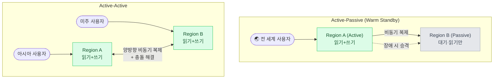
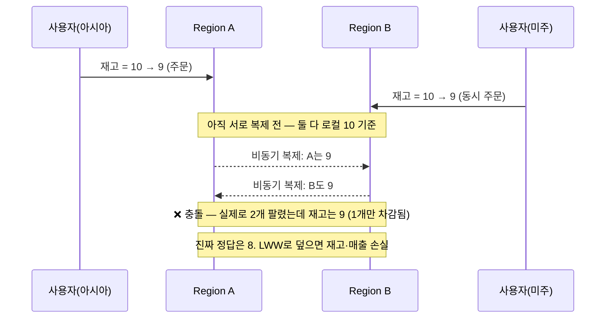
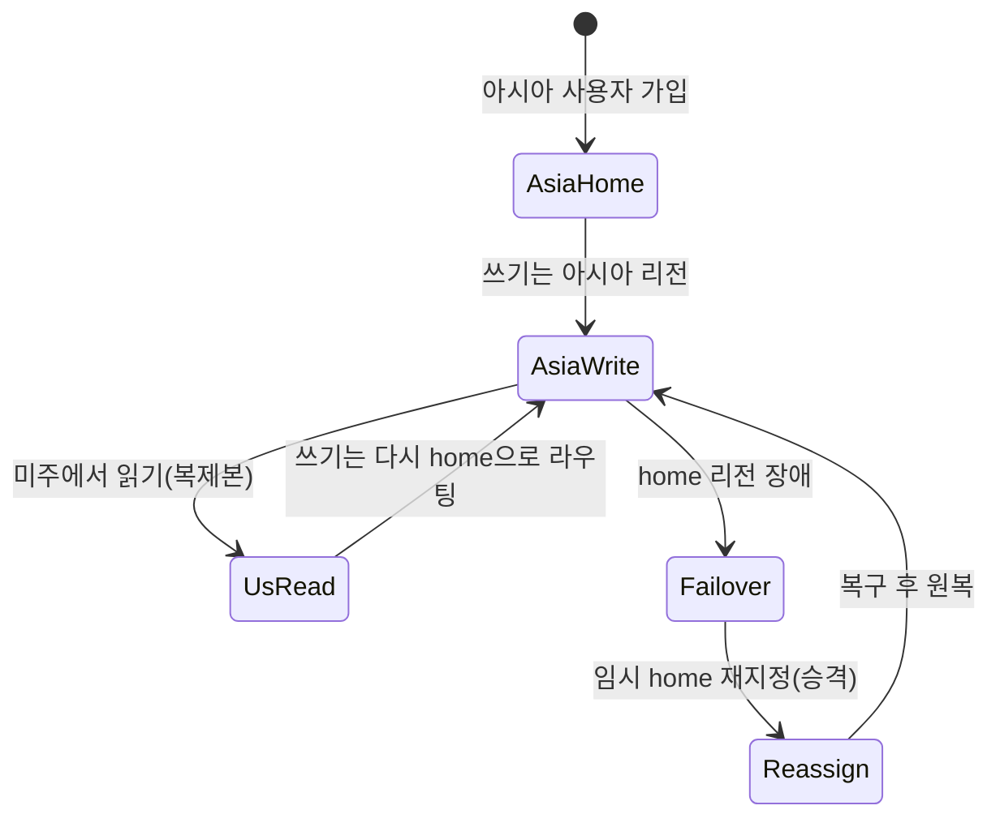
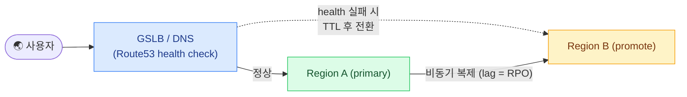
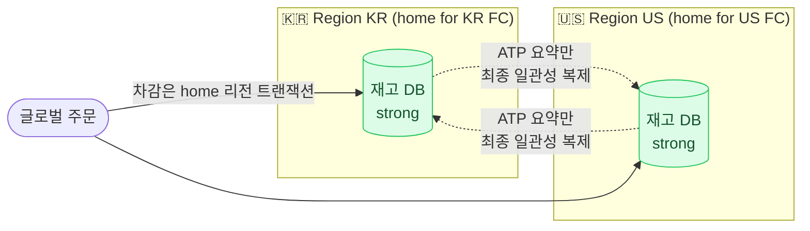

## 1. 왜 멀티리전인가 — 세 가지 동인

`Multi-Region(멀티리전)` 아키텍처는 시스템을 지리적으로 떨어진 여러 데이터센터 리전에 배치하는 것이다. 단일 리전으로 충분한데 굳이 복잡도를 떠안는 이유는 셋뿐이다.

- **지연(Latency)**: 사용자와 가까운 리전에서 응답. 서울 사용자가 미국 리전에 붙으면 왕복만 150~200ms. 글로벌 서비스는 사용자를 가까운 리전으로 붙여 체감 지연을 낮춘다.
- **가용성(Availability)**: 리전 전체 장애(AWS ap-northeast-2 다운 등)에도 다른 리전이 트래픽을 받아 서비스 지속. Single-region은 리전이 SPOF.
- **규제·데이터 주권(Data Sovereignty)**: `GDPR(General Data Protection Regulation, 유럽 개인정보보호법)`, 중국 데이터 현지화 등 — 특정 국가 사용자 데이터를 그 지역에 저장해야 하는 법적 요구.

> **🎯 면접 포인트 — "왜"를 못 대면 오버엔지니어링**
>
> 멀티리전은 비용·복잡도·일관성 난이도가 급증한다. "글로벌하니까 멀티리전"은 감점. 위 셋 중 **어떤 동인이 지배적인가**를 먼저 규정해야 아키텍처가 갈린다. 규제 때문이면 geo-partitioning이, 가용성 때문이면 failover 설계가, 지연 때문이면 read replica 배치가 중심이 된다.

### 물리적 제약 — 빛의 속도는 못 이긴다

| 구간 | RTT(왕복) | 함의 |
| --- | --- | --- |
| DC 내부 | ~0.5ms | 동기 복제 가능 |
| 같은 대륙 리전 간 (서울↔도쿄) | ~30~40ms | 동기 복제 부담되지만 가능 |
| 대륙 간 (서울↔버지니아) | ~150~180ms | 동기 복제하면 매 쓰기가 150ms+ → 사실상 불가 |
| 유럽↔아시아 | ~120~150ms | 동일 |

> **⚠️ 실무 함정 — "전 리전 동기 복제로 강한 일관성"**
>
> 리전 간 RTT 150ms 상황에서 모든 쓰기를 전 리전에 **동기 복제**하면 커밋 지연이 150ms+ 붙는다. TPS는 폭락하고 한 리전 느려지면 전체가 느려진다. 그래서 대부분 **리전 내부는 동기, 리전 간은 비동기** 복제를 택한다. 비동기의 대가가 곧 다음 섹션의 replication lag과 충돌이다. "전부 strong consistency"는 물리를 무시한 답.

## 2. 아키텍처 패턴 — Active-Passive vs Active-Active



*Active-Passive는 한 리전만 쓰기를 받고 다른 리전은 대기(장애 시 승격). Active-Active는 여러 리전이 동시에 쓰기를 받아 충돌 해결이 필수.*

| 패턴 | 쓰기 | 장점 | 단점 | RTO/RPO |
| --- | --- | --- | --- | --- |
| **Active-Passive (Warm Standby)** | 단일 리전 | 충돌 없음·단순, 일관성 관리 쉬움 | Passive 리소스 유휴·페일오버 시간 필요 | RTO 분~수십분, RPO ≈ lag |
| **Active-Active** | 다중 리전 | 낮은 지연·리소스 활용·리전 장애에 강함 | **충돌 해결 필수**·복잡도 급증 | RTO 초~분, RPO ≈ lag |
| **Pilot Light** | 단일 리전 | 최소 비용 대기 | 페일오버 시 스케일업 시간 김 | RTO 수십분~시간 |

> **💡 사례 — Netflix의 Active-Active**
>
> **Netflix**는 AWS 3개 리전에 걸친 Active-Active로 유명하다. 한 리전을 통째로 죽이는 **Chaos(카오스) 훈련**(regional evacuation)을 정기적으로 해 페일오버를 검증한다. 사용자를 가까운 리전으로 라우팅하되, 리전 장애 시 수 분 내 다른 리전으로 트래픽을 흘려보낸다. 핵심 교훈: **페일오버는 평소에 훈련해야 실제로 작동한다** — 안 돌려본 standby는 장애 때 반드시 문제를 낸다.

## 3. 리전 간 복제와 충돌 해결

비동기 복제는 **replication lag(복제 지연)**을 만든다. Region A에 쓴 데이터가 Region B에 도달하기 전, B가 같은 레코드를 수정하면 **충돌(conflict)**이 발생한다.



*Active-Active에서 동시 쓰기 충돌 — 재고 같은 수치는 LWW로 덮으면 데이터가 소실된다.*

### 충돌 해결 전략 3종

| 전략 | 방식 | 장점 | 위험 |
| --- | --- | --- | --- |
| **LWW (Last-Write-Wins)** | 타임스탬프 큰 쓰기 채택 | 단순·자동 | **조용한 데이터 손실**, 시계 오차(clock skew)에 취약 |
| **CRDT (Conflict-free Replicated Data Type)** | 수학적으로 병합 보장(카운터·집합) | 손실 없이 자동 수렴 | 표현 가능한 자료형 제한·메모리 오버헤드 |
| **단일 writer 리전 (home region)** | 레코드마다 쓰기 담당 리전 고정 | 충돌 원천 차단 | 원격 사용자 쓰기 지연·home 리전 장애 시 재지정 |

> **⚠️ 실무 함정 — LWW의 조용한 손실**
>
> LWW는 "타임스탬프 큰 값이 이긴다"이지만, 위 재고 예시처럼 **두 쓰기가 모두 유효한 차감**일 때 하나를 버리면 재고·매출이 소실된다. 게다가 서버 시계가 어긋나면(clock skew) 나중 쓰기가 더 작은 타임스탬프를 달아 **먼저 쓴 값이 이기는** 역전도 생긴다. 카운터성 데이터는 **CRDT(예: PN-Counter)**나 **단일 writer**로 가야 한다. "충돌은 LWW로 처리"만 답하면 시니어 기준 미달.

## 4. 데이터 파티셔닝 — home region과 geo-partitioning

충돌을 원천 차단하는 상위 전략은 **각 데이터에 "고향 리전"을 부여**하는 것이다.

- **User home region**: 사용자 A의 데이터는 A가 속한 리전이 쓰기를 소유. 다른 리전은 읽기 복제본만. → 사용자별 충돌 없음.
- **Geo-partitioning**: 데이터를 지역 기준으로 분할 저장. 유럽 사용자 데이터는 유럽 리전에만(GDPR 충족). CockroachDB·Spanner가 row 단위 `locality`를 지정.



*User home region — 쓰기는 항상 home 리전으로, 원격 리전은 읽기 복제본. 장애 시에만 home을 재지정.*

> **💡 사례 — 쿠팡·글로벌 커머스의 지역 분리**
>
> **쿠팡**은 한국 중심이지만 대만·글로벌 확장에서 리전별 데이터·재고를 분리 운영한다. **Amazon**의 커머스는 마켓플레이스(리전)별로 재고·주문을 파티셔닝하고, 리전 간에는 카탈로그·정산 같은 저빈도 데이터만 비동기로 맞춘다. 핵심은 **강한 일관성이 필요한 데이터(재고·결제)는 단일 리전에 가두고, 리전 간에는 최종 일관성으로 충분한 것만 복제**하는 경계 설계다.

## 5. 페일오버 — RTO/RPO와 라우팅

리전 장애 시 트래픽을 다른 리전으로 넘기는 것이 페일오버다. 두 지표로 목표를 정량화한다.

- **RTO(Recovery Time Objective, 복구 목표 시간)**: 장애 후 서비스 재개까지 허용 시간. (예: 5분)
- **RPO(Recovery Point Objective, 복구 목표 지점)**: 허용 가능한 데이터 손실 범위. 비동기 복제면 **RPO ≈ replication lag**.



*GSLB/DNS health check가 리전 장애를 감지하고 트래픽을 승격 리전으로 전환. 전환 지연에 DNS TTL이 더해진다.*

### 글로벌 트랜잭션·복제 기술 비교

| 기술 | 일관성 | 복제 | 페일오버 특성 | 대가 |
| --- | --- | --- | --- | --- |
| **Google Spanner** | 외부 일관성(strong) | Paxos quorum + **TrueTime** | 자동, RPO ≈ 0 | 쓰기 지연↑·GPS/원자시계 인프라 |
| **DynamoDB Global Tables** | 최종 일관성(LWW) | 멀티 리전 Active-Active 비동기 | 자동, RPO = lag(초 단위) | 충돌 시 LWW 손실 가능 |
| **Aurora Global Database** | 리전 내 strong, 리전 간 async | 스토리지 레벨 비동기 | 수동/자동 승격, RPO ~1초·RTO ~분 | 승격 시간·읽기 전용 secondary |

> **⚠️ 실무 함정 — DNS 페일오버의 split-brain과 TTL**
>
> ① **DNS TTL**: 클라이언트·중간 리졸버가 이전 IP를 TTL 동안 캐시 → TTL이 300초면 전환에 최대 5분 지연(RTO 악화). 그래서 짧은 TTL + health check를 쓰지만 너무 짧으면 DNS 부하. ② **Split-brain(분단 뇌)**: 네트워크 분단으로 두 리전이 서로 상대가 죽은 줄 알고 **둘 다 primary로 승격**하면 양쪽에 쓰기가 갈려 데이터가 갈라진다. 방어: 외부 합의(quorum/witness), fencing token, 자동 승격에 사람 확인 게이트. "health check 실패하면 자동 승격"만 답하면 split-brain을 지적당한다.

> **🎯 면접 포인트 — RPO는 비동기 복제에서 0이 될 수 없다**
>
> 비동기 복제는 원리상 "primary에 커밋됐지만 아직 secondary에 안 넘어간 데이터"가 존재한다. primary가 그 순간 죽으면 그 데이터는 **소실**된다 — RPO > 0은 필연. RPO를 0으로 만들려면 동기 복제(Spanner식 quorum)가 필요하고, 그 대가는 쓰기 지연이다. 이 **RPO-지연 트레이드오프**를 명확히 말하는 게 시니어 시그널.

## 6. 심화 함정 — 물류 도메인 재해석

> **💡 물류 도메인 — "글로벌 풀필먼트 재고의 리전 간 정합성"**
>
> 글로벌 이커머스는 한국·미국·유럽 `FC(Fulfillment Center, 풀필먼트 센터)`의 재고를 각 리전 DB로 관리한다. 여기서 멀티리전 일관성이 곧 돈이다. • **재고 차감은 절대 LWW 금지** — 위 재고 예시처럼 동시 주문이 조용히 소실되면 **oversell(초과 판매)**이나 재고 유령이 생긴다. FC별 재고는 **단일 writer 리전(home = 그 FC의 리전)**에 가두고 강한 일관성으로 차감한다. • 리전 간에는 **"판매 가능 수량(ATP, Available To Promise)" 요약만 최종 일관성**으로 복제 — 다른 리전 고객에게 "재고 있음"을 보여주되, 실제 차감(확정)은 home 리전 트랜잭션으로. • 리전 장애로 페일오버할 때 lag만큼의 **미복제 주문**은 RPO 손실 후보 → **Outbox + 멱등(idempotent) 재처리**로 복구 시 재적용, 또는 결제 확정 전까지 재고를 **soft-reserve**만 걸어 손실 시 자동 해제. 물류에선 RPO 1건이 실제 배송사고이므로, 재고·주문 확정 경로만 동기 quorum(비용 감수), 조회·추천은 비동기로 나누는 **경로별 일관성 차등**이 정답에 가깝다.



*FC 재고 차감은 home 리전 strong consistency로, 리전 간에는 판매 가능 수량(ATP) 요약만 최종 일관성으로 복제.*

```sql
-- home 리전 내부: 재고 차감은 조건부 UPDATE로 원자적·oversell 방지
UPDATE inventory
   SET available = available - :qty,
       version   = version + 1
 WHERE fc_id = :fcId
   AND sku    = :sku
   AND available >= :qty;   -- 0행이면 재고 부족 → 주문 거절 (조용한 음수 금지)

-- 페일오버 복구 시 Outbox 이벤트를 멱등키로 재적용 (중복 차감 방지)
INSERT INTO applied_events (event_id) VALUES (:eventId)
ON CONFLICT (event_id) DO NOTHING;   -- 이미 적용됐으면 skip
```

### 확인 질문 3개

1. 리전 간 RTT 150ms 환경에서 결제 트랜잭션에 strong consistency가 필요하다면, 지연을 감수하고 동기 quorum(Spanner식)을 쓸지 vs 단일 리전에 가둘지 어떻게 결정하겠는가?
2. Active-Active에서 "좋아요 수 카운터"와 "계좌 잔액"은 충돌 해결 전략이 달라야 한다. 각각 무엇을 쓰고 왜 그런가? (힌트: CRDT vs 단일 writer)
3. DNS TTL 300초 + 비동기 복제 lag 2초인 시스템의 실질 RTO와 RPO는 각각 얼마인가? 이를 각각 절반으로 줄이려면 무엇을 바꿔야 하고, 그 대가는?

> **🎯 마무리 한 줄 (면접 클로징)**
>
> "멀티리전은 지연·가용성·규제 중 지배 동인을 먼저 정하고, **리전 내부는 동기·리전 간은 비동기**를 기본으로 합니다. 충돌은 데이터 성격별로 갈라 — 카운터는 CRDT, 잔액·재고는 **단일 writer home region + strong consistency**로 가두고, 조회성은 최종 일관성으로 복제합니다. 페일오버는 **RTO/RPO를 정량 목표로** 잡고 split-brain을 fencing/quorum으로 막으며, 무엇보다 평소에 리전 장애를 훈련합니다." — 경로별 일관성 차등과 RTO/RPO 정량화를 한 호흡에 말하면 시니어 합격 시그널.
