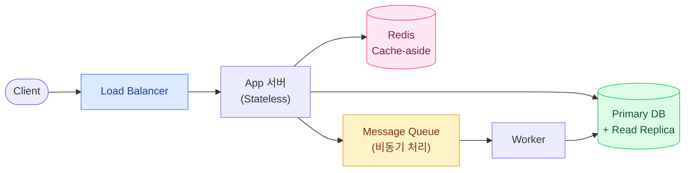
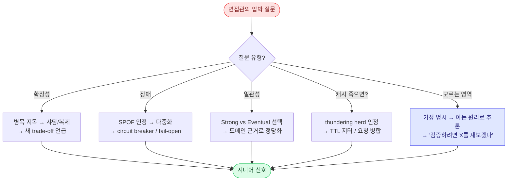
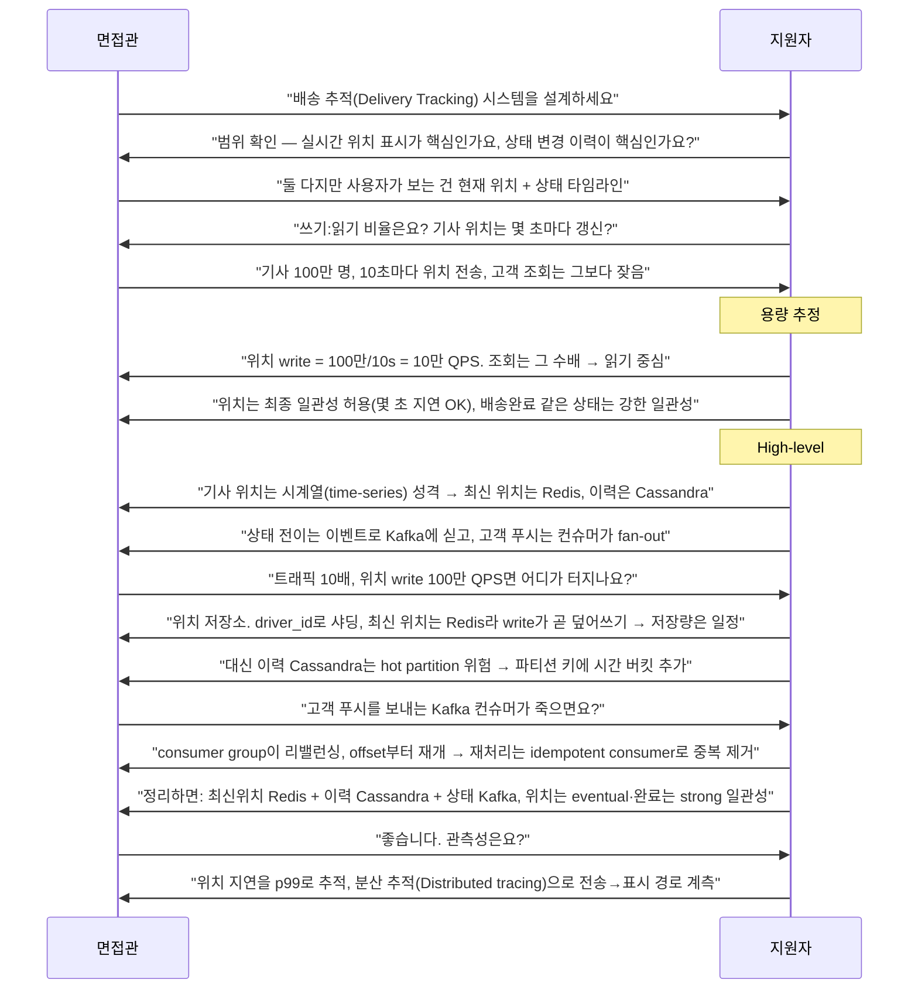

## 0. 이 카드의 목적 — 문제 20개보다 프레임워크 1개

시스템 디자인 면접에서 떨어지는 대부분은 지식이 없어서가 아니라 **45분을 운영하지 못해서**다. Kafka도 알고 Redis도 아는데, 45분 뒤 화이트보드에는 정당화 없는 박스만 잔뜩 그려져 있다. 면접관이 보는 것은 정답 아키텍처가 아니라 **모호한 문제를 구조화하는 능력·trade-off를 언어화하는 능력·압박에 무너지지 않는 태도**다.

> **🎯 면접 포인트 — 면접관의 채점 기준**
>
> 쿠팡·토스·카카오, 그리고 FAANG(Facebook·Amazon·Apple·Netflix·Google)의 시스템 디자인 면접은 공통적으로 6개 축을 본다: **요구사항 파악 / 용량 추정 / 아키텍처 합리성 / Deep-dive 깊이 / Trade-off 설명 / 커뮤니케이션**. 이 카드는 이 6축을 45분 타임라인에 어떻게 태우는지를 다룬다. "무엇을 설계하느냐"가 아니라 "어떻게 진행하느냐"가 주제다.

## 1. 45분 타임라인 — 시간을 지배하라

```mermaid
flowchart LR
    S(["면접 시작"]) --> R["1. 요구사항 명확화<br/>5~10분"]
    R --> E["2. 용량 추정<br/>5분"]
    E --> A["3. API / 데이터 모델<br/>5분"]
    A --> H["4. High-level 아키텍처<br/>10분"]
    H --> D["5. Deep-dive<br/>15분"]
    D --> C["6. 마무리 · Trade-off<br/>5분"]
    C --> F(["종료"])

    style R fill:#dbeafe,stroke:#3b82f6,color:#1e3a8a
    style E fill:#e0e7ff,stroke:#6366f1,color:#312e81
    style A fill:#ede9fe,stroke:#8b5cf6,color:#4c1d95
    style H fill:#fef3c7,stroke:#f59e0b,color:#78350f
    style D fill:#fee2e2,stroke:#ef4444,color:#7f1d1d
    style C fill:#dcfce7,stroke:#22c55e,color:#14532d
```



*45분 배분. Deep-dive(15분)가 변별력의 핵심 구간이다. 앞단계를 질질 끌면 Deep-dive를 못 가고 "박스만 그리다 끝난" 인상을 남긴다.*

| 단계 | 시간 | 이 단계에서 면접관이 확인하는 것 | 흔한 실패 |
| --- | --- | --- | --- |
| 요구사항 명확화 | 5~10분 | scope를 좁히는가, 무엇을 안 만들지 정하는가 | 질문 없이 바로 그림 |
| 용량 추정 | 5분 | 숫자를 만들고 그 숫자로 결정하는가 | 계산 없이 "많이 옵니다" |
| API / 데이터 모델 | 5분 | 핵심 엔티티·접근 패턴을 잡는가 | 필드 나열에 시간 낭비 |
| High-level | 10분 | 컴포넌트 간 데이터 흐름이 말이 되는가 | 정당화 없는 기술 나열 |
| Deep-dive | 15분 | 병목·일관성·장애를 끝까지 파는가 | 얕게 훑고 다음으로 도망 |
| 마무리 | 5분 | trade-off를 스스로 요약하는가 | 시간 초과로 도달 못 함 |

> **💡 팁 — 시간 배분을 입으로 선언하라**
>
> 시작할 때 "요구사항 5분, 추정 5분 잡고 아키텍처와 deep-dive에 시간을 많이 쓰겠습니다"라고 말하면 그 자체로 **시간 관리 능력**을 보여주는 신호다. 면접관은 "이 사람은 45분을 스스로 운영하는구나"라고 첫인상을 잡는다.

## 2. 단계별 진행법 + 압박 후속 질문 대응

면접관의 후속 질문은 랜덤이 아니다. 각 단계마다 **"네가 지금 한 결정을 정말 이해하고 했냐"**를 찌르는 정형화된 압박이 있다. 미리 알면 방어할 수 있다.

### 2-1. 요구사항 명확화 (5~10분)

무엇을 만들고 무엇을 **안** 만들지부터 합의한다. Functional(기능)과 Non-functional(비기능: 가용성·일관성·지연·처리량·저장량)을 나눠 묻는다.

> **⚠️ 실무 함정 — "일단 그리기" 유혹**
>
> 문제를 듣자마자 손이 화이트보드로 가는 것이 가장 흔한 탈락 신호다. "URL 단축기 설계하세요"에 바로 hash 함수를 그리는 순간, 면접관은 "custom alias 지원 여부? 만료? 분석 기능?"을 묻고 지원자는 이미 그린 그림을 지운다. **5분의 질문이 40분의 방향을 정한다.**

압박 후속과 대응:

- 면접관: "이 시스템의 **핵심 유스케이스 하나만** 꼽으면?" → 모범: scope를 좁혀 "쓰기보다 읽기가 100:1인 조회 중심 시스템"처럼 성격을 한 문장으로 규정. 이 규정이 뒤의 캐시·복제 결정을 정당화한다.
- 면접관: "가용성과 일관성 중 뭐가 더 중요한가요?" → 모범: 도메인으로 답한다. "송금은 강한 일관성(Strong Consistency), 배송 위치 표시는 최종 일관성(Eventual Consistency, 최종 일관성)으로 지연 몇 초를 허용" — CAP(Consistency, Availability, Partition tolerance) 이론을 도메인에 접지.

### 2-2. 용량 추정 (5분)

DAU(Daily Active Users, 일간 활성 사용자) → QPS(Queries Per Second, 초당 쿼리 수) → 저장량 → 대역폭. 반드시 **계산 과정을 입으로** 말한다.

```text
전제: DAU 1억, 사용자당 하루 평균 조회 10회
1 day ≈ 10^5 초 (정확히 86,400s)

평균 QPS = (1억 × 10) / 10^5 = 10^9 / 10^5 = 10,000 QPS
피크 QPS = 평균 × 5~10배 ≈ 50,000 ~ 100,000 QPS

저장량(가정: 레코드당 300B, 하루 10억 write)
= 10^9 × 300B = 3 × 10^11 B ≈ 300 GB/day → 1년 ≈ 100 TB
```

> **🎯 면접 포인트 — 추정은 설계의 근거가 되어야 한다**
>
> 숫자를 계산만 하고 버리면 의미 없다. "피크 10만 QPS → 단일 DB로 불가 → 읽기 복제 + 캐시로 읽기를 흡수, 쓰기는 샤딩"처럼 **추정 → 아키텍처 결정으로 즉시 연결**해야 한다. 면접관이 "그 숫자로 무엇을 결정했나요?"라고 물었을 때 답이 없으면 계산은 장식이었던 것.

압박 후속: 면접관 "**트래픽이 10배가 되면** 어디가 먼저 터지나요?" → 모범 4단 구성: ① 병목 지목("단일 write DB") ② 근거 숫자("현재 10만 QPS write, 10배면 100만 — 단일 노드 한계 수만 QPS 초과") ③ 완화책("샤딩 키를 user_id로, 논리 샤드 N개") ④ **새 trade-off**("대신 cross-shard 조인 불가, 분산 트랜잭션 필요 → Saga로 회피"). "오토스케일 하면 됩니다"는 ②③④가 통째로 빠져 감점이다.

### 2-3. API / 데이터 모델 (5분)

REST vs gRPC를 접근 패턴으로 정하고, 핵심 엔티티와 **주요 인덱스**를 잡는다. 필드를 전부 나열하지 말고 접근 패턴(어떤 쿼리가 뜨거운가)에 집중한다.

### 2-4. High-level 아키텍처 (10분)

LB(Load Balancer) → App → Cache → DB에 Queue·CDN·Search를 필요한 만큼 배치. **각 박스를 그릴 때마다 "왜 여기 있는지" 한 문장**을 붙인다.



*High-level 기본형. 각 컴포넌트마다 존재 이유를 말로 정당화해야 "기술 나열"에서 벗어난다.*

압박 후속: 면접관 "**왜 Kafka인가요? SQS는 안 되나요?**" → 모범: 요구사항으로 가른다. "**재생(replay)·다중 컨슈머·순서 보장·높은 처리량**이 필요하면 Kafka(로그 기반, 파티션 순서). 단순 작업 큐이고 운영 부담을 줄이고 싶으면 SQS(완전관리형). 지금은 이벤트를 여러 소비자가 각자 처리하고 재생이 필요하므로 Kafka." — "Kafka가 좋으니까요"는 즉시 반격당한다.

### 2-5. Deep-dive (15분) — 변별력의 심장

면접관이 한 컴포넌트를 콕 집어 "여기를 더 파봅시다"라고 한다. 병목(Hotspot)·일관성·장애 전파(Cascading failure)·데이터 파이프라인 중 하나로 깊이 들어간다.



*압박 질문 분기 대응. 핵심은 "모르는 영역"조차 가정을 명시하고 원리로 추론하는 것 — 침묵이나 얼버무림만 피하면 된다.*

압박 후속: 면접관 "**그 캐시가 죽으면** 어떻게 되나요?" → 모범: ① 즉시 문제 인정("모든 읽기가 DB로 몰리는 **thundering herd(쇄도)**, DB가 2차로 죽는 cascading failure") ② 완화("TTL(Time To Live)에 지터를 줘 동시 만료 분산, 동일 키 요청은 **request coalescing**으로 1건만 DB로, cache warming") ③ 근거("현재 캐시 히트율 95% 가정 시 miss가 5%→100%면 DB 부하 20배"). 숫자로 규모를 잡으면 시니어 신호.

> **⚠️ 실무 함정 — Deep-dive에서 도망치기**
>
> 면접관이 깊이 파려 하는데 "그 부분은 이렇게 하면 되고요, 다음으로 넘어가서..."로 **주제를 바꾸는 것**이 미들과 시니어를 가르는 결정적 순간이다. 면접관은 일부러 한 곳을 깊이 판다. 여기서 "더 파고들 수 있다"를 보여주지 못하면 지식의 깊이가 없다고 판단한다. **한 주제를 3~4겹까지 파는 연습**을 해야 한다.

### 2-6. 마무리 (5분)

스스로 trade-off를 요약한다. "기본 설계는 A, 대안은 B(이럴 땐 B가 낫다), 남은 리스크는 C" 3문장이면 충분하다. 관측성(Observability: Metric·Log·Trace)과 비용을 한 줄씩 얹으면 완성도가 올라간다.

## 3. 흔한 탈락 패턴 — 자기 진단 체크리스트

| 탈락 패턴 | 무엇이 문제인가 | 어떻게 고치나 |
| --- | --- | --- |
| **요구사항 생략** | 5분 질문 없이 바로 그림 → scope 폭주 | 반드시 Functional/Non-functional 나눠 5분 확보 |
| **정당화 없는 기술 나열** | "Kafka, Redis, Cassandra 씁니다" 나열만 | 박스마다 "왜"를 한 문장씩 |
| **숫자 없는 주장** | "트래픽 많으니 확장해야죠" | DAU→QPS→저장량 계산을 입으로 |
| **면접관 힌트 무시** | 힌트를 흘려듣고 하던 것 계속 | 힌트는 "이쪽을 보라"는 신호 — 즉시 방향 전환 |
| **Deep-dive 회피** | 파려 하면 주제 변경 | 한 주제 3~4겹 파는 연습 |
| **시간 관리 실패** | 앞에서 20분 써 Deep-dive 못 감 | 타임박스 선언 + 스스로 컷 |

> **💡 팁 — 면접관 힌트는 감점이 아니라 구조 신호**
>
> "혹시 이 부분에서 데이터가 급증하면요?" 같은 질문은 비난이 아니라 **"여길 파면 점수를 준다"는 안내**다. 힌트가 나오면 감점당한 게 아니라 오히려 기회다. 힌트를 무시하고 원래 하려던 말을 계속하는 것이야말로 커뮤니케이션 감점. 힌트가 나오면 "좋은 지적입니다, 그 시나리오를 보면..."으로 즉시 올라타라.

## 4. 레벨별 평가 루브릭 — 같은 문제, 다른 깊이

같은 "배송 추적 시스템"을 줘도 레벨에 따라 발화가 갈린다. 자신이 지금 어느 칸에 있는지 진단하라.

| 단계 | 주니어 | 미들 | 시니어 |
| --- | --- | --- | --- |
| 요구사항 | 바로 그림부터 | 기능 요구는 물음 | 비기능(가용성·일관성 목표)을 숫자로 고정 |
| 추정 | 생략 | 대략 계산 | 추정을 아키텍처 결정 근거로 직결 |
| 아키텍처 | 단일 서버 | LB+DB+Cache 표준형 | 각 선택의 trade-off를 스스로 언급 |
| Deep-dive | 얕게 훑음 | 한 겹 파고 멈춤 | 병목→완화→새 trade-off까지 3~4겹 |
| 장애 | 고려 안 함 | SPOF 지목 | cascading·retry storm·fail-open 정책까지 |
| 커뮤니케이션 | 침묵/독백 | 설명은 함 | 면접관과 협업하듯 가정을 합의하며 진행 |

> **🎯 면접 포인트 — 시니어의 결정적 차이는 "trade-off의 자발성"**
>
> 미들은 면접관이 물어야 trade-off를 답한다. 시니어는 **묻기 전에 스스로** "이 선택의 단점은 X인데, 대안 Y는 이럴 때 낫습니다"를 말한다. 카카오·토스 시니어 면접의 합격선은 대체로 여기다 — 정답을 아느냐가 아니라, **자기 결정의 반대편을 스스로 볼 줄 아느냐.**

## 5. 모의 면접 시나리오 — "배송 추적 시스템을 설계하세요"

물류 도메인으로 45분이 실제로 어떻게 흐르는지 문답으로 본다.



*문답 흐름. 지원자가 그림보다 **질문·숫자·trade-off**를 먼저 던지는 리듬에 주목. 면접관의 압박마다 "지목→근거→완화→새 trade-off" 4단으로 응수한다.*

> **💡 팁 — 이 카드로 연습하는 법**
>
> `/interview <주제>`로 코치를 면접관 삼아 45분 타이머를 걸고 위 리듬을 재현하라. 끝나면 6축(요구사항·추정·아키텍처·Deep-dive·Trade-off·커뮤니케이션)을 각 5점으로 자가 채점하고, 4번 루브릭에서 자신이 어느 칸이었는지 표시하라. 관련 케이스는 `system-design-08~10`(Rate Limiter·URL Shortener·배송 추적)으로 이어서 손에 익힌다.
