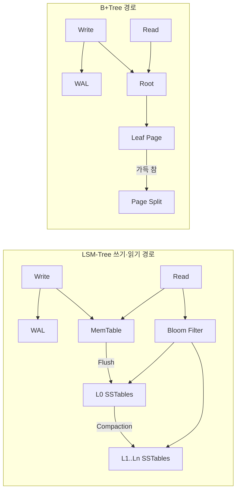

## 1. 저장 엔진 선택은 증폭 비용 선택이다

`B+Tree`는 정렬된 페이지를 제자리 갱신하고, `LSM-Tree(Log-Structured Merge-Tree, 로그 구조 병합 트리)`는 쓰기를 메모리와 순차 파일에 모은 뒤 백그라운드에서 합친다. “LSM은 쓰기가 빠르고 B+Tree는 읽기가 빠르다”는 출발점일 뿐이다. 운영에서는 사용자 I/O 한 번이 내부적으로 몇 번의 I/O와 몇 바이트의 저장 공간을 만드는지 봐야 한다.

| 비용 | 의미 | LSM-Tree | B+Tree |
|---|---|---|---|
| Read Amplification | 한 번 읽기 위해 확인하는 구조 수 | 여러 SSTable·레벨을 확인할 수 있음 | 보통 루트→리프 페이지 경로 |
| Write Amplification | 논리 쓰기 1바이트당 실제 쓰기 바이트 | WAL·Flush·반복 Compaction | WAL·데이터 페이지·페이지 분할 |
| Space Amplification | 최신 논리 데이터보다 더 쓰는 공간 | 중복 버전·삭제 Tombstone이 병합 전까지 존재 | 페이지 여유 공간·오래된 버전 |



## 2. LSM-Tree의 실제 경로

쓰기는 먼저 WAL(Write-Ahead Log, 선행 기록 로그)에 남고 정렬된 MemTable에 들어간다. MemTable이 차면 불변 구조로 전환한 뒤 SSTable(Sorted String Table)로 순차 Flush한다. 읽기는 MemTable과 여러 SSTable 후보를 확인하므로 Bloom Filter와 블록 인덱스가 불필요한 디스크 접근을 줄인다.

Compaction은 중복 버전과 Tombstone을 제거하지만 데이터를 다시 읽고 쓴다. Leveled Compaction은 읽기·공간 증폭을 낮추는 대신 쓰기 증폭이 커지기 쉽고, Tiered/Universal Compaction은 쓰기를 덜 합치는 대신 읽기·공간 비용과 I/O 변동성이 커진다.

```text
관측해야 할 최소 지표
- flush bytes/sec, compaction read/write bytes/sec
- L0 file count와 compaction pending bytes
- block-cache hit ratio, Bloom useful/false-positive 비율
- foreground write stall 시간, read p95/p99 latency
```

> **실무 함정** — 평균 쓰기 처리량이 충분해도 Compaction이 밀리면 L0 파일이 쌓여 쓰기 Stall과 읽기 p99가 함께 튄다. 부하 시험은 유입 구간뿐 아니라 Compaction이 정상 상태로 수렴하는 시간까지 지속해야 한다.

## 3. 언제 무엇을 선택하는가

- Append 중심 이벤트·시계열·대규모 KV 적재처럼 쓰기량이 크고 범위별 데이터 수명이 분명하면 LSM-Tree가 유리하다.
- 짧은 포인트 조회, 강한 범위 스캔 예측성, 빈번한 제자리 갱신이 중요하면 B+Tree가 단순한 선택일 수 있다.
- 엔진 이름보다 키 분포, 캐시 크기, 압축 전략, SSD IOPS, 읽기/쓰기 비율을 같은 데이터로 측정한다.

> **면접 포인트** — “쓰기 많으니 LSM”에서 멈추지 말고, Compaction 예산을 별도 I/O로 확보하고 쓰기 Stall·Tombstone·복구 시간까지 운영 설계에 포함해야 시니어 답변이 된다.

## 참고

- [RocksDB Compaction](https://github.com/facebook/rocksdb/wiki/Compaction)
- [RocksDB Universal Compaction](https://github.com/facebook/rocksdb/wiki/Universal-Compaction)
