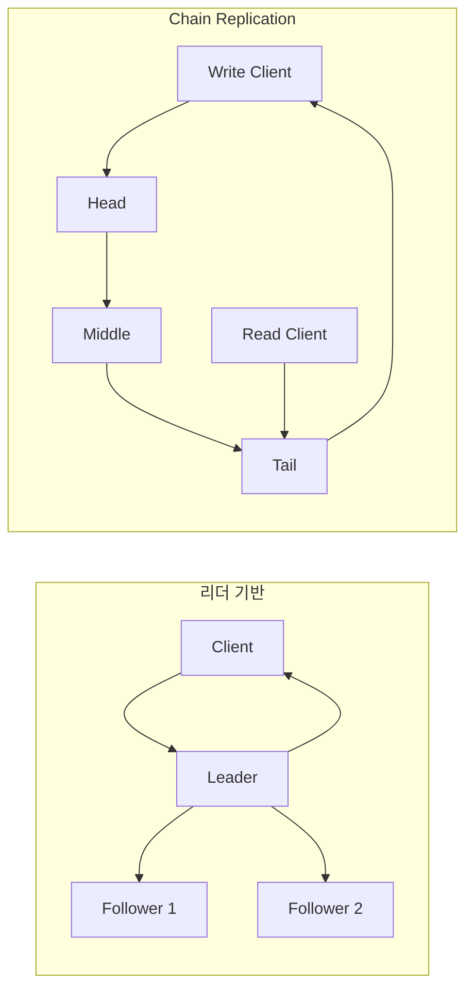

## 1. 복제는 순서와 확인 규칙이다

복제본을 세 대 둔다고 일관성이 자동으로 생기지 않는다. 누가 쓰기 순서를 정하고, 어느 복제본까지 반영됐을 때 성공으로 응답하며, 읽기가 어떤 버전을 반환할지 프로토콜로 정해야 한다.



| 방식 | 쓰기 순서 | 기본 읽기 위치 | 강점 | 주요 위험 |
|---|---|---|---|---|
| 리더 기반 | 리더 로그 순서 | 리더 또는 복제본 | 일반적이고 운영 경험 풍부 | 리더 병목·복제 지연 읽기 |
| Chain Replication | Head→…→Tail | Tail | 파이프라인 처리와 강한 읽기 규칙 | Tail 읽기 병목·체인 재구성 |
| CRAQ | 체인 전파 | 모든 노드 가능 | 읽기 확장성과 강한 일관성 조합 | Dirty 읽기의 Tail 확인 비용 |

## 2. CRAQ의 Clean과 Dirty

CRAQ(Chain Replication with Apportioned Queries)는 각 노드가 객체 버전을 저장한다. Tail까지 확정된 버전은 Clean, 아직 체인을 통과 중인 최신 버전은 Dirty다. 노드가 Clean 객체를 읽으면 즉시 응답하고, Dirty라면 Tail에 현재 확정 버전을 물어 그 버전을 반환한다.

```text
write(v2): Head -> Middle(v2=dirty) -> Tail(v2=commit)
ack(v2):   Tail -> ... -> Head, 각 노드는 v2를 clean 처리
read:      clean이면 로컬 응답, dirty이면 Tail의 확정 버전 확인
```

> **실무 함정** — 정상 경로 QPS만 비교하면 안 된다. 노드 제거 중 미완료 쓰기를 어느 이웃이 이어받는지, 새 노드가 Snapshot과 변경분을 어떻게 따라잡는지 정의되지 않으면 장애 순간에 중복 적용이나 유실이 생긴다.

## 3. 선택 기준

- 쓰기 순서와 트랜잭션 기능이 중요하고 범용 운영 도구가 필요하면 리더 기반이 자연스럽다.
- 읽기는 Tail로 충분하고 대량 객체 쓰기를 파이프라인화하려면 Chain Replication을 검토한다.
- 읽기 비중이 높고 여러 복제본에서 강한 읽기를 제공해야 한다면 CRAQ의 추가 메타데이터와 확인 비용을 비교한다.

> **면접 포인트** — “복제 3개” 대신 쓰기 성공 시점, 읽기 위치, RPO(Recovery Point Objective, 복구 시점 목표), 장애 감지 오판 시 동작을 순서대로 설명해야 한다.

## 참고

- [Chain Replication 논문](https://www.cs.cornell.edu/fbs/publications/ChainReplicOSDI.html)
