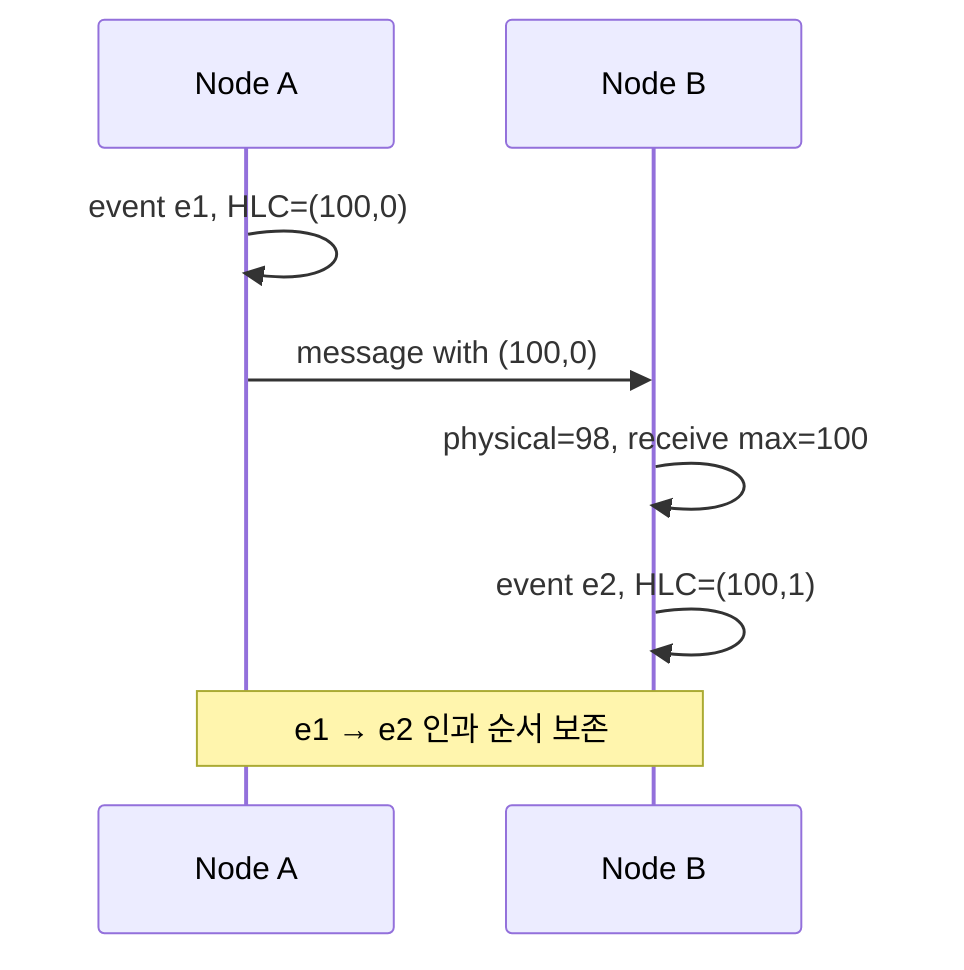

## 1. 벽시계는 정확한 전역 순서가 아니다

NTP 보정, VM 정지, 하드웨어 편차 때문에 서로 다른 노드의 `now()`는 어긋나거나 뒤로 갈 수 있다. 따라서 단순 Timestamp 비교는 인과관계를 잃을 수 있다. 분산 시계 설계는 필요한 보장이 “인과 순서”인지 “실제 시간과 일치하는 트랜잭션 순서”인지 먼저 구분한다.



| 방식 | 표현 | 제공하는 핵심 | 비용·제약 |
|---|---|---|---|
| 물리 시계 | 단일 Timestamp | 사람이 이해하기 쉬운 시간 | Skew·역행·동률 |
| Lamport Clock | 논리 Counter | 인과관계가 있으면 순서 증가 | 실제 시간과 거리 표현 불가 |
| HLC | 물리값+논리 Counter | 물리 시간 근접성과 인과 순서 | 완전한 동시성 판별은 아님 |
| TrueTime 계열 | `[earliest, latest]` 구간 | 제한된 시간 불확실성 노출 | 시계 인프라와 대기 비용 |

## 2. HLC 갱신 규칙

HLC(Hybrid Logical Clock, 하이브리드 논리 시계)는 로컬 물리 시간, 현재 HLC, 수신 HLC의 최대 물리값을 선택하고 동률일 때 논리 카운터를 증가시킨다. 물리 시계가 뒤로 가도 HLC가 감소하지 않게 만든다.

```text
on local event:
  physical = max(wall_clock, hlc.physical)
  logical  = (physical == hlc.physical) ? hlc.logical + 1 : 0

on receive(remote):
  physical = max(wall_clock, local.physical, remote.physical)
  logical  = 동률 관계에 따라 max(local.logical, remote.logical) + 1
```

TrueTime은 현재 시각을 점이 아니라 불확실성 구간으로 제공한다. 트랜잭션 Commit Timestamp 이후가 실제로 지났다고 확신할 때까지 기다리는 Commit Wait를 통해, 먼저 완료된 트랜잭션이 나중 트랜잭션보다 앞선 순서로 관찰되게 한다.

> **실무 함정** — HLC Timestamp가 있다고 충돌이 사라지는 것은 아니다. 동시에 발생한 업데이트의 병합 정책, Tie-breaker, 보존할 인과 메타데이터를 별도로 정해야 한다.

## 3. 선택 기준

- 이벤트 정렬과 버전 비교에 물리 시간 근접성이 필요하면 HLC를 검토한다.
- 진짜 동시성을 구분해야 하면 Vector Clock 같은 더 큰 메타데이터가 필요할 수 있다.
- 외부 일관성이 필요하면 제한된 시계 불확실성과 합의·Commit Wait가 결합된 시스템 비용을 받아들여야 한다.

> **면접 포인트** — “시계를 동기화한다”는 답보다 허용 Skew, 시간 역행, 인과관계, 동률 처리와 사용자에게 필요한 일관성 수준을 분리해 설명한다.

## 참고

- [Cloud Spanner: TrueTime and external consistency](https://docs.cloud.google.com/spanner/docs/true-time-external-consistency)
