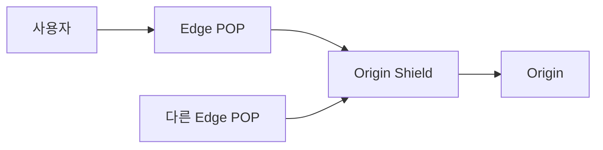

## 1. 캐시를 계층으로 본다

엣지 노드는 사용자와 가깝지만 모든 미스를 원본으로 보내면 인기 객체 만료 순간에 원본이 무너진다. 여러 엣지의 미스를 중간 Shield가 합치면 원본 요청 수를 줄일 수 있다.



| 결정 | 이점 | 위험 |
|---|---|---|
| 긴 TTL | 높은 적중률 | 오래된 응답 |
| Shield | 원본 보호·요청 병합 | 중앙 병목·지역 간 지연 |
| 버전 URL | 즉시 안전한 교체 | URL 생성 규칙 필요 |
| Purge | 같은 URL을 빠르게 갱신 | 전파 지연·운영 복잡성 |

```text
cache_key = scheme + host + path + normalized_query + selected_headers
freshness  = max_age - current_age
```

> **실무 함정** — 사용자 쿠키 전체를 키에 넣으면 객체가 사용자별로 쪼개져 CDN이 사실상 우회된다. 응답을 바꾸는 최소 차원만 명시한다.

## 2. 실패와 관측

미스율만 보지 말고 Shield 적중률, 원본 요청률, Purge 전파 시간, 오래된 응답 제공량을 함께 본다. 원본 장애 때 `stale-if-error`를 허용할 데이터와 절대 허용하지 않을 데이터를 분류한다.

> **면접 포인트** — CDN 도입으로 끝내지 말고 캐시 키, 일관성 요구, Hot Key와 원본 보호까지 요청 경로 전체를 설명한다.
