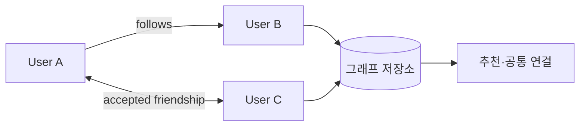

## 1. 관계의 의미부터 고정한다

팔로우는 방향 간선 하나지만 친구는 수락 상태를 가진 대칭 관계다. 쓰기 API는 요청 ID나 관계의 자연 키로 재시도를 멱등하게 처리하고 차단 관계가 모든 조회보다 우선하도록 한다.



| 조회 | 기본 구조 | 확장 전략 |
|---|---|---|
| 내가 팔로우 | `from_user` 인접 목록 | 커서 페이지네이션 |
| 나를 팔로우 | `to_user` 역방향 인덱스 | 샤드·캐시 |
| 공통 연결 | 정렬된 두 집합 교집합 | 작은 집합 우선·비동기 후보 |
| 추천 | 2-hop 후보+점수 | 배치 계산·온라인 필터 |

```sql
INSERT INTO follows(from_user_id, to_user_id, created_at)
VALUES (:from, :to, now())
ON CONFLICT (from_user_id, to_user_id) DO NOTHING;
```

> **설계 판단** — 일반 사용자는 사용자 ID 기준 샤딩이 단순하지만 유명 계정의 역방향 목록은 한 파티션에 집중된다. 고차수 노드는 별도 버킷으로 분산한다.

## 2. 일관성과 개인정보

관계 생성 직후 읽기는 주 저장소에서 확인하고 추천·카운트는 최종 일관성을 허용할 수 있다. 비공개 계정, 차단, 탈퇴 삭제는 파생 캐시와 추천 인덱스에도 전파해야 한다.

> **면접 포인트** — 그래프 DB 이름보다 핵심 조회 패턴, 차수 분포, 방향 인덱스, 개인정보 삭제 경로를 먼저 제시한다.
