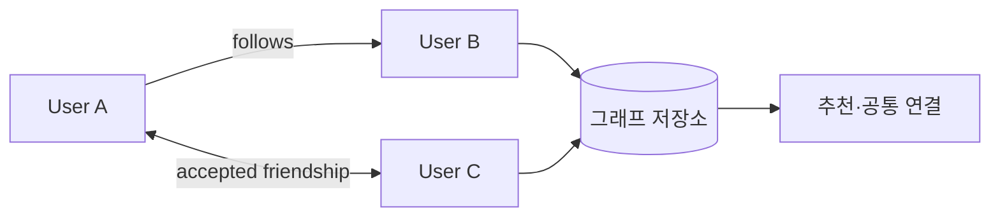

> **검수 경계** — 팔로워 수·공통 연결 수·캐시 크기는 가상 입력이다. 특정 소셜 서비스의 현재 그래프 저장소나 추천 알고리즘을 사실로 단정하지 않는다.

## 1. 관계의 의미부터 고정한다

팔로우는 방향 간선 하나지만 친구는 수락 상태를 가진 대칭 관계다. 쓰기 API는 요청 ID나 관계의 자연 키로 재시도를 멱등하게 처리하고 차단 관계가 모든 조회보다 우선하도록 한다.


```mermaid
flowchart LR
    A[User A] -->|follows| B[User B]
    A <-->|accepted friendship| C[User C]
    B --> G[(그래프 저장소)]
    C --> G
    G --> R[추천·공통 연결]
```

| 조회 | 기본 구조 | 확장 전략 |
|---|---|---|
| 내가 팔로우 | `from_user` 인접 목록 | 커서 페이지네이션 |
| 나를 팔로우 | `to_user` 역방향 인덱스 | 샤드·캐시 |
| 공통 연결 | 정렬된 두 집합 교집합 | 작은 집합 우선·비동기 후보 |
| 추천 | 2-hop 후보+점수 | 배치 계산·온라인 필터 |

```sql
INSERT INTO follows(from_user_id, to_user_id, created_at)
VALUES (:from, :to, now())
ON CONFLICT (from_user_id, to_user_id) DO NOTHING;
```

> **설계 판단** — 일반 사용자는 사용자 ID 기준 샤딩이 단순하지만 유명 계정의 역방향 목록은 한 파티션에 집중된다. 고차수 노드는 별도 버킷으로 분산한다.

## 2. 일관성과 개인정보

관계 생성 직후 읽기는 주 저장소에서 확인하고 추천·카운트는 최종 일관성을 허용할 수 있다. 비공개 계정, 차단, 탈퇴 삭제는 파생 캐시와 추천 인덱스에도 전파해야 한다.

> **면접 포인트** — 그래프 DB 이름보다 핵심 조회 패턴, 차수 분포, 방향 인덱스, 개인정보 삭제 경로를 먼저 제시한다.

## 검수 경계와 실패 흐름

- 수치와 임계값은 요구사항으로 선언하고 실제 workload·부하 테스트·관측 지표로 검증한다. 제품·기업의 내부 구현을 근거 없이 일반화하지 않는다.
- 쓰기 성공 후 이벤트/읽기 모델 갱신 실패, 응답 유실 후 재시도, 중복·순서 역전·부분 장애를 정상적인 실패 경로로 모델링한다.
- 원장과 캐시·검색·알림·분석 파생 모델의 상태를 구분하고, 멱등 키·버전·재처리 큐·대사 작업으로 수렴시킨다.
- 성능 최적화는 평균이 아니라 p95/p99, 버스트와 복구 중 부하를 함께 본다. fallback을 추가할 때 정확성·보안·개인정보·비용 trade-off를 기록한다.

## 공식·1차 출처

- [https://docs.aws.amazon.com/neptune/latest/userguide/PropertyGraph.html](https://docs.aws.amazon.com/neptune/latest/userguide/PropertyGraph.html)
- [https://redis.io/docs/latest/develop/data-types/sets/](https://redis.io/docs/latest/develop/data-types/sets/)
- [https://tinkerpop.apache.org/docs/current/reference/](https://tinkerpop.apache.org/docs/current/reference/)
