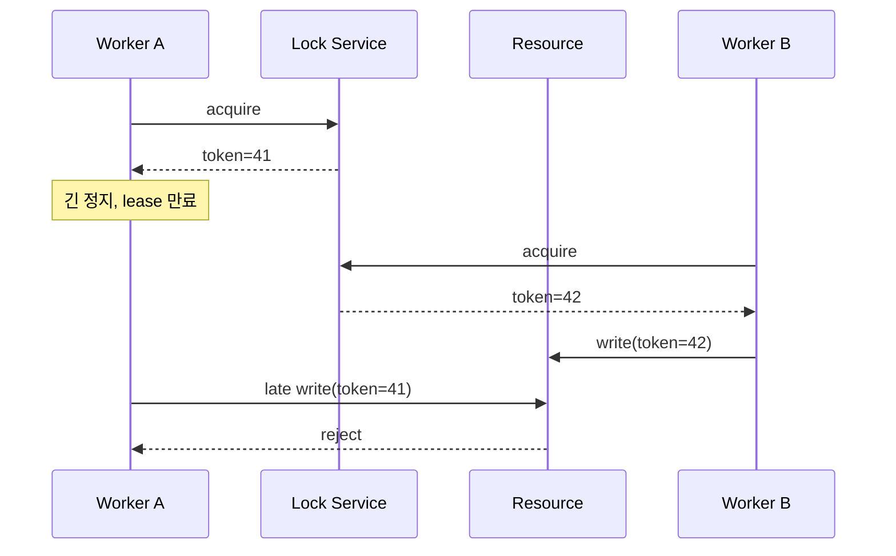

## 1. 락 획득과 쓰기 권한은 다르다

Lease는 죽은 소유자의 자원을 회수하지만, 네트워크 지연이나 긴 GC 뒤에 돌아온 이전 소유자가 쓰는 것을 혼자 막지 못한다. 락 서비스가 증가하는 Token을 발급하고 실제 자원이 더 작은 Token을 거부해야 한다.



| 방식 | 적합한 상황 | 한계 |
|---|---|---|
| DB 조건부 갱신 | 한 레코드 경쟁 | 범용 자원 조정 어려움 |
| 단일 Writer | 키별 순차 처리 | 라우팅·복구 설계 필요 |
| Lease | 제한 시간 소유 | 지연된 쓰기 차단 불충분 |
| Lease+Fencing | 외부 자원 보호 | 자원의 Token 검증 필요 |

```text
accept write only when incoming_fence >= last_accepted_fence
persist last_accepted_fence with the protected mutation
```

> **실무 함정** — 락 획득 성공을 작업 성공으로 간주하면 안 된다. Lease 갱신 실패, 세션 단절, 작업의 멱등성을 별도로 처리한다.

## 2. 운영 기준

합의 기반 세션의 가용성, 획득 지연, 만료 횟수, Token 거절량을 관측한다. 결제처럼 정합성이 핵심이면 락보다 데이터베이스 제약과 상태 전이를 우선 검토한다.

> **면접 포인트** — “Redis로 락”보다 실패 모델과 보호 대상이 Token을 검증하는 끝단 안전성을 설명한다.
