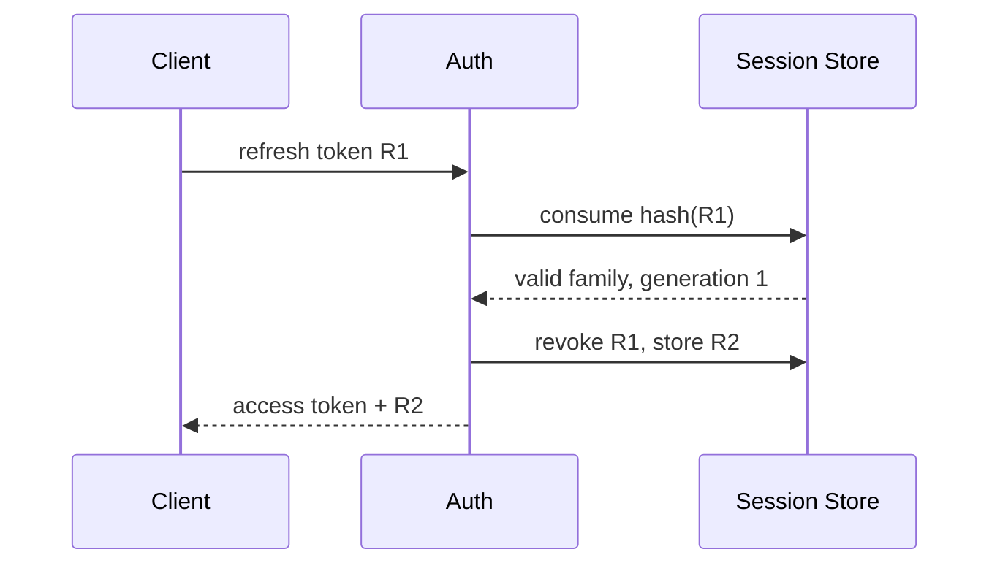

## 1. 두 종류의 상태를 구분한다

Access Token은 요청 검증 비용을 낮추고 짧게 유지한다. Refresh Token 계열은 서버에 해시와 세대 정보를 저장해 회전과 폐기를 통제한다. 비밀번호 변경이나 계정 차단은 사용자 세션 버전을 올려 전체 기기를 무효화할 수 있다.



| 선택 | 장점 | 비용 |
|---|---|---|
| 서버 세션 | 즉시 폐기·정책 변경 | 저장소 조회와 가용성 |
| 서명 Access Token | 분산 검증 | 만료 전 폐기 어려움 |
| Refresh 회전 | 탈취 재사용 감지 | 가족 상태·경쟁 처리 |
| 사용자 세션 버전 | 전체 로그아웃 단순화 | 검증 시 버전 확인 필요 |

```text
session_key = hash(refresh_token)
partition   = hash(user_id)
ttl         = min(device_policy, absolute_session_lifetime)
```

> **보안 경계** — 원본 Refresh Token을 로그나 DB에 평문으로 남기지 않는다. 재사용이 감지되면 같은 Token Family 전체를 폐기한다.

## 2. 확장과 장애

세션 저장소는 사용자 또는 Token ID로 샤딩하고 TTL 삭제 폭주를 분산한다. 저장소 장애 때 인증을 전부 허용하는 Fail-open은 보안 사고가 되므로 기능별 정책을 명시한다.

> **면접 포인트** — 토큰 형식 선택보다 강제 로그아웃 시간, 탈취 모델, 키 회전, 저장소 장애 정책을 요구사항으로 수치화한다.
