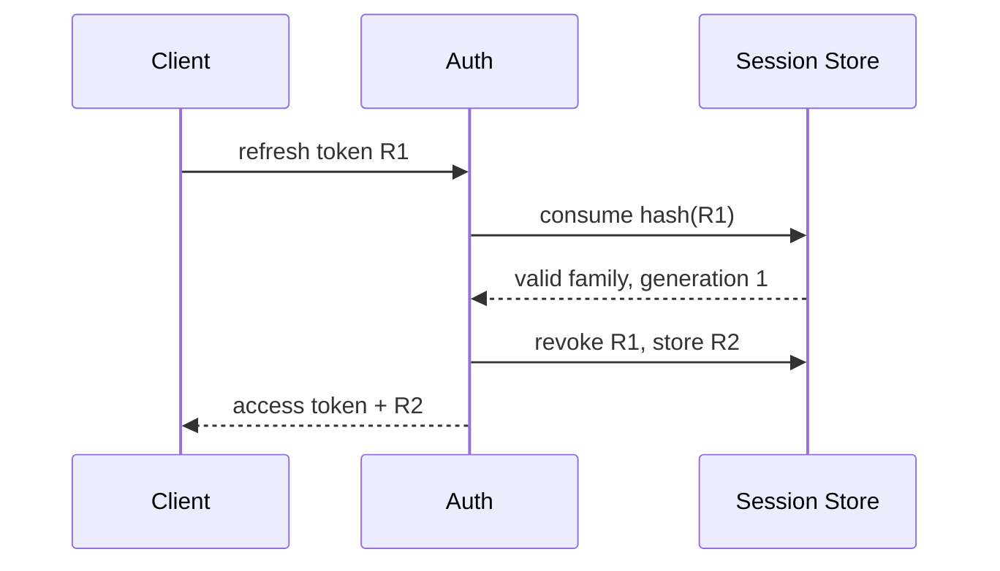

> **검수 경계** — 동시 세션 수와 토큰 TTL은 보안 요구사항과 사용자 경험에 따른 가상 입력이다. JWT나 Redis가 즉시 로그아웃을 자동 보장하지 않는다.

## 1. 두 종류의 상태를 구분한다

Access Token은 요청 검증 비용을 낮추고 짧게 유지한다. Refresh Token 계열은 서버에 해시와 세대 정보를 저장해 회전과 폐기를 통제한다. 비밀번호 변경이나 계정 차단은 사용자 세션 버전을 올려 전체 기기를 무효화할 수 있다.


```mermaid
sequenceDiagram
    participant C as Client
    participant A as Auth
    participant S as Session Store
    C->>A: refresh token R1
    A->>S: consume hash(R1)
    S-->>A: valid family, generation 1
    A->>S: revoke R1, store R2
    A-->>C: access token + R2
```

| 선택 | 장점 | 비용 |
|---|---|---|
| 서버 세션 | 즉시 폐기·정책 변경 | 저장소 조회와 가용성 |
| 서명 Access Token | 분산 검증 | 만료 전 폐기 어려움 |
| Refresh 회전 | 탈취 재사용 감지 | 가족 상태·경쟁 처리 |
| 사용자 세션 버전 | 전체 로그아웃 단순화 | 검증 시 버전 확인 필요 |

```text
session_key = hash(refresh_token)
partition   = hash(user_id)
ttl         = min(device_policy, absolute_session_lifetime)
```

> **보안 경계** — 원본 Refresh Token을 로그나 DB에 평문으로 남기지 않는다. 재사용이 감지되면 같은 Token Family 전체를 폐기한다.

## 2. 확장과 장애

세션 저장소는 사용자 또는 Token ID로 샤딩하고 TTL 삭제 폭주를 분산한다. 저장소 장애 때 인증을 전부 허용하는 Fail-open은 보안 사고가 되므로 기능별 정책을 명시한다.

> **면접 포인트** — 토큰 형식 선택보다 강제 로그아웃 시간, 탈취 모델, 키 회전, 저장소 장애 정책을 요구사항으로 수치화한다.

## 검수 경계와 실패 흐름

- 수치와 임계값은 요구사항으로 선언하고 실제 workload·부하 테스트·관측 지표로 검증한다. 제품·기업의 내부 구현을 근거 없이 일반화하지 않는다.
- 쓰기 성공 후 이벤트/읽기 모델 갱신 실패, 응답 유실 후 재시도, 중복·순서 역전·부분 장애를 정상적인 실패 경로로 모델링한다.
- 원장과 캐시·검색·알림·분석 파생 모델의 상태를 구분하고, 멱등 키·버전·재처리 큐·대사 작업으로 수렴시킨다.
- 성능 최적화는 평균이 아니라 p95/p99, 버스트와 복구 중 부하를 함께 본다. fallback을 추가할 때 정확성·보안·개인정보·비용 trade-off를 기록한다.

## 공식·1차 출처

- [https://cheatsheetseries.owasp.org/cheatsheets/Session_Management_Cheat_Sheet.html](https://cheatsheetseries.owasp.org/cheatsheets/Session_Management_Cheat_Sheet.html)
- [https://www.rfc-editor.org/rfc/rfc8725](https://www.rfc-editor.org/rfc/rfc8725)
- [https://www.rfc-editor.org/rfc/rfc9700](https://www.rfc-editor.org/rfc/rfc9700)
