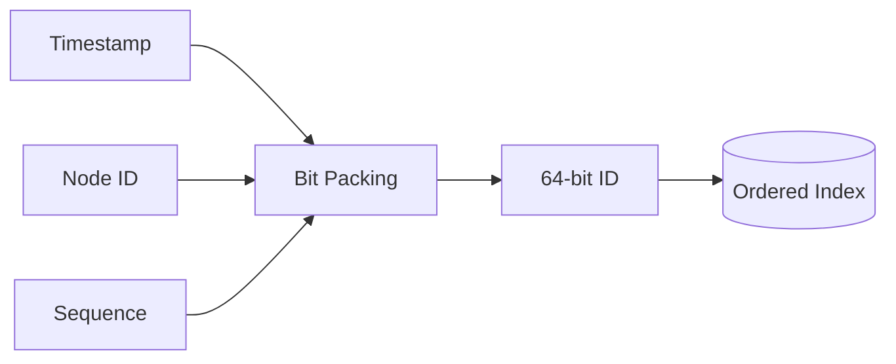

## 1. 필요한 속성을 먼저 고른다

전역 고유성, 대략적 시간 순서, 생성 가용성, 예측 불가능성은 서로 다른 요구다. 외부 공개 ID는 순차 번호 노출을 피하고, 내부 저장 키는 인덱스 지역성을 고려해 분리할 수도 있다.



| 방식 | 장점 | 주요 위험 |
|---|---|---|
| DB Sequence | 강한 고유성·단순함 | 중앙 의존·번호 노출 |
| 구간 할당 | DB 호출 감소 | 사용하지 않은 구간·할당 장애 |
| 랜덤 UUID | 조정 없는 생성 | 큰 키·인덱스 분산 쓰기 |
| 시간 기반 ID | 정렬·작은 키 | 시계 역행·노드 ID 충돌 |

```text
id = timestamp_bits | node_bits | per_tick_sequence
if clock < last_clock: stop, wait, or switch to a persisted logical epoch
```

> **실무 함정** — “충돌 확률이 낮다”와 “구조적으로 충돌하지 않는다”를 혼동하지 않는다. 생성 방식에 맞는 중복 제약은 최종 저장소에도 둔다.

## 2. 운영 안전장치

노드 ID는 임의 환경 변수보다 임대 레지스트리로 유일성을 보장한다. 시계 역행, 시퀀스 소진, 중복 제약 위반을 지표화하고 재시작 뒤 마지막 Epoch를 복구한다.

> **면접 포인트** — 초당 생성량으로 Timestamp·Sequence Bit를 계산하고 수명, 정렬성, 장애 시 가용성의 Trade-off를 설명한다.
