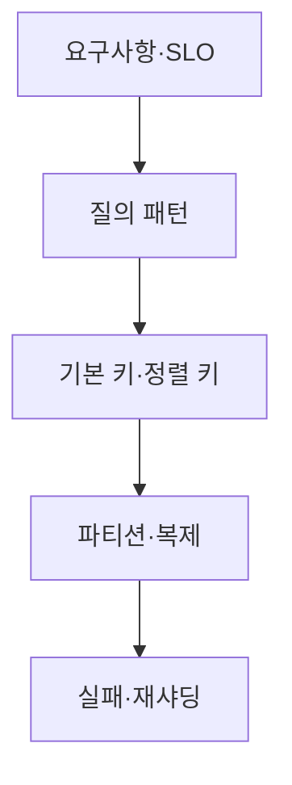

## 1. 저장소 이름보다 질의표가 먼저다

면접에서는 평균과 최대 쓰기량, 객체 크기, 보존 기간, 허용 유실량을 가정으로 선언한다. 각 API가 사용하는 키, 정렬, 범위, 일관성을 표로 만들면 필요한 인덱스가 드러난다.



| 질문 | 확인할 결정 | 경고 신호 |
|---|---|---|
| 무엇으로 찾나 | Partition Key | 단조 증가 키 한 파티션 |
| 어떤 순서인가 | Sort Key·Index | 모든 필드 인덱싱 |
| 얼마나 오래 두나 | TTL·Archive | 삭제 폭주 |
| 얼마나 정확해야 하나 | 복제·일관성 | 요구 없는 강한 일관성 |

```text
daily_bytes = peak_events_per_second * average_event_bytes * 86_400
replicated_capacity = daily_bytes * retention_days * replication_factor
```

> **면접 전략** — 계산값은 정답이 아니라 설계 규모를 고르는 근거다. 압축, 인덱스, 복제 오버헤드가 빠졌음을 명시하고 여유 계수를 둔다.

## 2. 깊이 질문에 대비한다

Hot Key는 버킷을 추가하되 읽을 때 합치는 비용을 설명한다. 보조 인덱스는 쓰기 증폭과 지연을 만들며, 재샤딩 중에는 이중 쓰기보다 변경 로그 기반 복제를 선호할 수 있다.

> **면접 포인트** — 정상 경로 뒤에 노드 장애, 복제 지연, 파티션 이동, 데이터 복구와 검증 순서를 붙이면 설계가 완성된다.
