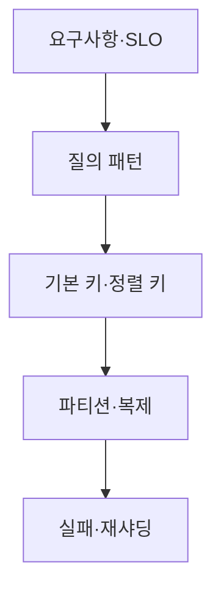

> **검수 경계** — 이벤트 수·보존 기간·객체 크기·조회 패턴은 면접용 가정이다. 저장소의 편안한 한계를 제품 불문 상수로 말하지 않는다.

## 1. 저장소 이름보다 질의표가 먼저다

면접에서는 평균과 최대 쓰기량, 객체 크기, 보존 기간, 허용 유실량을 가정으로 선언한다. 각 API가 사용하는 키, 정렬, 범위, 일관성을 표로 만들면 필요한 인덱스가 드러난다.


```mermaid
flowchart TD
    R[요구사항·SLO] --> Q[질의 패턴]
    Q --> K[기본 키·정렬 키]
    K --> P[파티션·복제]
    P --> F[실패·재샤딩]
```

| 질문 | 확인할 결정 | 경고 신호 |
|---|---|---|
| 무엇으로 찾나 | Partition Key | 단조 증가 키 한 파티션 |
| 어떤 순서인가 | Sort Key·Index | 모든 필드 인덱싱 |
| 얼마나 오래 두나 | TTL·Archive | 삭제 폭주 |
| 얼마나 정확해야 하나 | 복제·일관성 | 요구 없는 강한 일관성 |

```text
daily_bytes = peak_events_per_second * average_event_bytes * 86_400
replicated_capacity = daily_bytes * retention_days * replication_factor
```

> **면접 전략** — 계산값은 정답이 아니라 설계 규모를 고르는 근거다. 압축, 인덱스, 복제 오버헤드가 빠졌음을 명시하고 여유 계수를 둔다.

## 2. 깊이 질문에 대비한다

Hot Key는 버킷을 추가하되 읽을 때 합치는 비용을 설명한다. 보조 인덱스는 쓰기 증폭과 지연을 만들며, 재샤딩 중에는 이중 쓰기보다 변경 로그 기반 복제를 선호할 수 있다.

> **면접 포인트** — 정상 경로 뒤에 노드 장애, 복제 지연, 파티션 이동, 데이터 복구와 검증 순서를 붙이면 설계가 완성된다.

## 검수 경계와 실패 흐름

- 수치와 임계값은 요구사항으로 선언하고 실제 workload·부하 테스트·관측 지표로 검증한다. 제품·기업의 내부 구현을 근거 없이 일반화하지 않는다.
- 쓰기 성공 후 이벤트/읽기 모델 갱신 실패, 응답 유실 후 재시도, 중복·순서 역전·부분 장애를 정상적인 실패 경로로 모델링한다.
- 원장과 캐시·검색·알림·분석 파생 모델의 상태를 구분하고, 멱등 키·버전·재처리 큐·대사 작업으로 수렴시킨다.
- 성능 최적화는 평균이 아니라 p95/p99, 버스트와 복구 중 부하를 함께 본다. fallback을 추가할 때 정확성·보안·개인정보·비용 trade-off를 기록한다.

## 공식·1차 출처

- [https://www.postgresql.org/docs/current/indexes.html](https://www.postgresql.org/docs/current/indexes.html)
- [https://www.postgresql.org/docs/current/ddl-partitioning.html](https://www.postgresql.org/docs/current/ddl-partitioning.html)
- [https://docs.aws.amazon.com/amazondynamodb/latest/developerguide/bp-partition-key-design.html](https://docs.aws.amazon.com/amazondynamodb/latest/developerguide/bp-partition-key-design.html)
