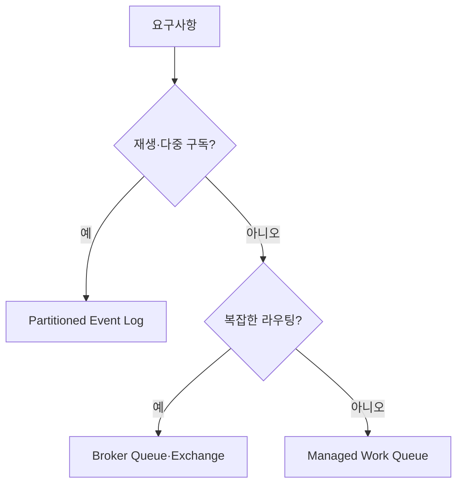

## 1. 메시지의 수명을 먼저 결정한다

이벤트 로그는 여러 소비자가 각자의 Offset으로 재생하고 장기간 보존한다. 작업 큐는 가용 Worker 하나에게 작업을 넘기고 ACK·Visibility Timeout으로 재전달한다. 복잡한 라우팅은 Exchange 유형과 Header 규칙이 중요하다.



| 기준 | 이벤트 로그형 | Broker 큐형 | 관리형 작업 큐형 |
|---|---|---|---|
| 보존·재생 | 강점 | 제한적 | 제한적 |
| 라우팅 | Topic·Partition 중심 | Exchange·Binding | Queue·속성 중심 |
| 순서 | Partition별 | Queue 구성별 | 그룹/Queue별 |
| 운영 | Cluster·Partition 관리 | Broker 운영 | 공급자 제약 |

```text
required_throughput = peak_messages_per_second * retry_amplification
partition_count >= max(throughput_need, desired_parallel_consumers)
```

> **설계 원칙** — “Exactly-once 지원” 문구보다 생산자, Broker, 소비자 DB를 잇는 종단 효과가 멱등한지 확인한다.

## 2. 실패 모델을 계약에 넣는다

중복, 순서 역전, 독약 메시지, 긴 처리, Backlog 보존 한도를 정한다. 메시지 크기가 크면 객체 저장소에 본문을 두고 Broker에는 검증 가능한 참조를 전달한다.

> **면접 포인트** — 제품 비교표를 암기하기보다 메시지 수명과 소비 모델을 정한 뒤 후보를 좁힌다.
