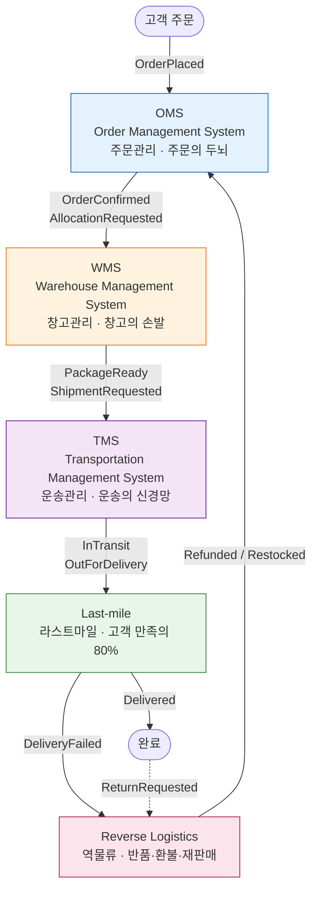
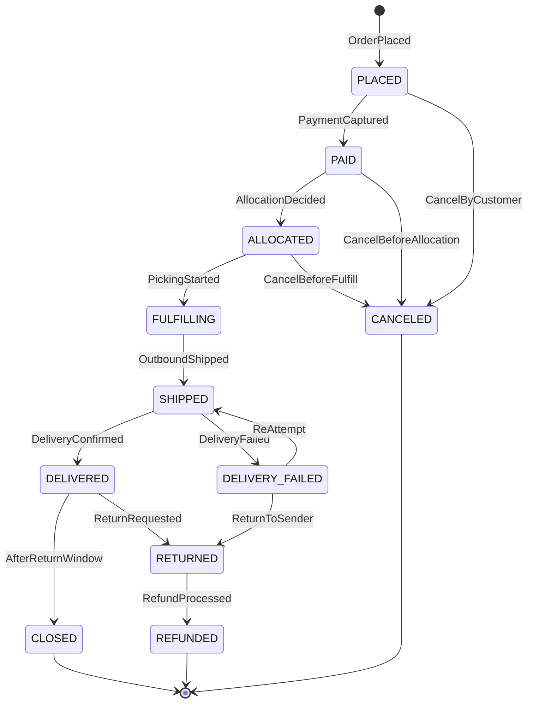
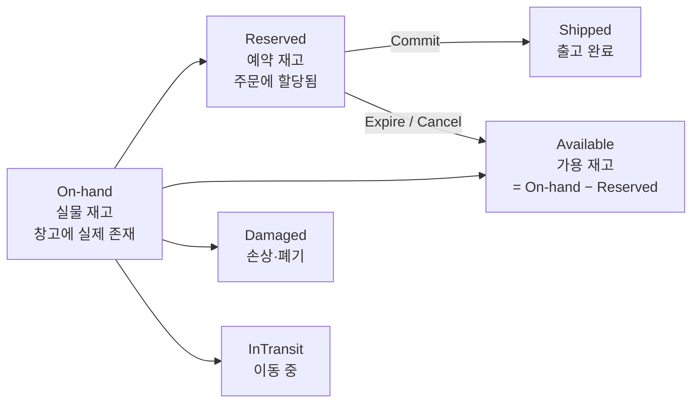
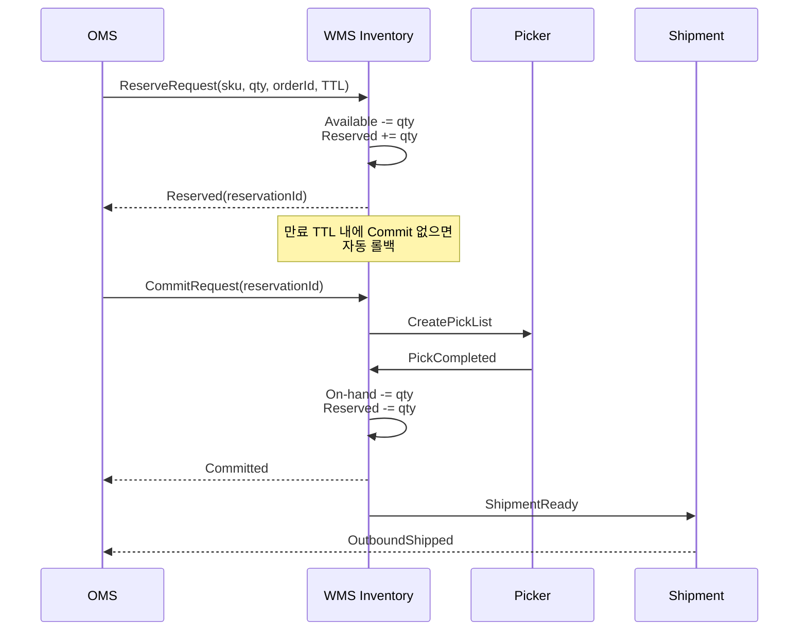
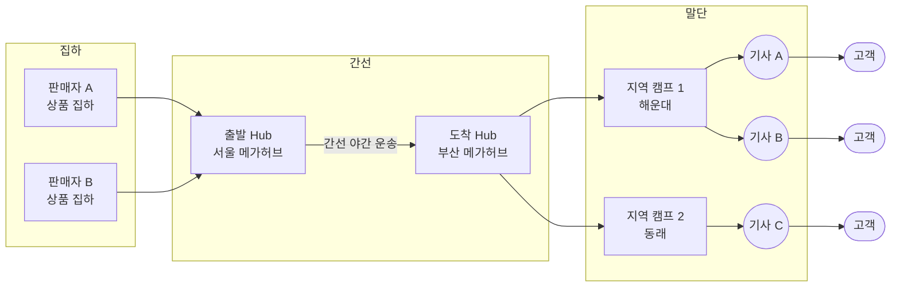
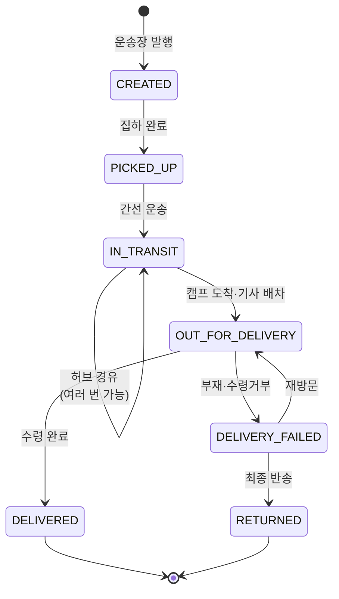
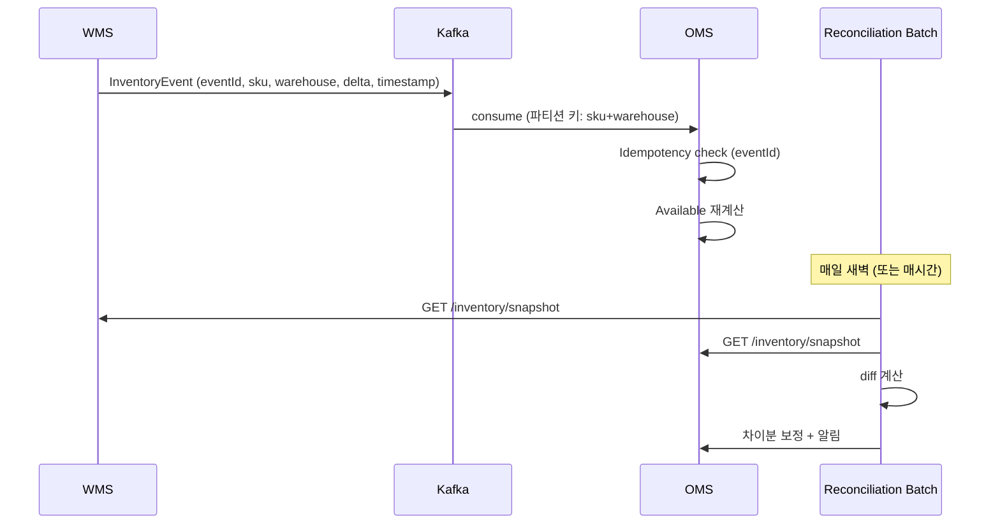
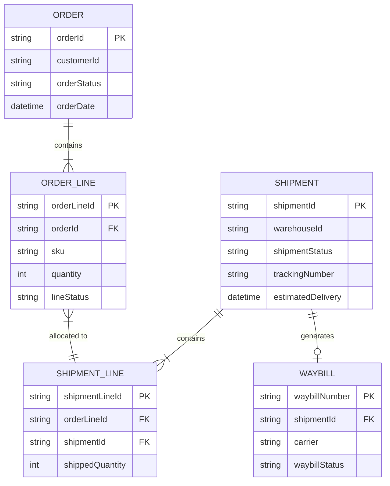

# 물류 도메인 전체 지도 — OMS / WMS / TMS 개관

> **세션 정보**
> - 코치: `logistics-domain-coach`
> - 모드: Concept (개념 정리 + 예제)
> - 작성일: 2026-04-10
> - 목적: 물류 도메인 첫 진입점. 밸류체인 전체 흐름과 3대 시스템 경계를 확실히 그리기.
> - 이후 세션에서 Deep-dive 할 주제를 미리 표시 → `🔥` 아이콘

---

## 1. 물류 밸류체인 한눈에

### 1-1. 전체 흐름 (Mermaid)

### 1-2. 단계별 핵심 정리표

| 단계 | 주요 Entity | 도메인 이벤트(Domain Event) | 대표 KPI |
|---|---|---|---|
| **OMS** | `Order`, `OrderLine`, `Customer`, `Payment`, `Allocation` | `OrderPlaced`, `OrderConfirmed`, `OrderCanceled`, `AllocationDecided` | 주문 수락률, 취소율, Cut-off(마감시각) 준수율 |
| **WMS** | `SKU(Stock Keeping Unit, 재고관리단위)`, `Inventory`, `Bin(보관 위치)`, `PickList`, `Package` | `InboundReceived`, `InventoryReserved`, `PickingStarted`, `PackagePacked`, `OutboundShipped` | 재고 정확도(Inventory Accuracy), 피킹 정확도(Pick Accuracy), UPH(Units Per Hour, 시간당 처리량) |
| **TMS** | `Shipment(화물)`, `Route(배차)`, `Waybill(운송장)`, `Vehicle`, `Driver`, `Hub` | `ShipmentCreated`, `RouteAssigned`, `ArrivedAtHub`, `DepartedHub` | OTD(On-Time Delivery, 정시배송률), 차량 적재율(Load factor), 구간 지연율 |
| **Last-mile** | `DeliveryTask`, `TrackingEvent`, `POD(Proof Of Delivery, 배송증빙)` | `OutForDelivery`, `DeliveryAttempted`, `Delivered`, `DeliveryFailed` | First-attempt success rate(최초 배송 성공률), 고객 CSAT, 재방문 비율 |
| **Returns** | `ReturnRequest`, `ReturnPickup`, `QCResult(검수 결과)`, `Refund` | `ReturnRequested`, `ReturnPickedUp`, `ReturnInspected`, `Refunded` | 반품률, 재판매율(Restock rate), 처리 리드타임 |

---

## 2. 3대 시스템 Deep Dive

### 🧠 OMS (Order Management System, 주문관리)

**책임 한 줄**: "주문이라는 비즈니스 객체의 **라이프사이클 전체**를 관리한다."

#### 주문 상태 머신 (Mermaid)

#### 왜 WMS/TMS 에서 분리되는가
- 주문은 **여러 채널**(자사 앱·오픈마켓·B2B)에서 들어오고, **여러 창고·파트너**에 할당된다. 멀티 소스 · 멀티 싱크를 흡수하는 허브가 필요.
- 결제·쿠폰·정산·고객 CS 가 모두 주문에 엮여 있어, WMS/TMS 에 섞으면 **Bounded Context(경계 있는 컨텍스트)** 가 무너진다.

#### 내부 주요 기능
1. **주문 수집 & 검증**: 재고·결제·주소 정규화·사기(Fraud) 검증
2. **Allocation(할당)**: 어느 창고에서 어느 SKU 를 보낼지 결정. 단일창고 / 분할출고(Split shipment) / 드랍쉬핑(Dropshipping) 판단
3. **주문 상태 머신** (위 다이어그램)
4. **결제/정산 연동**: Auth(인증) → Capture(매입) → Refund(환불). 부분 취소·부분 환불 처리
5. **취소/변경**: 상태에 따라 가능 범위가 달라짐. "출고 후 취소 불가" 같은 불변식(Invariant)

#### 실무 함정
- 주문 상태를 Boolean 플래그 여러 개로 관리 → 조합 폭발. **Enum + 상태 머신**으로 강제해야 함
- 분할 출고 시 "주문 1건 = 배송 1건" 가정이 깨짐. `Order ↔ Shipment` 가 **1:N**
- Cut-off time(마감시각) 전후 주문 몰림 → 동시성 + 트랜잭션 경쟁 🔥

---

### 🏭 WMS (Warehouse Management System, 창고관리)

**책임 한 줄**: "**실물 재고**의 입고부터 출고까지, 창고 내부 작업 전체를 관리한다."

#### 재고 3가지 상태 다이어그램

#### 재고 Reserve → Commit → Ship 3단계 흐름

#### 왜 분리되는가
- 창고 내부는 **사람·장비·물리 공간**과 맞물린다. 피킹 동선, 바코드, 컨베이어, 자동창고(AS/RS, Automated Storage and Retrieval System) 등 하드웨어와 강결합.
- 재고 정합성은 **실물 기준**이어서 OMS 의 "가용 재고"와 구분되는 별도 책임이 있음.

#### 내부 주요 기능
1. **입고(Inbound)**: PO(Purchase Order, 발주서) 대조 → 검수 → `Putaway(적치)`
2. **보관(Storage)**: Bin 할당, Slotting 최적화(회전율 높은 SKU 를 피킹 지점 가까이)
3. **피킹(Picking)**: `PickList` 생성 → 피킹 전략(Batch / Zone / Wave / Cluster picking) → 동선 최적화
4. **패킹 & 출고(Packing & Outbound)**: 박스 선택, 운송장 발행, TMS 로 인계
5. **재고 실사(Cycle count)**: 주기적 부분 실사 + 원인 분류(손망실·오피킹·시스템 오류)

> **면접 포인트**: "재고 차감을 어떻게 설계하시겠어요?" 질문에 "그냥 -1 하면 됩니다"는 **즉시 탈락**. Reserve → Commit → Ship 3단계 + 만료 처리 + 원자적 조건부 UPDATE(또는 낙관적 락) 를 이야기해야 함. 🔥

#### 실무 함정
- 재고 이동(Transfer) 중 "출발지에서 빠졌는데 도착지에 안 찍힌" 상태 — InTransit 상태 명시 필요
- Oversell(초과판매): 예약 만료를 안 걸어서 주문은 받았는데 실물이 없음 🔥
- 실물 vs 전산 차이 — 이걸 **이벤트**로 모델링하면 감사(Audit) 가 쉬워짐

---

### 🚛 TMS (Transportation Management System, 운송관리)

**책임 한 줄**: "**화물을 언제·어떻게·얼마에** 목적지까지 보낼지 결정하고 집행한다."

#### 허브앤스포크 네트워크 (Mermaid)

#### 왜 분리되는가
- 운송은 **차량·기사·경로·운임** 이라는 완전히 다른 도메인 객체를 다룸. WMS 와 섞으면 양쪽 모두 커짐.
- 3PL(Third Party Logistics, 3자 물류) 파트너 연동, 운임 정산, 규제(관세·운송보험) 가 붙어 복잡도 높음.

#### 내부 주요 기능
1. **Shipment 생성**: WMS 출고 이벤트 수신 → 운송장(Waybill) 발행
2. **배차(Dispatch)**: VRP(Vehicle Routing Problem, 차량 경로 문제) 풀이. 기본/용량제약(CVRP)/시간창 제약(VRPTW) 🔥
3. **구간 운송(Linehaul, 간선)**: 허브앤스포크(Hub-and-spoke) 모델
4. **Last-mile 인계**: 지역 캠프 도착 후 기사 앱(Driver App)으로 할당
5. **운임 정산(Freight Billing)**: 다구간·할증·정산 주기 관리

#### 허브앤스포크 vs 포인트투포인트(Point-to-Point)
| 관점 | 허브앤스포크 | 포인트투포인트 |
|---|---|---|
| 적재 효율 | 높음 (허브에서 모아 재분류) | 낮음 |
| 리드타임 | 김 (허브 경유) | 짧음 (직행) |
| 네트워크 복잡도 | 낮음 (N 노드에 N 개 링크) | 높음 (N² 링크) |
| 대표 사례 | CJ대한통운·FedEx | 쿠팡 로켓배송의 일부 구간 |

→ 쿠팡은 전국 메가허브 + 캠프 분산 **하이브리드** 모델.

#### 운송장 상태 머신

#### 실무 함정
- 기사 앱 **오프라인 동기화** — 지하·산간에서 스캔 누락 후 재접속 시 재생
- 운송장 상태 **중복 수신** — 동일 TrackingEvent 가 여러 경로로 올 수 있음 → Idempotency(멱등성) 필수 🔥
- 운임 계산의 **소급 정정** — 월말에 할증 조건이 바뀌면서 과거 운임 재계산

---

## 3. 실제 사례 — 쿠팡 로켓배송 매핑

쿠팡 로켓배송을 3대 시스템으로 분해:

| 레이어 | 쿠팡에서의 구현 | 특징 |
|---|---|---|
| **OMS** | 쿠팡 앱 주문 + 로켓배송 전용 SLA(당일/익일) 판정 | Cut-off time(보통 자정)까지 받은 주문을 하루 안에 ALLOCATED 상태까지 밀어넣어야 함 |
| **WMS** | **전국 100+ 풀필먼트 센터(FC, Fulfillment Center)** 자체 운영 | 로켓그로스 기준 직매입·직보관·직배송. 피킹 동선 최적화가 핵심 경쟁력 |
| **TMS** | **쿠팡로지스틱스서비스(CLS)** 자체 배송망 + 쿠팡친구 기사 직접 고용 | 기존 택배사 의존도↓. 허브·캠프·기사가 수직 통합되어 데이터 일관성·리드타임↓ |
| **Last-mile** | 쿠팡친구 기사 앱, 문앞 배송(Contactless), 실시간 위치 공유 | POD(Proof Of Delivery, 배송증빙) 로 사진 자동 촬영 |
| **Returns** | 앱에서 반품 신청 → 같은 기사가 다음 방문 때 수거 (정방향·역방향 통합) | 역물류 리드타임을 크게 줄인 차별점 |

### 비교 — 컬리 샛별배송
- 샛별배송의 핵심 제약: `Cut-off = 23:00`, `Delivery = 다음날 07:00 이전`. 약 8시간 안에 피킹·패킹·간선·라스트마일 전부 끝내야 함.
- 이 제약이 **모든 시스템 설계를 지배**. WMS 피킹 전략(Wave picking 으로 집중), TMS 야간 간선 운영, 냉장 콜드체인(Cold-chain) 유지가 모두 연동.

---

## 4. 백엔드 시스템 디자인 관점 — 이후 Deep-dive 주제

| 시스템 | 단골 이슈 | 관련 기술 | 다룰 세션 |
|---|---|---|---|
| **OMS** | 주문 폭주 시 결제·재고 트랜잭션 경쟁 | Saga, Outbox, Idempotency-Key | `backend-architecture-coach` |
| **WMS** | 재고 차감 동시성, Oversell 방지 | 낙관적 락, 조건부 UPDATE, Redis 원자 감소 | `database-coach` + `backend-dev-coach` |
| **TMS** | 실시간 배차 재최적화, VRP 스케일링 | OR-Tools, 메타휴리스틱, 분산 큐 | `system-design-coach` |
| **Last-mile** | 수천만 TrackingEvent/일 Fan-out | Kafka, CDC, 최종 일관성 | `system-design-coach` |
| **Returns** | 정방향·역방향 상태 합류 | 상태 머신 모델링, 이벤트 소싱 일부 | `backend-architecture-coach` |

> 🔥 특히 **Last-mile 추적 시스템**과 **WMS 재고 정합성**은 대형 이커머스 시스템 디자인 면접의 최상위 단골 주제.

---

## 5. 이해도 확인 질문 — 모범 답변

> 작성일: 2026-04-10

---

### Q1. OMS "가용 재고(Available)"와 WMS "실물 재고(On-hand)"가 불일치하는 상황

#### 핵심 전제

OMS와 WMS는 **별도의 Bounded Context(경계 있는 컨텍스트)**이며, 각각 독립된 데이터 저장소를 가진다. OMS의 Available은 "판매 가능한 수량"이라는 **논리적 재고**이고, WMS의 On-hand는 "창고에 물리적으로 존재하는 수량"이라는 **물리적 재고**다. 이 둘은 본질적으로 **Eventual Consistency(최종 일관성)** 관계에 있으며, 순간적 불일치는 피할 수 없다. 문제는 불일치를 얼마나 빨리, 정확하게 해소하느냐다.

#### 불일치 시나리오 5가지

**시나리오 1: 입고(Inbound) 처리 시차**

공급업체가 물건을 창고에 납품했지만, WMS에서 입고 검수(Receiving QC)를 완료하기 전 상태.

- WMS: 입고 검수 완료 후 On-hand 증가 (물리적으로는 이미 도착했지만 QC 대기 중)
- OMS: WMS로부터 `InventoryReceived` 이벤트를 수신해야 Available 증가
- **불일치 양상**: WMS On-hand가 OMS Available보다 **먼저 증가**. 혹은 반대로 QC 불합격/파손 발견 시 WMS On-hand가 기대보다 적게 증가하는데, OMS는 ASN(Advanced Shipping Notice, 사전출하통지) 기준으로 이미 Available을 올려놓은 경우.
- **동기화 방향**: WMS → OMS. WMS가 입고 확정 이벤트를 발행하고, OMS가 이를 소비하여 Available 갱신. **ASN 기반 선반영은 위험** — 실물 확인 후 반영이 원칙.
- **사례**: 쿠팡 FC 입고 검수 완료까지 평균 1-2영업일. 이 기간 동안 해당 SKU는 "입고 대기" 상태로 판매 불가.

**시나리오 2: 피킹(Picking) 중 실물 부족 발견**

OMS에서 주문을 받아 재고를 Reserve했고, WMS에 출고 지시를 내렸는데, 피커(Picker)가 해당 로케이션에 갔더니 실물이 없거나 수량이 부족한 경우.

- **불일치 양상**: OMS Available은 Reserve로 차감되었으니 문제없어 보이지만, **다른 주문의 Available 계산 기반인 On-hand 자체가 틀렸던 것**. 연쇄적으로 Oversell(초과판매) 위험.
- **동기화 방향**: WMS → OMS. `ShortPickDetected` 이벤트로 OMS의 On-hand 기준값을 보정. OMS는 해당 주문을 Backorder(미충족 주문) 또는 취소 처리하고 Available 재계산.
- **사례**: Amazon FC에서는 Short Pick 발생 시 ASIN(Amazon Standard Identification Number)의 재고 정확도 점수를 차감하고, 임계치 이하가 되면 해당 Bin에 대해 강제 Cycle Count를 트리거한다.

**시나리오 3: 반품(Return) 입고 처리 지연**

고객 반품 신청 → 택배 수거 → 창고 도착 → QC 검수 → 재판매 가능 판정 과정에서, OMS는 "반품 접수됨"을 알지만 WMS에서 실물 검수가 끝나기 전까지 재고 환원 불가.

- **불일치 양상**: 반품 물량이 많은 시즌(블랙프라이데이 직후)에는 수만 건의 반품이 QC 대기열에 쌓이면서, OMS와 WMS 간 재고 차이가 수일간 벌어짐.
- **동기화 방향**: WMS → OMS. WMS가 QC 완료 후 `ReturnInspectionCompleted(result=RESELLABLE)` 이벤트를 발행해야만 OMS가 Available 증가. **QC 전 선반영은 불량품 재판매 위험**.

**시나리오 4: 재고 실사(Cycle Count) 차이 발견**

WMS에서 정기/비정기 재고 실사를 수행했더니 전산 재고와 실물 재고에 차이가 발생. 원인은 오피킹(Wrong Pick), 도난, 파손 미기록, 위치 이동 미스캔 등.

- **불일치 양상**: 이것이 가장 **은밀한 불일치**. 명시적 트리거 없이 누적되다가 Oversell로 표면화됨.
- **동기화 방향**: WMS → OMS. `InventoryAdjusted(sku, delta, reason)` 이벤트. reason 필드로 원인별 분류(손망실/오피킹/시스템오류) → 재발 방지.

**시나리오 5: 이벤트 유실 또는 순서 역전**

WMS → OMS 간 메시지 브로커(Kafka/SQS)에서 이벤트가 유실되거나, 네트워크 지연으로 순서가 뒤바뀜.

- **동기화 방향**: 양방향 보정.
  1. Kafka Consumer의 **Idempotency(멱등성)** 보장 — 이벤트 ID 기반 중복 제거
  2. **순서 보장** — 같은 SKU-Warehouse 조합은 같은 파티션으로 라우팅
  3. **주기적 Full Reconciliation(전수 대사)** — 배치로 WMS 전체 재고 스냅샷과 OMS 재고를 비교하여 차이 보정

#### 동기화 전략 정리표

| 시나리오 | 동기화 방향 | 이벤트 | 보정 전략 |
|---|---|---|---|
| 입고 시차 | WMS → OMS | `InventoryReceived` | 실물 확인 후 반영, ASN 선반영 금지 |
| Short Pick | WMS → OMS | `ShortPickDetected` | Backorder/취소 + Available 재계산 |
| 반품 QC 지연 | WMS → OMS | `ReturnInspectionCompleted` | QC 완료 후에만 환원 |
| 재고 실사 차이 | WMS → OMS | `InventoryAdjusted` | 원인별 분류 + 강제 Cycle Count |
| 이벤트 유실/역전 | 양방향 | 전수 대사 배치 | 멱등성 + 파티션 순서 보장 + 주기적 Reconciliation |

#### 아키텍처 관점의 보정 메커니즘

> **면접 포인트**: "Available과 On-hand가 다를 수 있나요?"에 "네, 다를 수 있습니다"로 끝내면 안 된다. **왜 다른지(5가지 시나리오) → 어떻게 감지하는지(이벤트 + 대사) → 어떻게 해소하는지(동기화 방향 + 멱등성) → 그래도 해소 안 되면(Reconciliation Batch)** 까지 답해야 시니어 수준이다.

---

### Q2. 수직 통합(쿠팡) vs 3PL 위탁(전통 이커머스) 비교

#### 모델 정의

- **수직 통합(Vertical Integration)**: 자사가 창고, 배송 차량, 기사, IT 시스템을 직접 소유/운영. 대표: 쿠팡(로켓배송), 컬리(샛별배송), Amazon(FBA + Amazon Logistics).
- **3PL(Third Party Logistics, 3자 물류) 위탁**: 외부 물류업체에 보관/배송을 위탁. 대표: 11번가-CJ대한통운, G마켓-롯데택배, 전통 이커머스 대부분.

#### (1) 리드타임(Lead Time)

| 구분 | 수직 통합 | 3PL 위탁 |
|---|---|---|
| 일반 상품 | 당일/익일 (쿠팡 로켓: 주문~배송 평균 12-18시간) | 2-3영업일 (CJ대한통운 기준) |
| Cut-off | 자사 통제 → 유연하게 연장 가능 (로켓배송 자정 마감) | 3PL 마감 시각에 종속 (보통 오후 2-3시) |
| 예외 처리 | 즉시 내부 조정 (경로 변경, 기사 재배치) | 3PL 콜센터 경유 → 지연 불가피 |
| 피크 시즌 | 자사 인력 증원으로 대응 | 3PL 용량 공유 → 다른 고객과 경쟁, SLA 저하 위험 |

**핵심**: 수직 통합은 **End-to-end 리드타임을 직접 통제**할 수 있다. 쿠팡이 "로켓배송"이라는 차별화를 만들 수 있었던 근본 이유. 3PL은 자사 물량만의 우선순위를 보장받기 어렵다.

#### (2) 데이터 일관성(Data Consistency)

| 구분 | 수직 통합 | 3PL 위탁 |
|---|---|---|
| 재고 동기화 | 단일 시스템 또는 내부 이벤트 버스 → Near Real-time | 3PL API 폴링 또는 배치 파일(EDI) → 수분~수시간 지연 |
| 배송 추적 | 기사 앱에서 실시간 GPS + 스캔 이벤트 → 초 단위 | 3PL이 제공하는 추적 API 의존 → 허브 스캔 단위 (수시간 간격) |
| 데이터 포맷 | 자사 표준 → 정규화 불필요 | 3PL마다 다른 API/EDI 포맷 → **Anti-corruption Layer(부패 방지 계층)** 필수 |
| 장애 영향 | 내부 시스템 장애 → 자체 복구 | 3PL 시스템 장애 → 블랙박스, 원인 파악 불가 |
| 분석/ML | 전 구간 데이터 확보 → 수요 예측, 동선 최적화 자유로움 | 3PL 데이터 접근 제한 → 모델링 한계 |

**핵심**: 데이터 일관성은 수직 통합의 **가장 큰 숨은 이점**. 쿠팡이 ETA를 "7시 12분~7시 42분" 수준으로 좁힐 수 있는 이유는 자사 기사 앱의 GPS 데이터 + 내부 ML 파이프라인을 직접 통제하기 때문. 3PL 모델에서는 이 정밀도가 구조적으로 불가능.

#### (3) 확장성(Scalability)

| 구분 | 수직 통합 | 3PL 위탁 |
|---|---|---|
| 지역 확장 | 새 FC/캠프 건설 필요 → 6개월~2년 | 3PL 기존 네트워크 활용 → 수주 내 시작 가능 |
| 물량 탄력성 | 자사 설비 용량 한계 → CAPEX(Capital Expenditure, 자본적 지출) 선투자 | 종량제(per-parcel) → 물량 변동에 유연 |
| 해외 진출 | 현지 인프라 구축 필수 (Amazon: 국가별 FC 구축에 수년) | 현지 3PL 파트너 계약으로 빠른 진입 |

**핵심**: 3PL은 **변동비(OPEX)** 모델로 초기 리스크가 낮다. 수직 통합은 **규모의 경제(Economies of Scale)**에 도달해야 비용 역전이 일어나며, 그 전까지는 적자를 감수해야 한다.

#### (4) 초기 투자비(Initial Investment)

| 구분 | 수직 통합 | 3PL 위탁 |
|---|---|---|
| 인프라 | FC 건설/임대, 자동화 설비, 차량 구매/리스 | 거의 없음 (3PL 시설 사용) |
| IT 시스템 | 자체 WMS/TMS/기사앱 개발 (수십~수백명 엔지니어) | 3PL API 연동 어댑터 개발 (소규모 팀) |
| 규모 예시 | 쿠팡: 2014~2023 누적 적자 약 7조원 (물류 인프라 투자 포함) | 수억~수십억 수준의 연동 비용 |
| 손익분기 | 일 수십만 건 이상 물량 필요 (보통 3-5년) | 첫 날부터 변동비 기반 운영 가능 |

#### Trade-off 요약: 언제 어떤 모델을 선택하는가

| 선택 기준 | 수직 통합이 유리한 경우 | 3PL이 유리한 경우 |
|---|---|---|
| 물량 | 대규모, 안정적 | 소규모, 변동 큼 |
| 차별화 | 배송 속도/경험이 핵심 | 상품/가격이 핵심 |
| 자금 | 장기 적자 감수 가능 (VC/IPO 자금) | 초기 비용 최소화 필요 |
| 데이터 | 전 구간 데이터 필수 (ML/개인화) | 기본 추적 정보로 충분 |
| 지역 | 특정 지역 집중 | 전국/글로벌 빠른 커버리지 |

**실무 트렌드**: 대부분의 성장 이커머스는 **하이브리드 모델**로 수렴. 네이버 스마트스토어는 CJ대한통운 풀필먼트(3PL)를 기본으로 하되, NFA(Naver Fulfillment Alliance)로 자사 영향력을 점진적으로 확대. 배달의민족도 B마트(자사 MFC, Micro Fulfillment Center) + 일반 배달(가맹점 자체 배송) 하이브리드.

---

### Q3. "주문 1건 = 배송 1건"이 깨지는 시나리오 + Order-Shipment 카디널리티

#### 시나리오 1: Split Shipment (분할 출고) — 1 Order : N Shipments

고객이 주문 1건에 상품 A, B, C를 담았는데:
- 상품 A는 서울 FC에, 상품 B와 C는 부산 FC에 있음 (Multi-warehouse)
- 또는 상품 A는 재고 있지만 상품 B는 입고 예정 (Partial availability)
- 또는 상품 A는 냉장, 상품 B는 상온 → 다른 배송 차량 필요 (온도대 분리)

**결과**: 주문 1건이 2개 이상의 Shipment로 쪼개진다.

**사례**:
- **Amazon**: "Your items will arrive in 2 shipments" — 각 FC에서 독립 출고. 내부 비용 최적화 알고리즘이 "합배송 vs 분할" 판단.
- **쿠팡**: 로켓배송과 로켓그로스(마켓플레이스 풀필먼트) 상품이 같은 주문에 섞이면 별도 배송으로 분리.

#### 시나리오 2: Merge Shipment (합배송) — N Orders : 1 Shipment

같은 고객이 짧은 시간 내에 주문 여러 건을 넣었고, 같은 FC에서 출고되며, 컷오프 전이라 물리적으로 합칠 수 있는 경우.

**결과**: 주문 N건이 1개의 Shipment로 합쳐진다.

**사례**:
- **쿠팡**: "장바구니에 담지 않고 따로 주문한 상품이 하나의 박스에 도착" — 합배송 최적화의 결과.
- **Amazon**: "Group my orders into fewer shipments" 옵션을 고객이 명시적으로 선택 가능.
- **B2B 물류**: 같은 수하인(Consignee)에게 가는 여러 건의 화물을 하나의 파렛트/컨테이너로 합적(Consolidation).

#### 데이터 모델: Order-Shipment 관계

1:1 가정이 깨지면 **M:N 관계**가 된다. `OrderLine(주문항목)` 레벨에서 Shipment와 연결하는 중간 엔티티가 필요하다.

**핵심 설계 원칙**:
- `Order`와 `Shipment`는 **직접 연결하지 않는다**. `OrderLine` ↔ `ShipmentLine`으로 연결.
- `ShipmentLine.shippedQuantity`는 `OrderLine.quantity`와 다를 수 있다 (Partial Shipment).
- 한 `OrderLine`이 여러 `ShipmentLine`에 걸칠 수 있다 (분할 출고 + 부분 출고).

#### 상태 전이(State Machine)에 미치는 영향

**Order 상태는 하위 Shipment들의 상태를 집계(Aggregate)하여 파생**된다.

| Order 상태 | 조건 |
|---|---|
| `PARTIALLY_SHIPPED` | 1개 이상의 Shipment가 SHIPPED 이상이고, 1개 이상이 아직 CREATED/PICKING |
| `FULLY_SHIPPED` | 모든 Shipment가 SHIPPED 이상 |
| `PARTIALLY_DELIVERED` | 1개 이상의 Shipment가 DELIVERED이고, 1개 이상이 아직 미도착 |
| `DELIVERED` | 모든 Shipment가 DELIVERED |

#### 파급 영향 정리

| 영역 | 1:1 가정 시 | M:N 실제 |
|---|---|---|
| DB 모델 | Order-Shipment 직접 FK | OrderLine-ShipmentLine 중간 테이블 필수 |
| 상태 관리 | Order 상태 = Shipment 상태 | 독립 상태 머신 + 집계 로직 |
| 고객 알림 | "배송 중" 1회 | "1/2 배송 중", "2/2 배송 중" — 알림 설계 변경 |
| 환불/취소 | 전체 취소, 전체 환불 | 부분 취소, 부분 환불 — Shipment 단위 처리 |
| 정산 | 주문 1건 = 정산 1건 | Shipment별 배송비 별도 정산 |
| CS 대응 | 단순 | "주문 3건 중 2건만 도착" 유형의 CS 급증 |
| KPI | OTD = 주문 단위 | OTD를 주문 단위? Shipment 단위? 정의부터 합의 필요 |

> **면접 핵심 포인트**: "Order와 Shipment의 관계를 어떻게 모델링하시겠습니까?"에 "1:1로 시작하되 M:N을 고려하겠습니다"는 불충분하다. 처음부터 `OrderLine ↔ ShipmentLine`의 M:N 중간 엔티티를 설계하고, Order 상태가 Shipment 상태의 **파생값(Derived State)**임을 명시해야 한다. 이 파생 로직을 **이벤트 드리븐**으로 구현할 것인지(각 Shipment 상태 변경 이벤트가 Order 상태 재계산 트리거) vs **폴링**으로 구현할 것인지에 대한 Trade-off까지 논의할 수 있어야 시니어 수준이다.

---

## 참고 — 다음 학습 후보

1. **Last-mile 추적 시스템 설계** — `system-design-coach` Design 모드
2. **재고 차감 동시성 문제 심화** — `database-coach` + `backend-dev-coach` 협업
3. **주문-결제-배송 Saga 설계** — `backend-architecture-coach` Interview 모드
4. **VRP(배차) 알고리즘 기초와 스케일링** — `system-design-coach` Concept 모드
